# 案例一:8分钟快速建立一个审批流程
-----
>短短的8分钟基于BPMT能快速地实现什么？通过下面这个简单的应用场景你马上就能了解。

## 业务背景描
A公司是一家小型企业，王总是公司老板，小李是人力专员。每当新员工入职时，小李会将员工资料通过邮件形式发给王总审批；得到批准后小李再将该员工的资料输入《在职员工档案》excel表。

今年由于公司业务发展，人员流动频繁，**员工入职依靠邮件审批暴露出漏审、难归档等问题。**
于是，王总经过一番了解找到BPMT，希望能够通过信息系统解决上述问题。

## 系统设计
分析：A公司新员工入职的业务包括两个部分：
* 在职员工档案管理——原《在职员工档案》excel表部分；
* 新员工入职审批——原邮件审批部分。

方案：**在BPMT中可以采用“动态表+工作流”的方式来实现，即：**
* 在职员工档案管理：用动态表来管理《在职员工档案表》的数据。允许维护人进行修改和删除，但是不能直接新增记录。
* 新员工入职审批：采用工作流实现新员工的入职审批。如果新员工的入职工作流审批通过，则向[1]的动态表中插入新员工的记录。
    

## 快速配置
分两步，先配置在职员工档案管理部分，再加入工作流审批的功能。

### 第一步,在职员工档案管理
用动态表实现在职员工档案管理的最终效果如下：
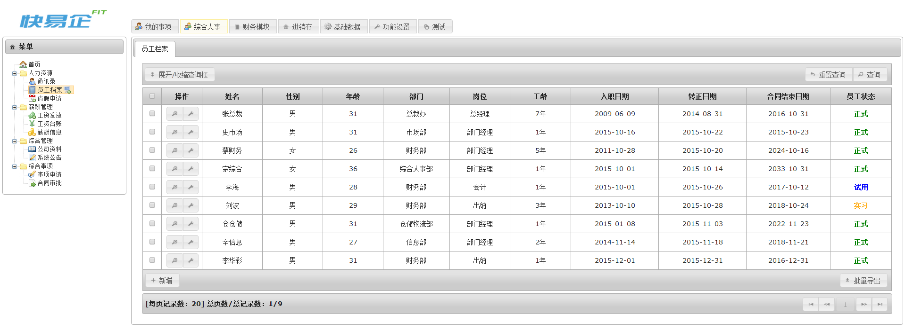

 
>如何得到上面的效果？**首先要有存储数据的表。**

在[动态表开发]中创建一张动态表用于存储员工档案数据。
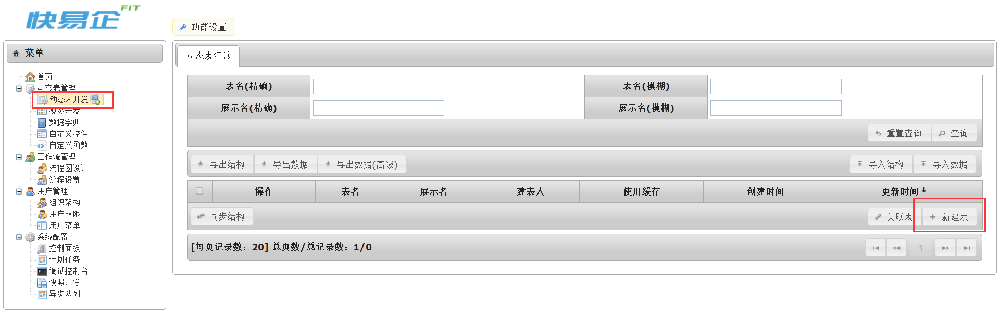

支持自定义表名和字段。字段的设置可参考《在职员工档案》excel表。
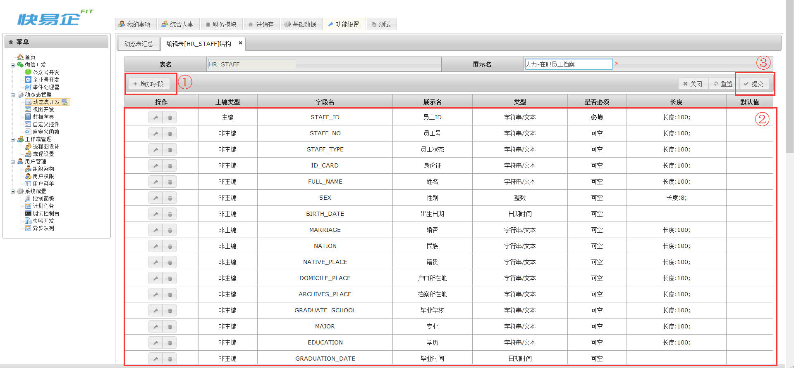

创建好的动态表如下图，可以进行维护管理：
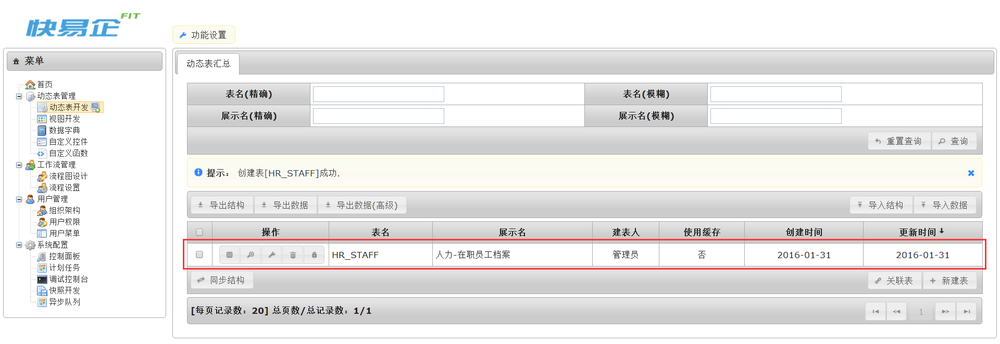
 
>现在有了数据表，再为之**建立视图**作为日常操作的界面。

在[视图开发]中新建视图，并将视图与上面建好的动态表进行关联
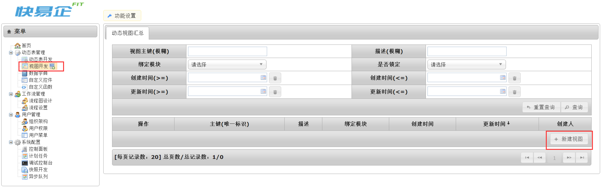
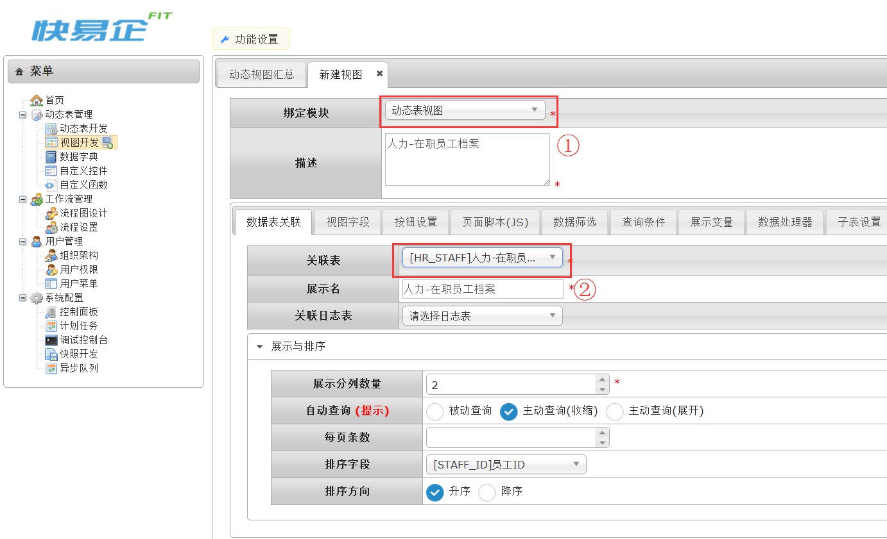
 
点击上方一系列标签可以对视图字段、按钮等视图元素进行设置。
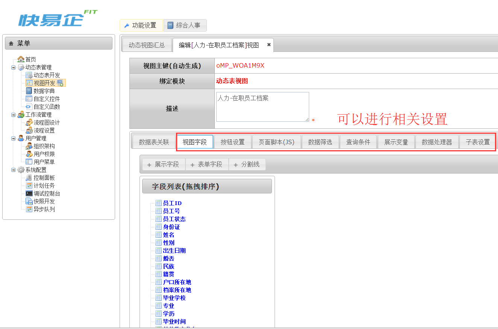
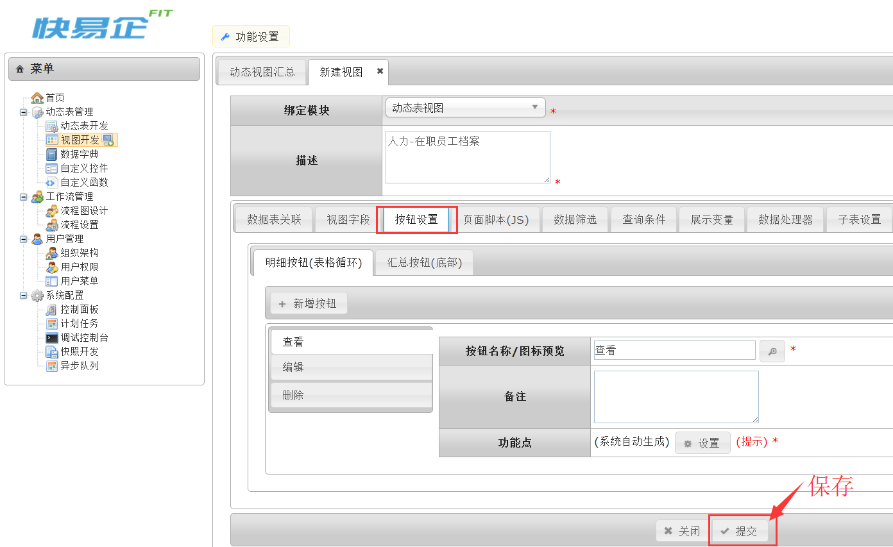
 
建好的视图如下图，可以点击预览，也可以进行维护管理：
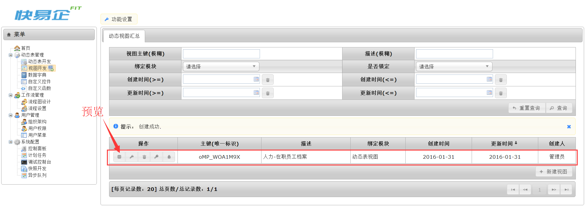
 
>最后为视图建立**菜单入口**。

在[用户菜单]里建立"域"和"菜单"。
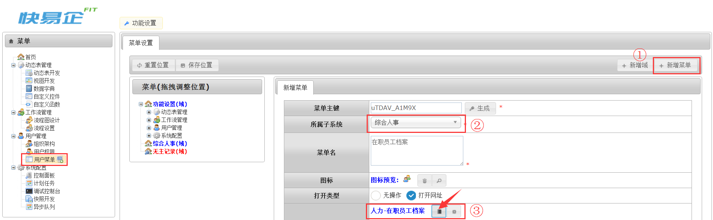
 
刷新浏览器可以看到刚刚完成的“在职员工档案”。

### 第二步,新员工入职审批

用工作流实现入职审批的最终效果如下：

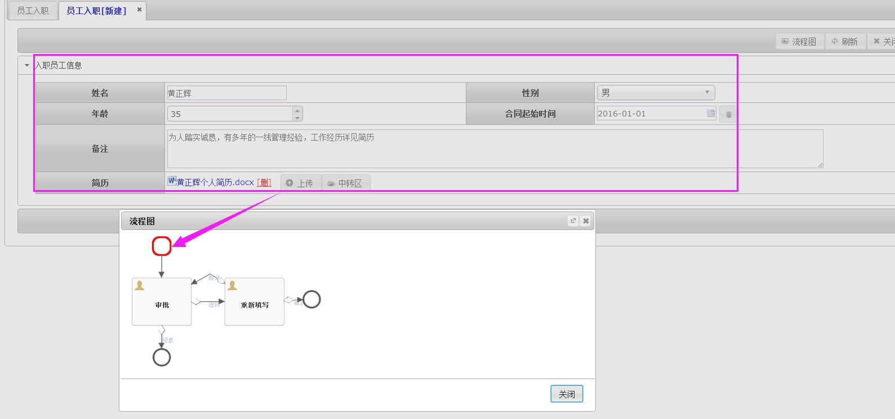

>工作流的建立从画图开始，**BPMT支持在线画流程图。**

在[流程图设计]中，通过简单的鼠标拖拽就能画出入职审批的流程图。
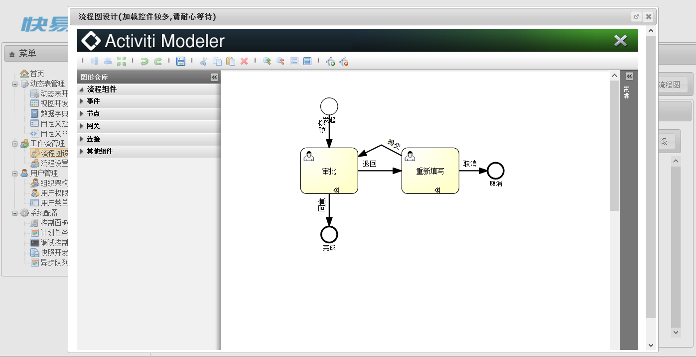
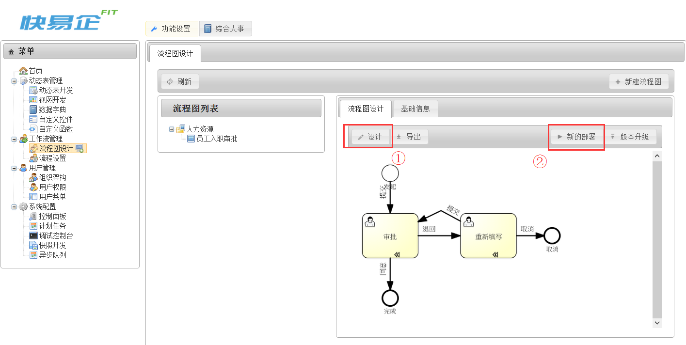

>画好的流程图进行部署后，才可以**被系统识别**并自动生成工作流视图。

在[流程设置]中找到员工入职审批流程，点击每个具体节点可以进行节点字段、人员分配等设置。

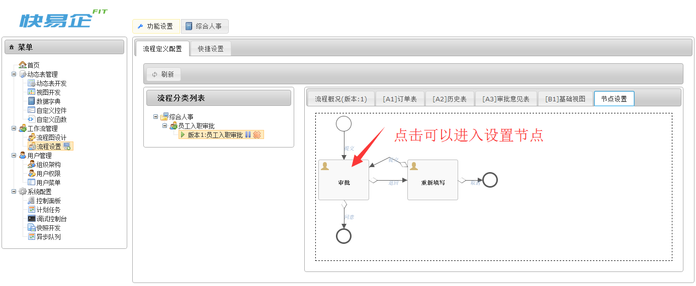
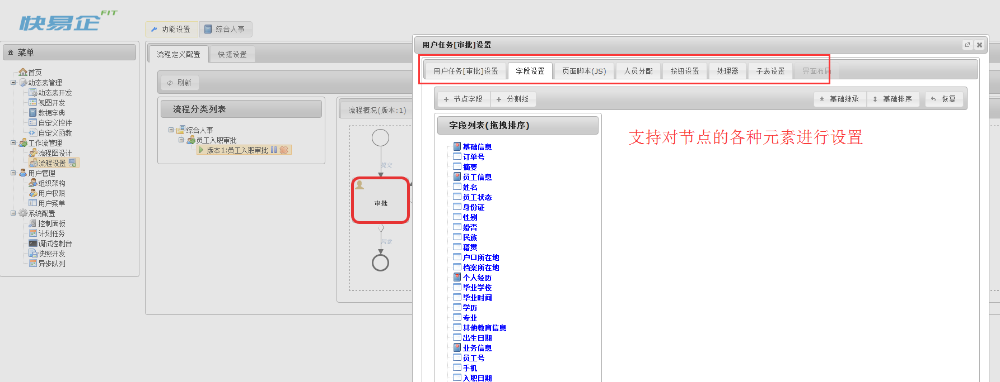
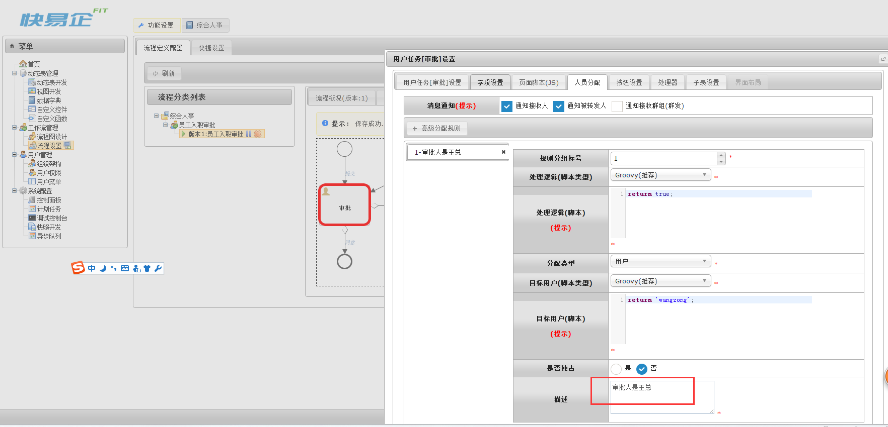

设置好菜单之后（步骤同上），“员工入职审批”流程就完成了。
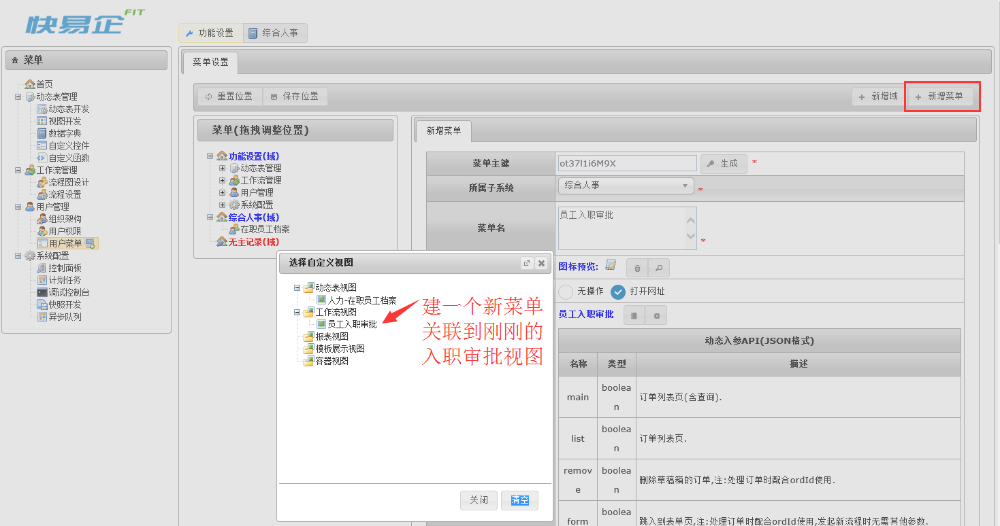

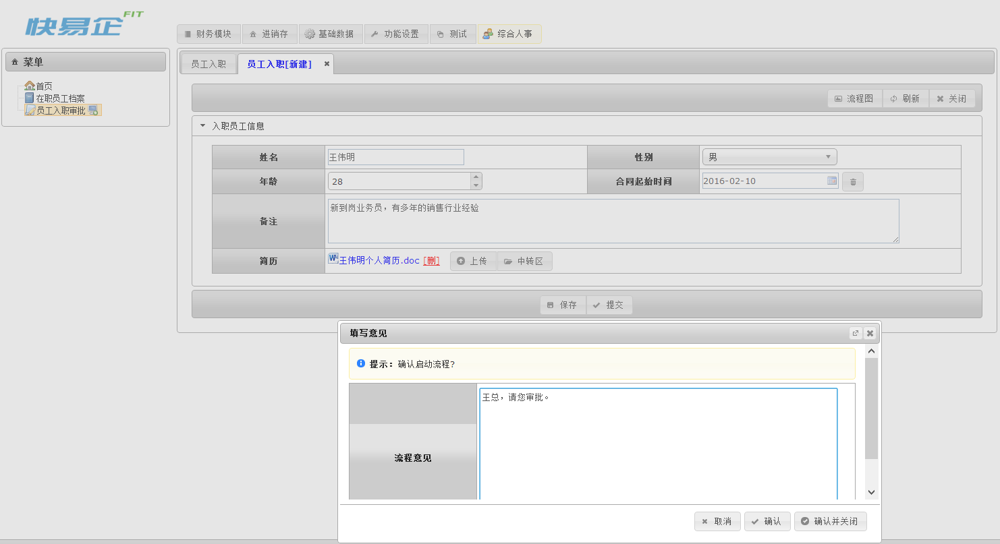
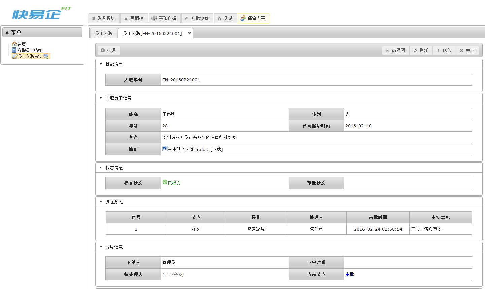
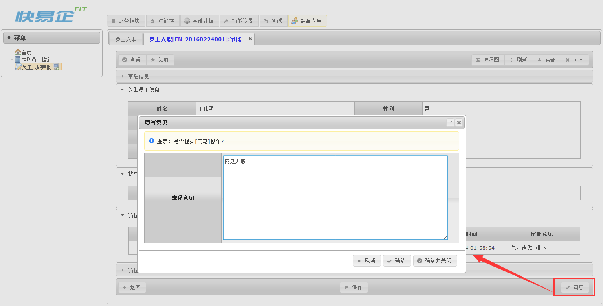
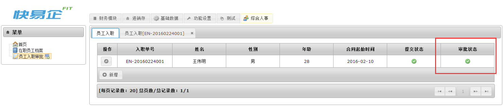
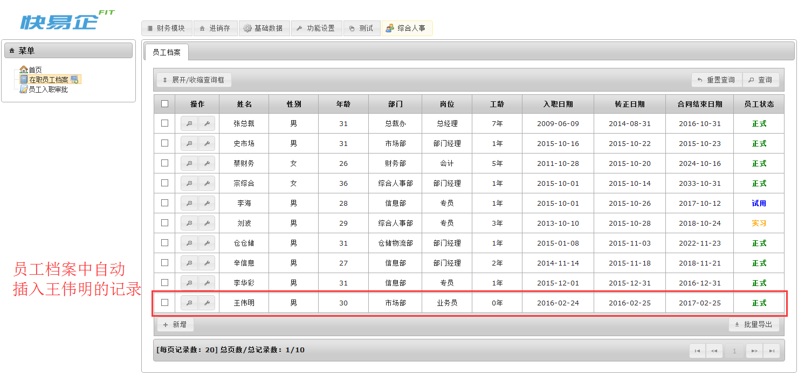
