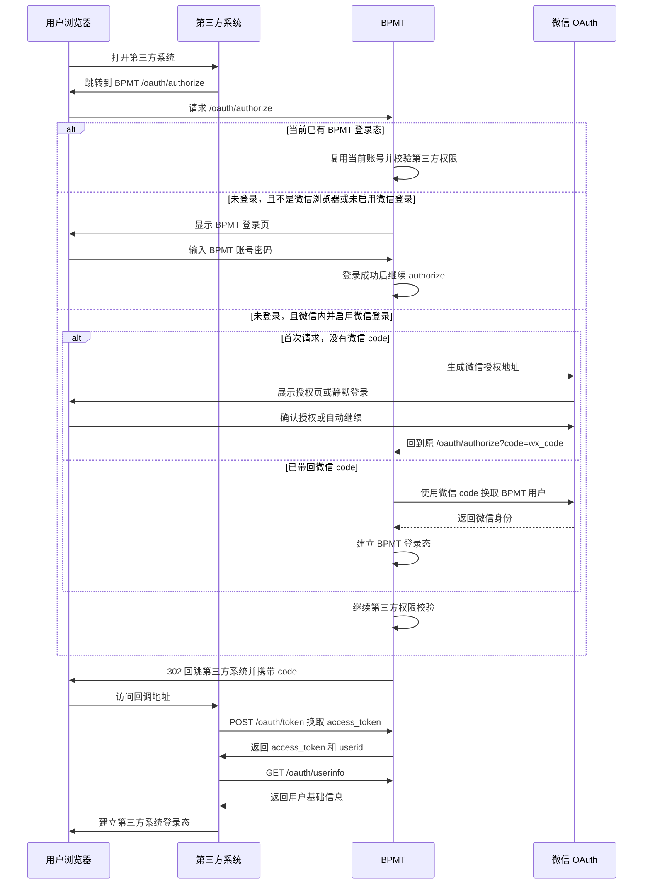
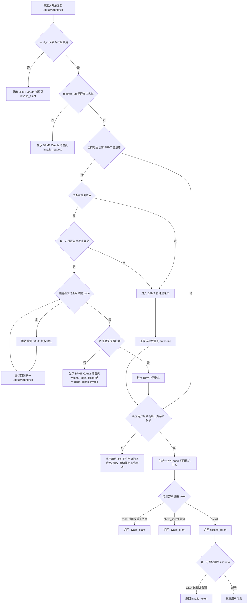

# OAuth 第三方登录

从 `bpmt-lite v1.5.0` 开始，BPMT 可以作为第三方系统的统一登录入口。第三方系统把用户带到 BPMT 登录，BPMT 登录成功后再把用户带回第三方系统。

`bpmt-lite v1.6.1` 在这个标准 OAuth 流程上补齐了微信生态下的登录态传导。第三方系统仍只需要发起标准 `/oauth/authorize`。如果用户是在微信里打开第三方系统、当前又没有 BPMT 登录态，而且该第三方系统启用了微信登录绑定，BPMT 会先走企业号或服务号微信 OAuth，登录成功后再回到原始 `/oauth/authorize`，继续签发标准 OAuth `code`。

## 适用版本

本章适用于 `bpmt-lite v1.5.0` 及后续继续保留相同 OAuth 端点的版本。该能力使用 OAuth2 授权码登录方式，复用 BPMT 原有账号、登录页和权限配置。

- `v1.5.0`：首次提供第三方 OAuth 登录能力。
- `v1.5.2`：无权限时支持提示并切换 BPMT 账号。
- `v1.5.3`：修复非 80 端口场景的 OAuth 回跳地址。
- `v1.6.0`：支持 HTTPS 入口，并通过 `X-Forwarded-*` 生成公开 URL。
- `v1.6.1`：新增微信生态下第三方 OAuth 登录态传导。
- `v1.6.2`：优化第三方系统管理界面，并增强 OAuth 无权限提示。
- `v1.7.2`：当前发布版本，未新增或改变 OAuth 端点、授权码流程、微信登录分支和权限提示；升级后仍沿用本章接入方式。

## 这项能力解决什么问题

企业里常见的第三方业务系统通常也需要登录。启用本能力后，第三方系统可以把登录入口交给 BPMT，由 BPMT 负责确认用户身份和第三方系统访问权限。第三方系统拿到 BPMT 返回的登录结果后，再在自己的系统里建立登录态。

这适合需要统一入口、统一用户权限、又不想让每个第三方系统重复维护 BPMT 用户密码的场景。

## `v1.6.1` 这次新增了什么

1. 第三方系统的标准接入方式不变，仍然是浏览器跳转 `/oauth/authorize`，服务器侧继续调用 `/oauth/token` 和 `/oauth/userinfo`。
2. 只有在“微信浏览器 + 当前没有 BPMT 登录态 + 该第三方系统启用了微信登录绑定”三个条件同时满足时，BPMT 才会先进入微信 OAuth。
3. 如果当前浏览器已经有 BPMT 登录态，BPMT 会优先复用当前账号，不会因为人在微信里就强制改走微信登录。
4. 旧系统升级到 `v1.6.1` 后，如需启用这项能力，必须先执行 `bpmt-lite/database/v1.6.1-wechat-oauth-thirdpart.sql` 补齐第三方系统微信登录字段。
5. 第三方系统如果不启用微信登录绑定，行为与 `v1.6.0` 完全一致。

## `v1.6.2` 这次修复了什么

1. 第三方系统管理页按“基础信息、OAuth 配置、微信登录、权限与状态、说明”重新分组，配置时更容易区分哪些字段属于微信登录，哪些字段属于访问控制。
2. `clientSecret` 重置字段增加了明确提示：留空表示不重置，填写后才覆盖旧密钥。
3. 微信类型和服务号 Scope 改为平台统一选择控件，减少手工输入错误。
4. 如果微信或企业微信登录成功后，当前 BPMT 用户没有目标第三方系统权限，页面会明确提示：`用户[xxx]不具备访问本应用权限。`
5. 用户无权限时仍保留两个动作：退出当前账号并重新登录，或取消并返回第三方系统。

## 管理员需要先配置什么

1. 在 BPMT 后台进入 `系统开发 -> 第三方系统`。
2. 新增第三方系统，填写系统名称、`client_id`、回调地址、首页地址和权限点。
3. 保存后记录系统生成的 `clientSecret`。该密钥只展示一次，丢失后需要重置。
4. 如需在微信里自动补齐 BPMT 登录态，再配置微信登录区。
5. 进入 `权限组管理 -> 第三方系统权限`，把对应第三方系统权限分配给允许访问的用户或角色。
6. 把 `client_id`、`clientSecret`、回调地址和 BPMT OAuth 地址交给第三方系统维护者。

BPMT 后台显示的 clientSecret，在 /oauth/token 请求中对应参数名 client_secret。

OAuth 运行数据由 BPMT 自动保存。低代码用户不需要直接维护数据库表，也不需要手工处理授权码或 token 的存储。

## 微信登录配置怎么填

在 `系统开发 -> 第三方系统` 的表单里，`v1.6.1` 新增了“微信登录”配置区。

| 字段 | 什么时候需要填 | 说明 |
| --- | --- | --- |
| `启用微信登录` | 需要在微信里直接补齐 BPMT 登录态时 | 关闭时，第三方系统仍走普通 BPMT 登录页 |
| `微信类型` | 开启微信登录后必填 | `agent` 表示企业号/企业微信，`mp` 表示服务号 |
| `微信 Key` | 开启微信登录后必填 | `agent` 时填写企业号应用 `agentKey`；`mp` 时填写公众号 `mpKey` |
| `服务号 Scope` | 仅 `mp` 类型使用 | 允许 `snsapi_base` 或 `snsapi_userinfo`；留空按 `snsapi_base` 处理 |

配置来源建议按下面理解：

1. `agent` 类型对应 `微信管理 -> 企业号开发` 中已经存在的企业号应用配置，`微信 Key` 要能定位到对应 `WxAgent`。
2. `mp` 类型对应 `微信管理 -> 公众号开发` 中已经存在的服务号配置，`微信 Key` 要能定位到对应 `WxMp`。
3. 服务号登录要确保公众号配置本身完整，至少要有 `mpKey`、`appId`、`appSecret` 和访客表。
4. 企业号登录要确保企业号应用配置完整，并且平台侧已配置企业号 `corpId` 等基础参数。

## 升级到 `v1.6.1` 需要做什么

1. 升级已有数据库时，先执行 `bpmt-lite/database/v1.6.1-wechat-oauth-thirdpart.sql`。
2. 确认 BPMT 里已经维护好企业号应用或服务号配置。
3. 在 `系统开发 -> 第三方系统` 中打开目标第三方系统，按需填写微信登录区。
4. 检查 `权限组管理 -> 第三方系统权限`，确认微信登录进来的用户也拥有该第三方系统权限。

如果已经使用 `v1.6.1` 或后续版本，升级到 `v1.7.2` 不需要新的 OAuth 业务数据库结构变更。运行目录内执行 `sh ./upgrade.sh` 即可走默认升级路径。

## 登录顺序



## 常见鉴权情况



## 接入端点和参数

| 方法 | 路径 | 用途 |
| --- | --- | --- |
| `GET` | `/oauth/authorize` | 浏览器授权入口 |
| `POST` | `/oauth/token` | 使用授权码换取 access token |
| `GET` | `/oauth/userinfo` | 使用 access token 读取当前用户基础信息 |

`GET /oauth/authorize` 参数：

| 参数 | 是否必填 | 取值或说明 |
| --- | --- | --- |
| `response_type` | 是 | 固定为 `code` |
| `client_id` | 是 | 第三方系统的 OAuth 客户端标识 |
| `redirect_uri` | 是 | 必须与 BPMT 后台登记的回调地址精确匹配 |
| `state` | 否 | 第三方系统自定义状态值，BPMT 会原样带回 |

`POST /oauth/token` 参数：

| 参数 | 是否必填 | 取值或说明 |
| --- | --- | --- |
| `grant_type` | 是 | 固定为 `authorization_code` |
| `code` | 是 | `/oauth/authorize` 回跳时返回的一次性授权码 |
| `redirect_uri` | 是 | 必须与申请授权码时使用的回调地址一致 |
| `client_id` | 是 | 第三方系统的 OAuth 客户端标识 |
| `client_secret` | 是 | 第三方系统保存的密钥 |

成功响应示例：

```json
{
  "access_token": "opaque-token",
  "token_type": "Bearer",
  "expires_in": 7200,
  "userid": "admin"
}
```

`GET /oauth/userinfo` 请求头：

| 请求头 | 是否必填 | 取值或说明 |
| --- | --- | --- |
| `Authorization` | 是 | `Bearer <access_token>` |

成功响应示例：

```json
{
  "userid": "admin",
  "name": "管理员",
  "group": {
    "groupKey": "default",
    "name": "默认组织"
  },
  "role": {
    "roleKey": "admin",
    "name": "管理员"
  }
}
```

## 错误码和应对建议

| 错误码 | 用户应对建议 | 第三方系统应对 | BPMT 管理员检查 |
| --- | --- | --- | --- |
| `invalid_request` | 重新进入第三方系统入口；如果仍失败，联系第三方系统维护者。 | 检查请求参数，特别是 `redirect_uri` 和 `response_type` | 确认回调地址配置和第三方系统文档一致 |
| `invalid_client` | 联系第三方系统维护者确认系统是否启用。 | 检查 `client_id`、`client_secret` 和系统启停状态 | 确认第三方系统存在、已启用，必要时重置密钥 |
| `invalid_grant` | 重新发起登录，不要刷新旧回调页。 | 重新发起 `/oauth/authorize`，不要重复使用旧 `code` | 检查授权码是否过期、是否被重复使用 |
| `invalid_token` | 重新登录第三方系统。 | 引导用户重新走 OAuth 登录 | 检查 token 是否过期、撤销或格式错误 |
| `unsupported_grant_type` | 联系第三方系统维护者。 | 使用 `authorization_code` | 确认第三方系统没有使用密码模式或刷新 token |
| `access_denied` | 页面会提示 `用户[xxx]不具备访问本应用权限。`；可切换账号或联系管理员申请权限。 | 给用户显示无权限提示；取消返回时按 OAuth 错误处理 | 到 `权限组管理 -> 第三方系统权限` 分配权限 |
| `wechat_config_invalid` | 联系 BPMT 管理员检查微信登录配置。 | 不要反复重试旧链接；提示用户稍后重试或改用普通浏览器 | 检查 `WECHAT_TYPE`、`WECHAT_KEY`、企业号/服务号配置是否完整，必要时补执行 `v1.6.1` 升级 SQL |
| `wechat_login_failed` | 重新从第三方系统入口进入；如果仍失败，联系管理员。 | 提示用户重新发起登录，不要缓存旧微信回跳地址 | 检查微信配置、微信授权状态和 BPMT 日志；此错误通常停留在 BPMT 错误页，不会继续回跳第三方 |

OAuth 错误 JSON 示例：

```json
{
  "error": "invalid_grant",
  "error_description": "authorization code is invalid, expired, or already used"
}
```

## 安全提醒

- `clientSecret` 不要放在前端页面、浏览器地址、公开文档或日志里。
- 回调地址必须固定并精确匹配，避免使用过宽的跳转地址。
- 日志不要记录明文 `code`、`access_token`、`client_secret`、`password`。
- 微信登录相关日志也不要记录明文微信 `code`。
- 第三方系统应自己建立本系统登录态，不要把 BPMT 的 access token 当成长久会话凭证。
- 如果 BPMT 部署在 `nginx` 或其他网关之后，必须正确传递 `Host`、`X-Forwarded-Proto`、`X-Forwarded-Host` 和 `X-Forwarded-Port`，否则登录页、微信回跳地址和第三方回调地址可能丢失实际 scheme 或端口。

## 边界说明

- BPMT 菜单里的第三方 URL 或 iframe 只是打开第三方页面，不等于自动完成 OAuth 登录。
- 第三方页面没有自己的登录态时，应由第三方系统自行跳转到 `/oauth/authorize`。
- 微信内自动补齐 BPMT 登录态只在“未登录”场景触发；已有 BPMT 登录态时仍优先复用当前账号。
- 这套能力完全在 BPMT Web 里实现，不走 `bpmt-api`，也不使用 HMAC 业务签名。
- 当前 `v1.7.2` 仍不提供 OIDC、`id_token`、`refresh_token`、跨系统单点登出或独立 demo。
- 当前没有完善 demo，本章先使用流程图说明，不放真实截图。
