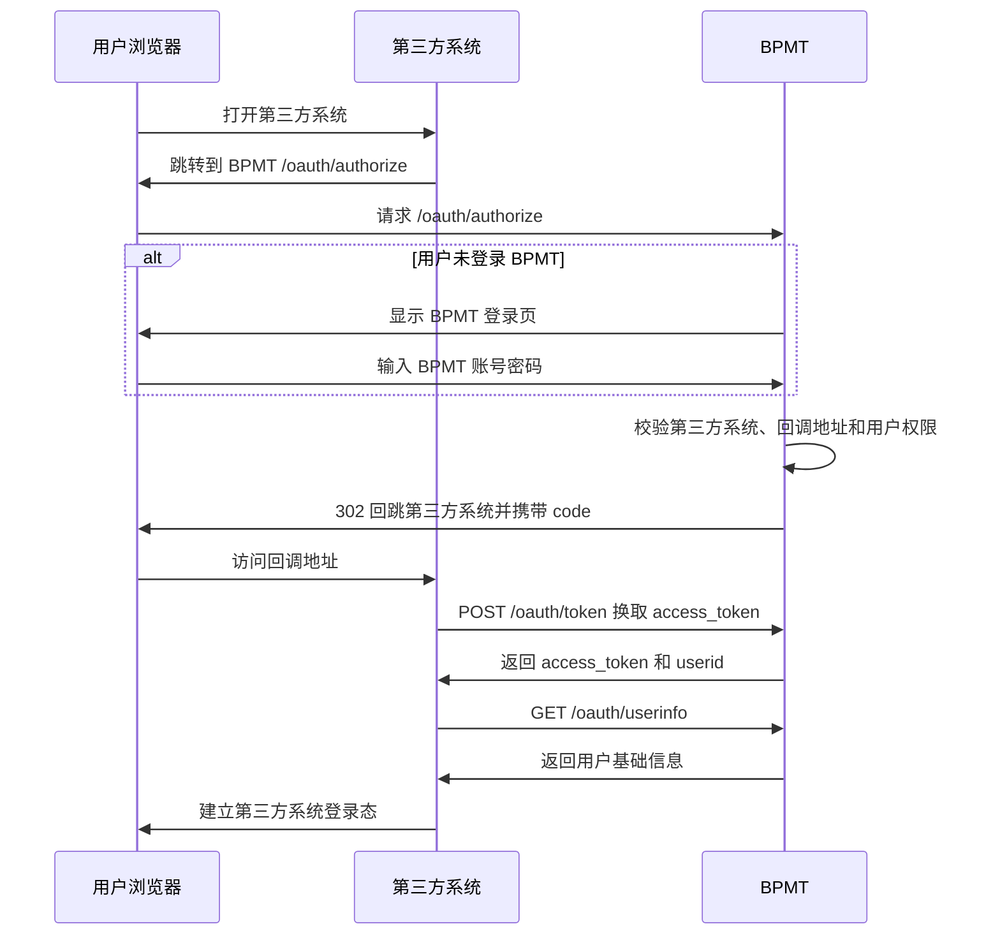
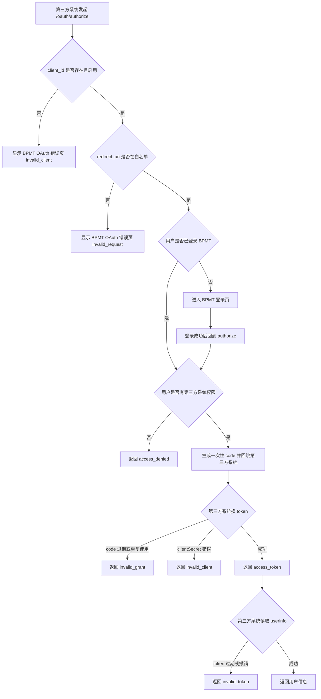

# OAuth 第三方登录

从 `bpmt-lite v1.5.0` 开始，BPMT 可以作为第三方系统的统一登录入口。第三方系统把用户带到 BPMT 登录，BPMT 登录成功后再把用户带回第三方系统。

## 适用版本

本章适用于 `bpmt-lite v1.5.0` 及后续继续保留相同 OAuth 端点的版本。该能力使用 OAuth2 授权码登录方式，复用 BPMT 原有账号、登录页和权限配置。

## 这项能力解决什么问题

企业里常见的第三方业务系统通常也需要登录。启用本能力后，第三方系统可以把登录入口交给 BPMT，由 BPMT 负责确认用户身份和第三方系统访问权限。第三方系统拿到 BPMT 返回的登录结果后，再在自己的系统里建立登录态。

这适合需要统一入口、统一用户权限、又不想让每个第三方系统重复维护 BPMT 用户密码的场景。

## 管理员需要先配置什么

1. 在 BPMT 后台进入 `系统开发 -> 第三方系统`。
2. 新增第三方系统，填写系统名称、`client_id`、回调地址、首页地址和权限点。
3. 保存后记录系统生成的 `clientSecret`。该密钥只展示一次，丢失后需要重置。
4. 进入 `权限组管理 -> 第三方系统权限`，把对应第三方系统权限分配给允许访问的用户或角色。
5. 把 `client_id`、`clientSecret`、回调地址和 BPMT OAuth 地址交给第三方系统维护者。

OAuth 运行数据由 BPMT 自动保存。低代码用户不需要直接维护数据库表，也不需要手工处理授权码或 token 的存储。

## 登录顺序



## 常见鉴权情况



## 接入端点和参数

| 方法 | 路径 | 用途 |
| --- | --- | --- |
| `GET` | `/oauth/authorize` | 浏览器授权入口 |
| `POST` | `/oauth/token` | 使用授权码换取 access token |
| `GET` | `/oauth/userinfo` | 使用 access token 读取当前用户基础信息 |

`GET /oauth/authorize` 参数：

| 参数 | 是否必填 | 取值或说明 |
| --- | --- | --- |
| `response_type` | 是 | 固定为 `code` |
| `client_id` | 是 | 第三方系统的 OAuth 客户端标识 |
| `redirect_uri` | 是 | 必须与 BPMT 后台登记的回调地址精确匹配 |
| `state` | 否 | 第三方系统自定义状态值，BPMT 会原样带回 |

`POST /oauth/token` 参数：

| 参数 | 是否必填 | 取值或说明 |
| --- | --- | --- |
| `grant_type` | 是 | 固定为 `authorization_code` |
| `code` | 是 | `/oauth/authorize` 回跳时返回的一次性授权码 |
| `redirect_uri` | 是 | 必须与申请授权码时使用的回调地址一致 |
| `client_id` | 是 | 第三方系统的 OAuth 客户端标识 |
| `client_secret` | 是 | 第三方系统保存的密钥 |

成功响应示例：

```json
{
  "access_token": "opaque-token",
  "token_type": "Bearer",
  "expires_in": 7200,
  "userid": "admin"
}
```

`GET /oauth/userinfo` 请求头：

| 请求头 | 是否必填 | 取值或说明 |
| --- | --- | --- |
| `Authorization` | 是 | `Bearer <access_token>` |

成功响应示例：

```json
{
  "userid": "admin",
  "name": "管理员",
  "group": {
    "groupKey": "default",
    "name": "默认组织"
  },
  "role": {
    "roleKey": "admin",
    "name": "管理员"
  }
}
```

## 错误码和应对建议

| 错误码 | 用户可能看到 | 第三方系统应对 | BPMT 管理员检查 |
| --- | --- | --- | --- |
| `invalid_request` | 登录失败或参数错误提示 | 检查请求参数，特别是 `redirect_uri` 和 `response_type` | 确认回调地址配置和第三方系统文档一致 |
| `invalid_client` | 第三方系统不可用 | 检查 `client_id`、`clientSecret` 和系统启停状态 | 确认第三方系统存在、已启用，必要时重置密钥 |
| `invalid_grant` | 登录回调失败或需要重新登录 | 重新发起 `/oauth/authorize`，不要重复使用旧 `code` | 检查授权码是否过期、是否被重复使用 |
| `invalid_token` | 登录态失效 | 引导用户重新走 OAuth 登录 | 检查 token 是否过期、撤销或格式错误 |
| `unsupported_grant_type` | 第三方系统接入方式不支持 | 使用 `authorization_code` | 确认第三方系统没有使用密码模式或刷新 token |
| `access_denied` | 当前用户无权进入第三方系统 | 给用户显示无权限提示 | 到 `权限组管理 -> 第三方系统权限` 分配权限 |

OAuth 错误 JSON 示例：

```json
{
  "error": "invalid_grant",
  "error_description": "authorization code is invalid, expired, or already used"
}
```

## 安全提醒

- `clientSecret` 不要放在前端页面、浏览器地址、公开文档或日志里。
- 回调地址必须固定并精确匹配，避免使用过宽的跳转地址。
- 日志不要记录明文 `code`、`access_token`、`client_secret`、`password`。
- 第三方系统应自己建立本系统登录态，不要把 BPMT 的 access token 当成长久会话凭证。

## 边界说明

- BPMT 菜单里的第三方 URL 或 iframe 只是打开第三方页面，不等于自动完成 OAuth 登录。
- 第三方页面没有自己的登录态时，应由第三方系统自行跳转到 `/oauth/authorize`。
- `v1.5.0` 不提供 OIDC、`id_token`、`refresh_token`、跨系统单点登出或独立 demo。
- 当前没有完善 demo，本章先使用流程图说明，不放真实截图。
