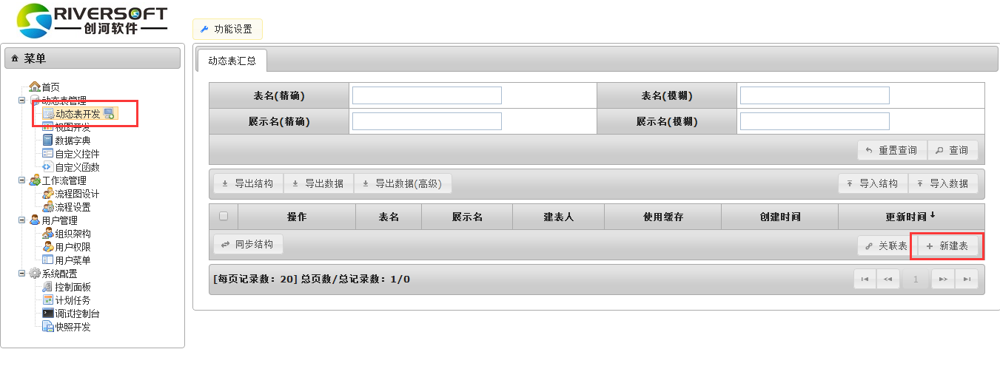
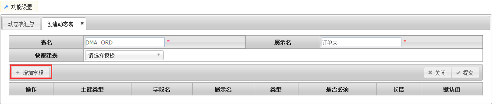
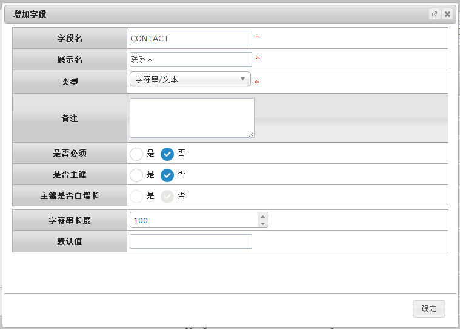
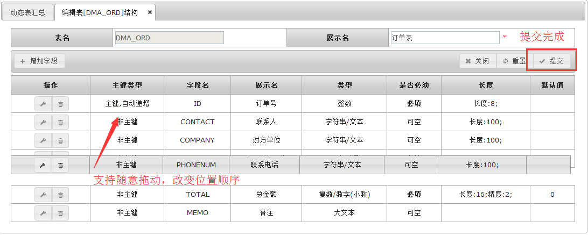
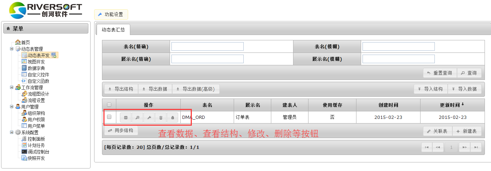

# 数据库设计
数据库设计是指对于一个给定的应用环境，构造最优的数据库模式，建立数据库及其应用系统，使之能够有效地存储数据，满足各种用户的应用需求。
## 动态表创建 ##
动态表是真实存在的数据库表，负责存储数据。
####建动态表
功能设置>菜单>动态表开发>新建表

填入表信息，表名：DMA_ORD；展示名：订单表;点击“新增字段”，开始为订单管理表设置字段  

####自定义字段
点击“增加字段”后，可在弹出的窗口中填入字段的信息。
字段名只允许为大写字母、下划线和数字，且保存后不能修改。
展示名是用户最终看到的信息，支持中文，允许修改。

####提交保存
建好后的字段可以自由拖曳调整顺序。确定无误后点击提交生成。

提交后回到“功能设置>菜单>动态表开发”中可以看到新建好的订单表（表名：DMA_ORD）。也可点击表记录左侧的按钮进行查看、修改和删除等操作。

`by Kim`
