# 工作流设计
工作流设计是对工作流程及其各操作步骤之间业务规则的抽象，利用计算机实现协同工作的过程。

##  流程图设计

### 新建流程图
功能设置>菜单>工作流管理>流程图设计
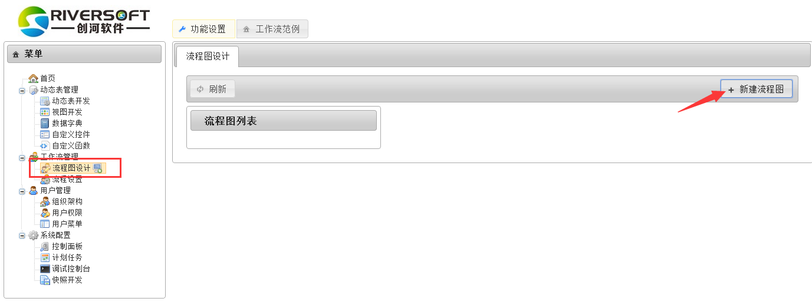
填写展示名和类别
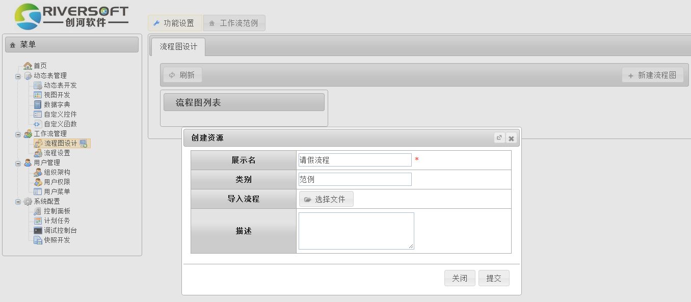

### 设计流程图

点击[设计]可设计并编辑流程图；第一次打开时可能需要稍候。
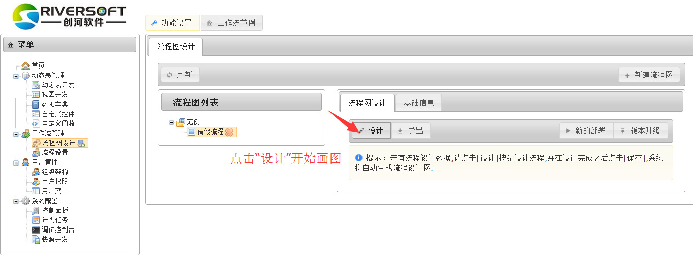

系统采用Activiti Modeler内核来生成流程图
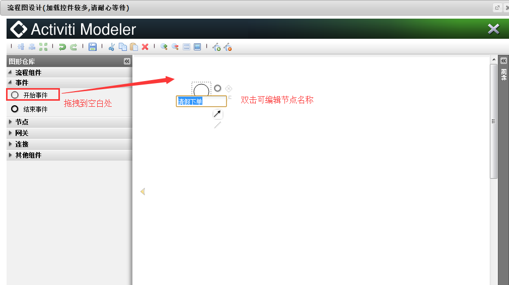

根据业务实际情况拖拽编辑
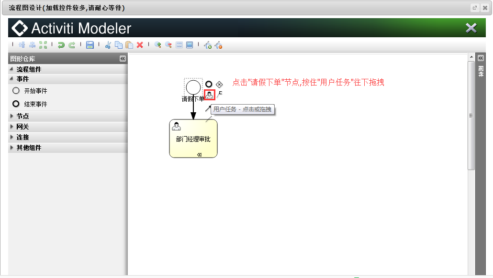

完成节点
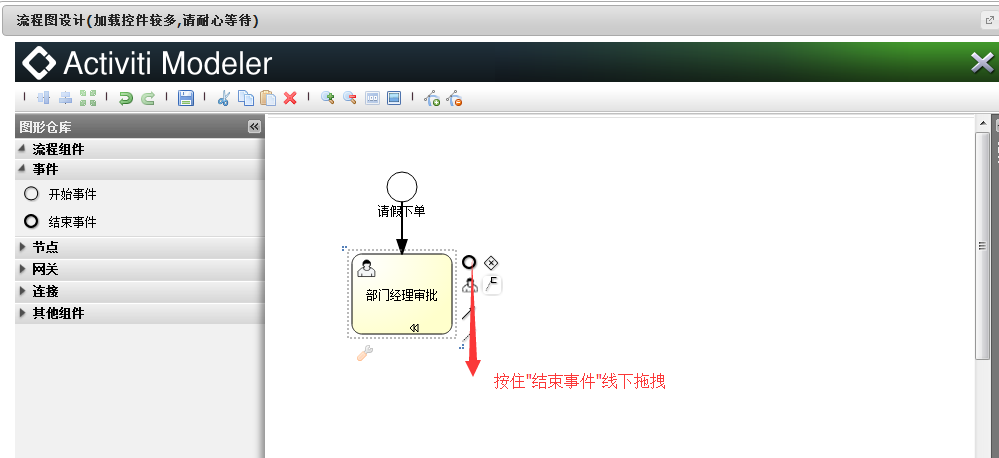

绘制反向连线
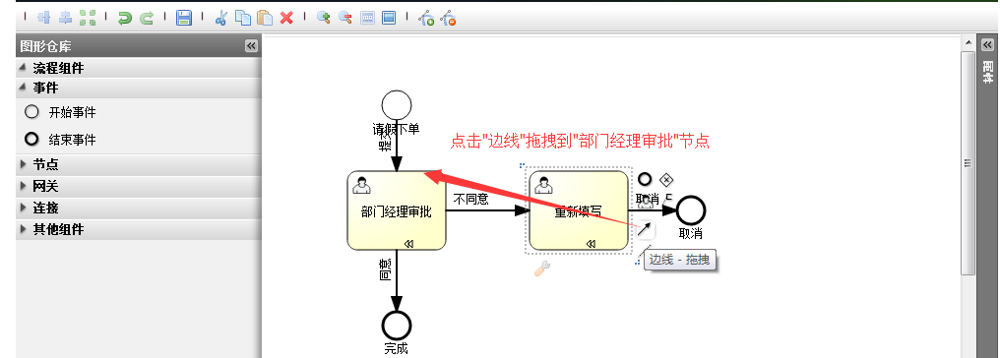

添加辅助点,拖动使两个逆向连线错开
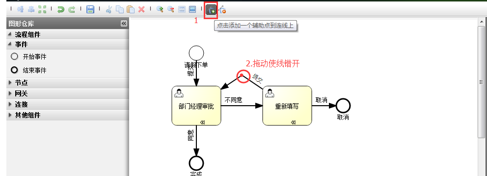

在流程图的侧边框补充填写流程名称和编号,并保存
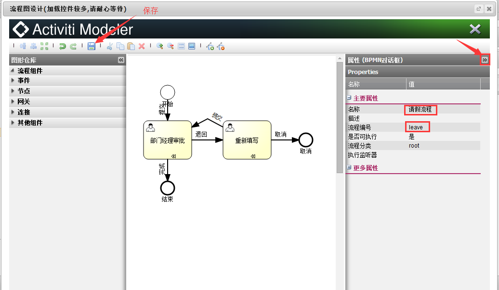

### 部署流程图
部署新的流程图,相当于创建一个全新的流程.
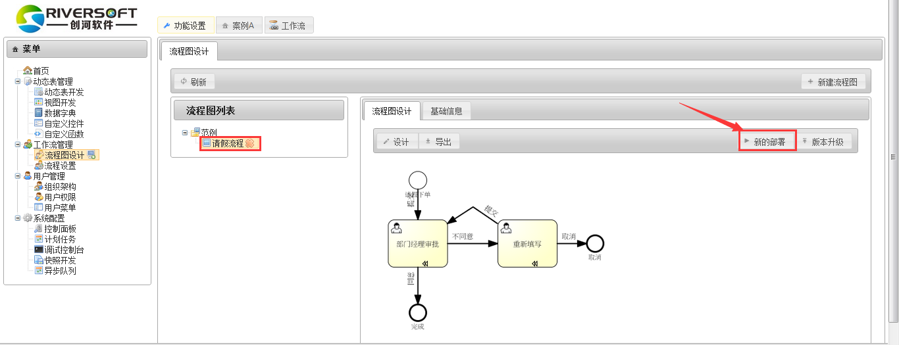

创建表、对应的历史表和审批意见表

订单表可自动创建也可以选择已经建好的动态表,历史表和审批意见表建议自动创建且规划好方便以后维护
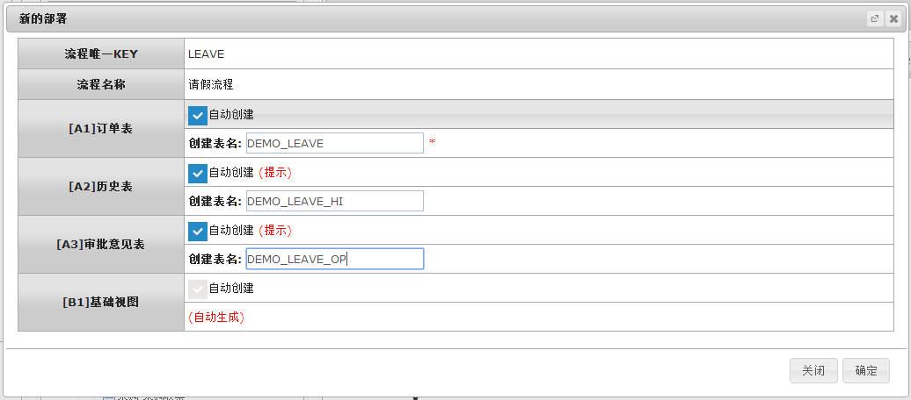

### 流程版本升级(拓展)
对于已有的流程,若对流程图进行调整或者重新设计,则需要进行版本升级。

注意：对于旧版本正在执行过程中的实例,会按照旧版本的流程图继续执行。新增的实例才会按照升级后的流程图执行。

找到对应的流程图,点击[版本升级]
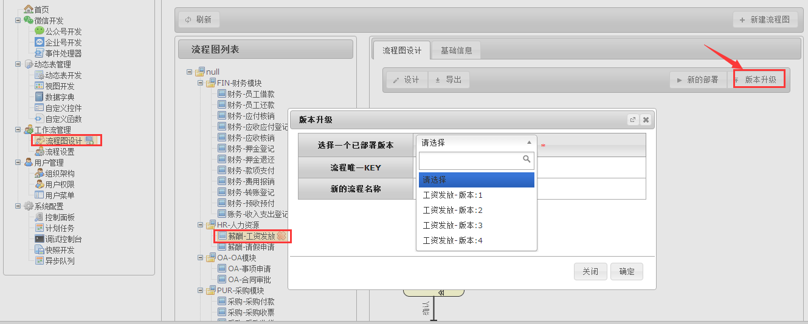

## 流程设置
详见章节5.2,工作流视图

`by Kim`
