# 企业号

----------

## 基础配置

在微信开发->企业号开发中进行参数配置：

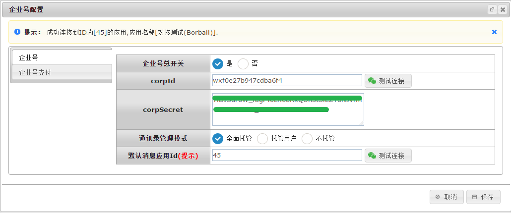

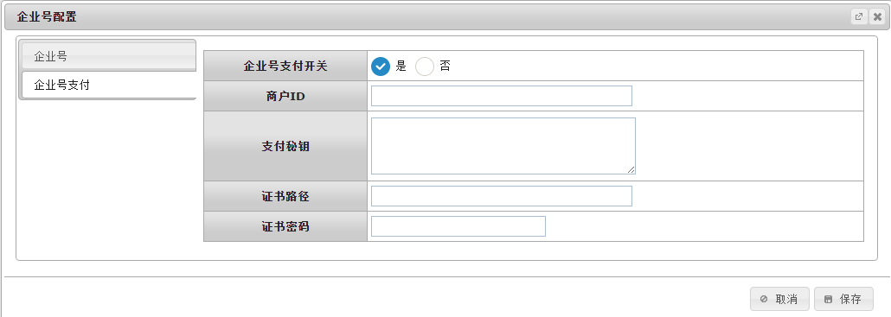

## 应用管理

### 创建

应用的创建需要在微信企业号[后端管理平台](https://qy.weixin.qq.com/)完成。添加完成后微信会生成一个应用ID，比如下图中45：

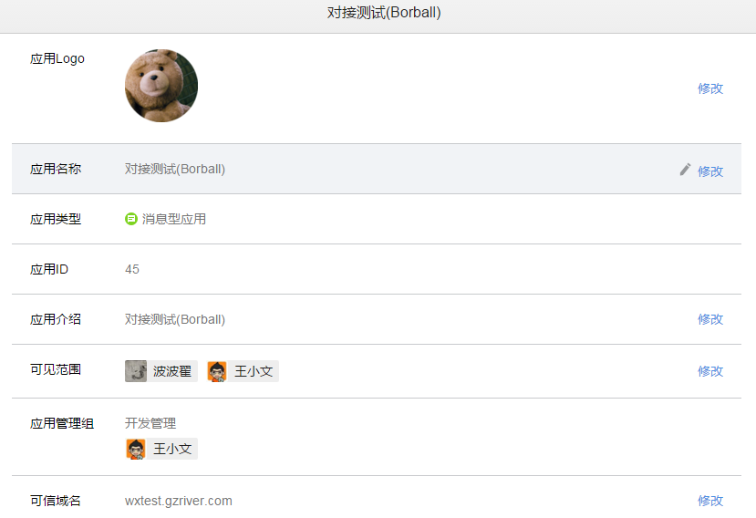

选择回调模式，然后输入回调URL，token和EncodingAESKey：

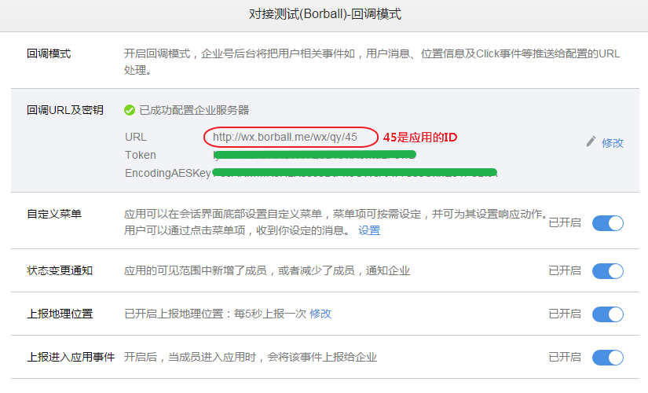

此时保存会失败的，因为微信会发验证请求到上面所填的URL，但是此时该应用还没在BPMT端做配置。

### 对接

回到BPMT中企业号开发，使用‘新建应用’来配置之前在微信后台创建的应用：输入应用ID，并且验证，正常情况下会有应用LOGO出现，之后输入token和EncodingAESKey。

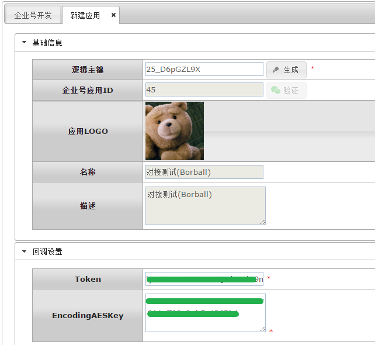

然后回到微信企业号[后端管理平台](https://qy.weixin.qq.com/)，尝试再次保存回调模式的设置，正常情况应该能保存成功。

再次回到企业号开发，刷新页面会看到该应用已经对接成功：

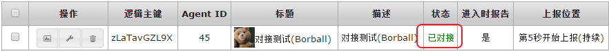

### 菜单设置

菜单可以是事件绑定或者视图绑定。

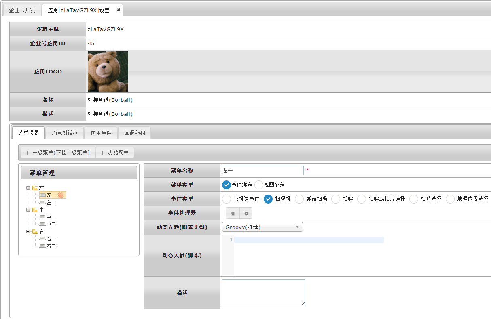

### 消息对话框

消息对话框可以绑定到事件处理器，也可以将对话框消息保存到数据库：

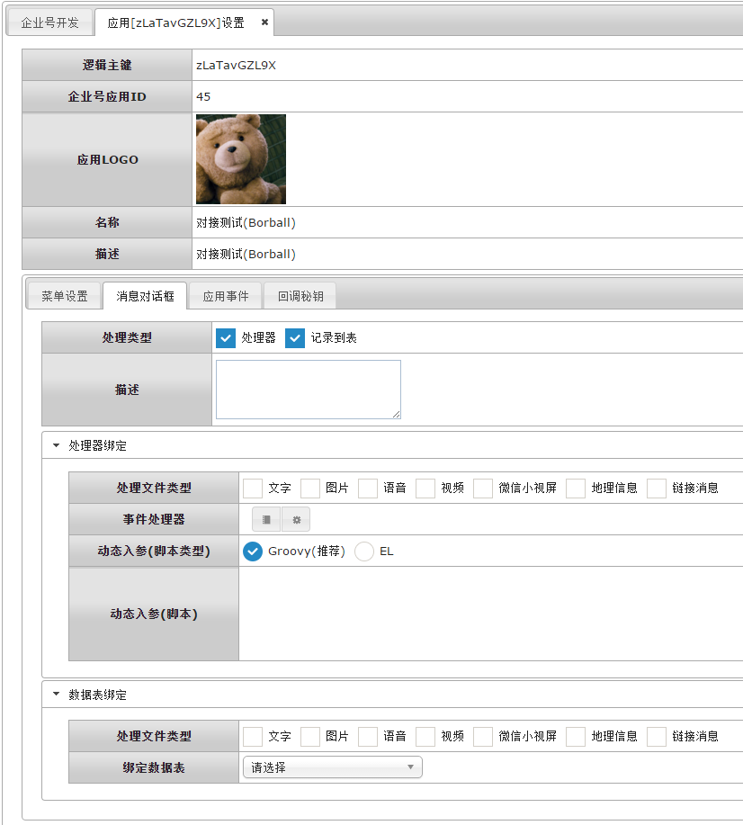

### 应用事件

企业号应用的事件可以绑定到事件处理器：

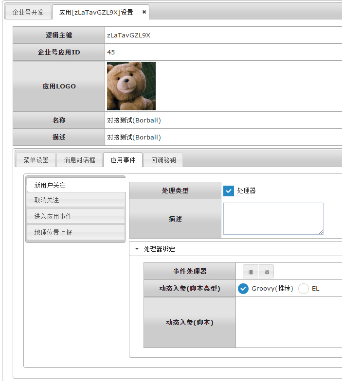

### 回调秘钥

企业号应用的回调秘钥可以重设：

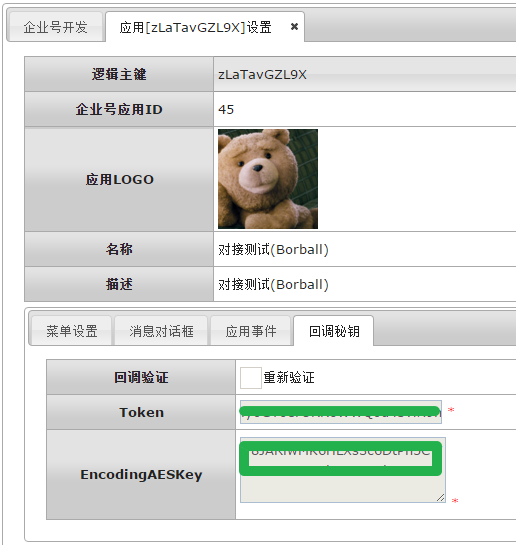

### 应用发布

以上功能设置好之后，特别是菜单创建完成之后，可以使用应用发布功能来发布微信企业号应用。

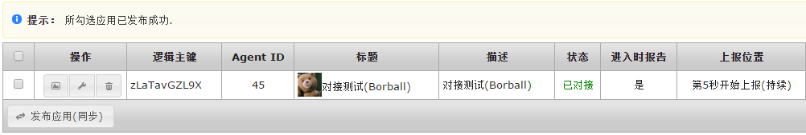

@by borball
