# 公众号

公众号包含订阅号和服务号

----------

## 创建

在微信开发->公众号开发中：‘新建’，按提示输入以下信息：

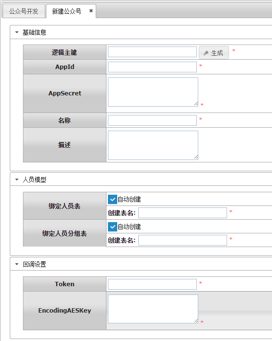

登录到微信公众平台后台管理平台：https://mp.weixin.qq.com/， 在开发-> 基本配置中修改“服务器配置”：

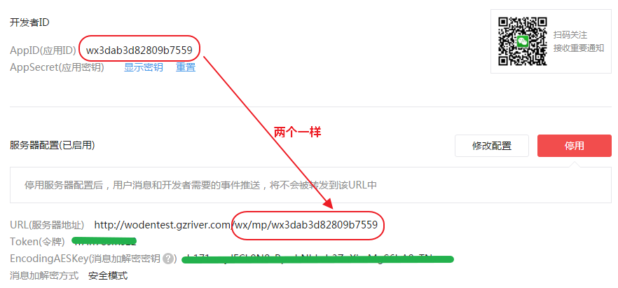

其中URL格式固定为：http://[域名]/wx/mp/appId。

点击保存之后，微信会发送验证请求到上面URL，如果一切正常保存成功之后，返回到BPMT将会看到公众号状态已经改为“已对接”：

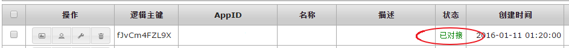

## 菜单

进入公众号编辑界面可以对公众号菜单进行编辑：

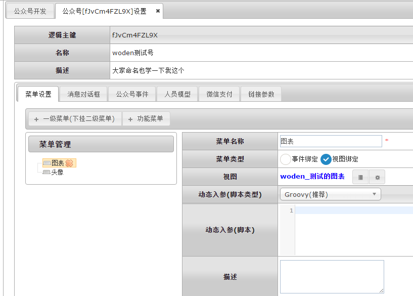

菜单可以是事件绑定或者视图绑定。

参见：事件处理器

## 消息对话框

进入公众号编辑界面可以对公众号消息对话框的处理逻辑进行设置，支持绑定到事件处理器：

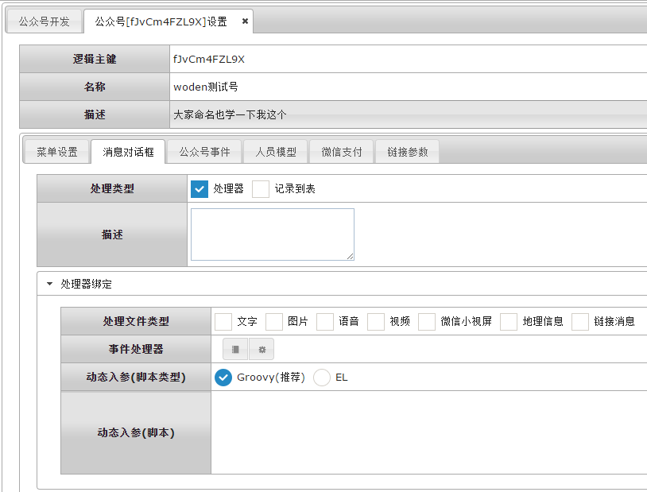

或者记录消息到数据表中：

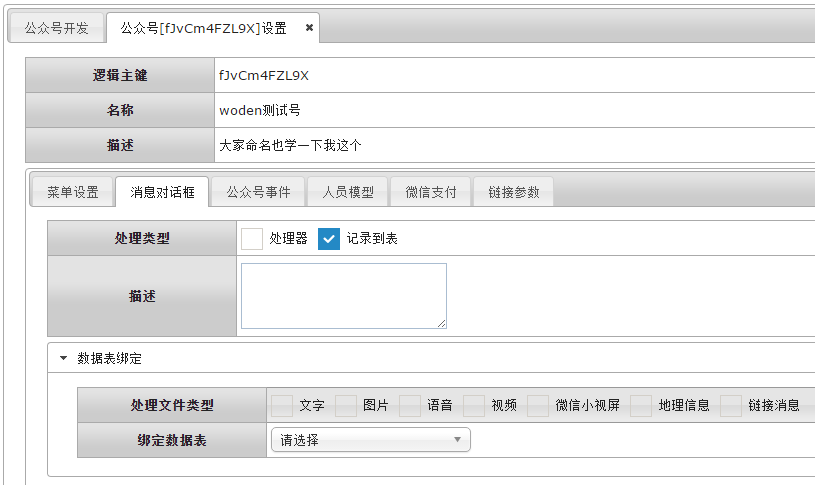

## 公众号事件

进入公众号编辑界面可以对公众号事件的处理逻辑进行设置，支持绑定到事件处理器：

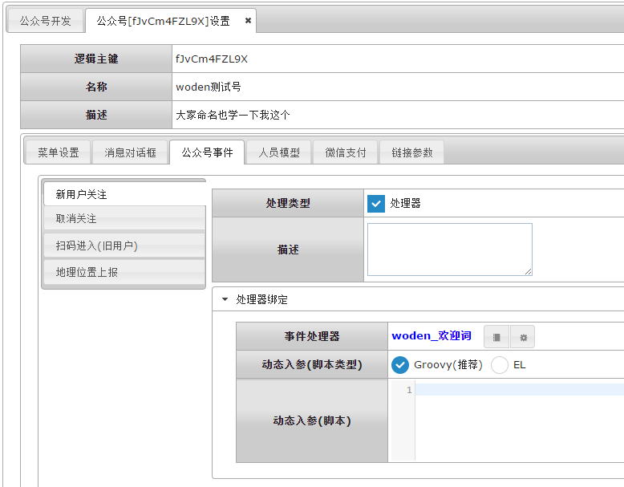

## 人员模型

进入公众号编辑界面可以对公众号的人员模型进行设置：

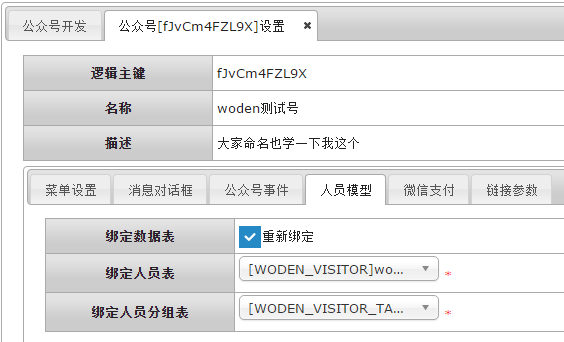

用户模型用户保存该公众号所有关注用户以及用户分组信息。

## 微信支付

进入公众号编辑界面可以公众号支付相关信息进行配置：

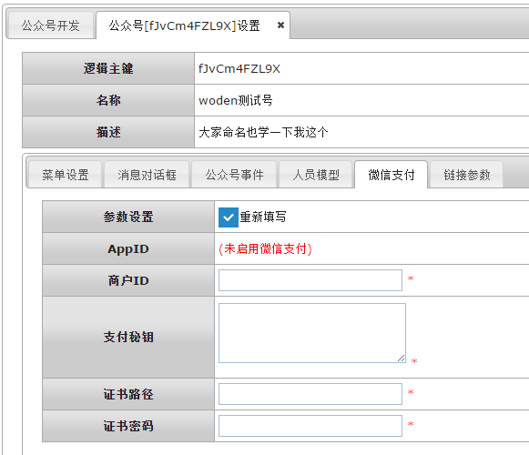

## 链接参数

进入公众号编辑界面可以对公众号基本链接参数进行重新配置：

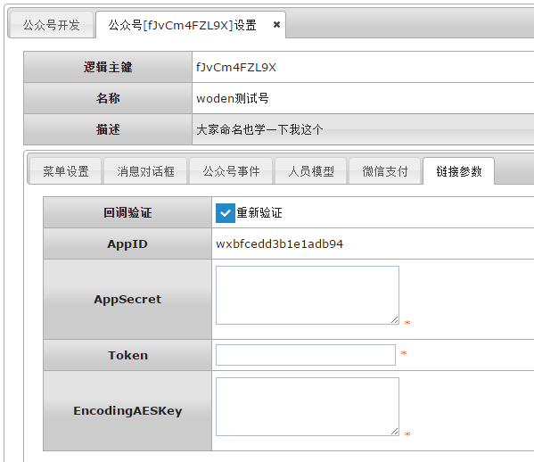

## 公众号发布

以上功能设置好之后，特别是菜单创建完成之后，可以使用公众号发布功能来发布微信公众号应用。

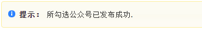

@by borball
