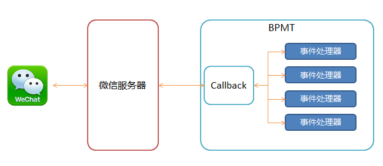

# 事件处理器

微信事件处理器是BPMT中用于开发微信公众号，企业号中各种事件、消息或者交互的业务逻辑。

下图是微信消息或者事件在BPMT微信解决方案里面的数据流：

0. 用户在微信中的发送的各类消息或者触发的事件会上报到微信服务器。
1. 微信服务器会把各类消息和事件按照SDK规范封装并安全转发到响应的回调URL。
2. BPMT收到各种消息或者事件之后会按照在BPMT中配置的事件处理器将消息或者事件分发到各个事件处理器中。
3. 事件处理器进行业务逻辑处理，如果有需要事件处理器可以回复消息给用户。
4. 微信将回复的消息发给用户。

@by borball
