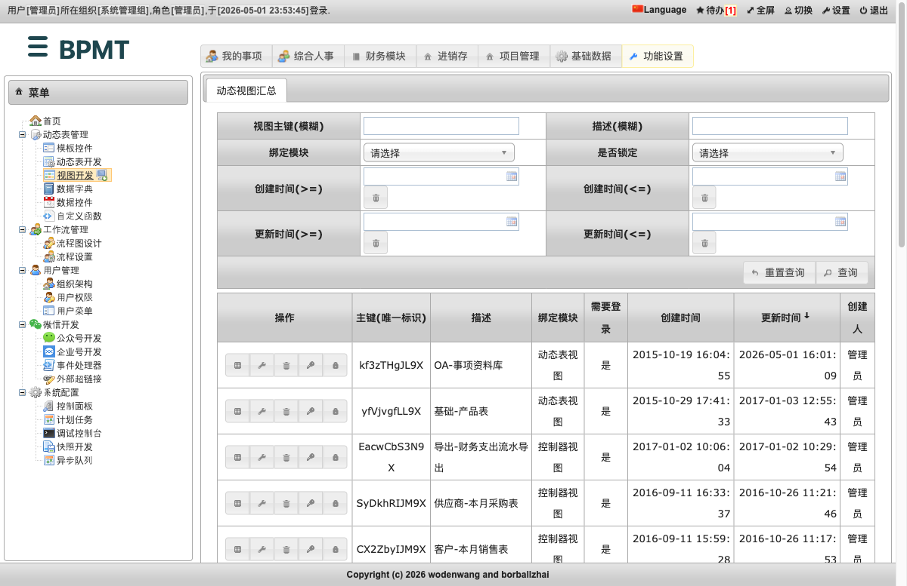
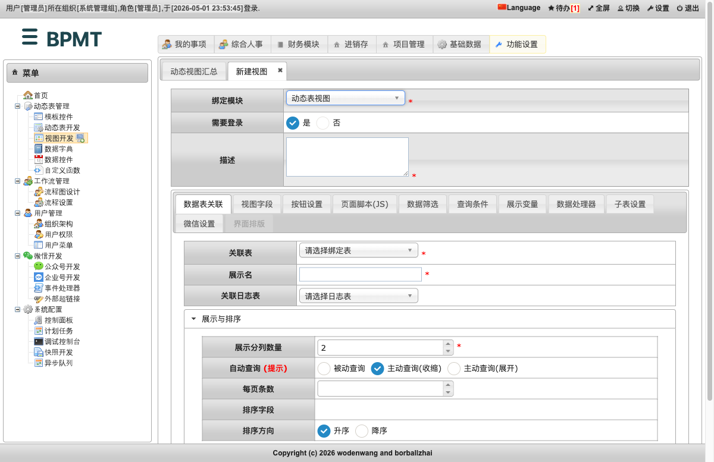
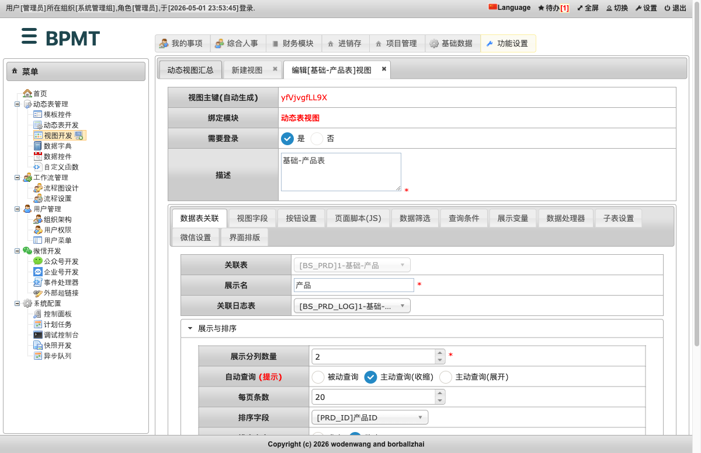
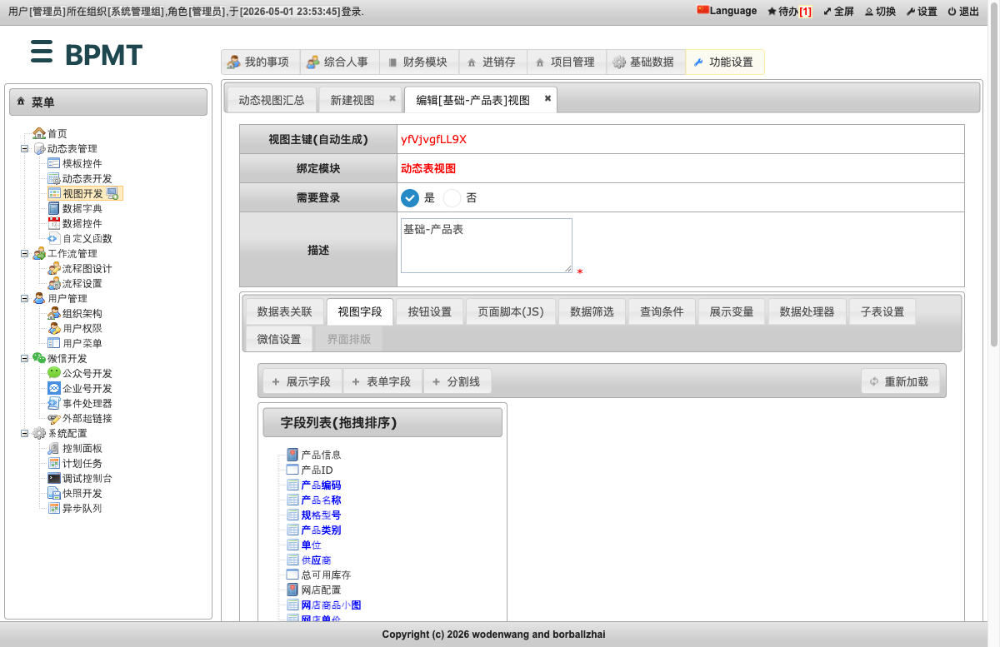
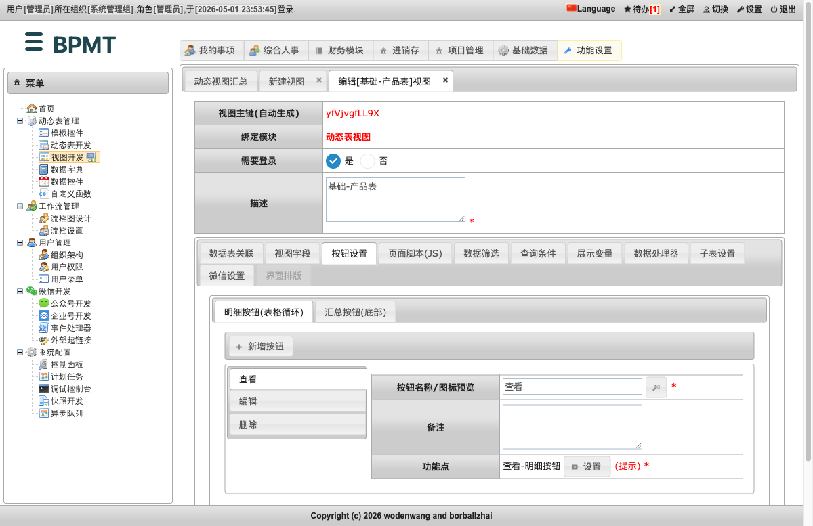
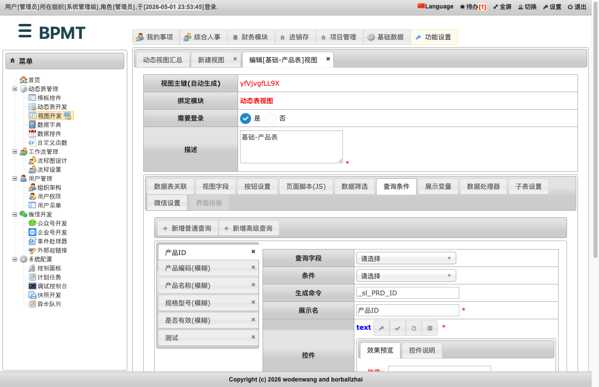
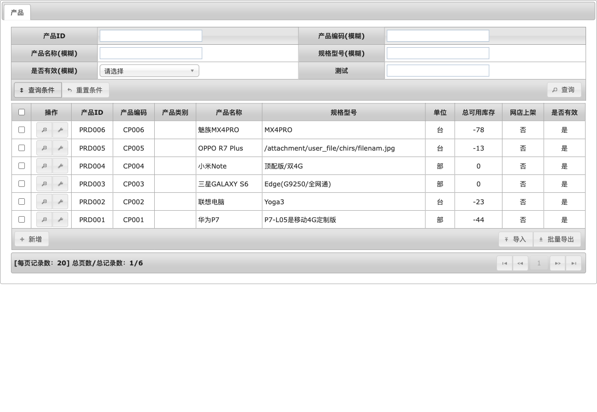
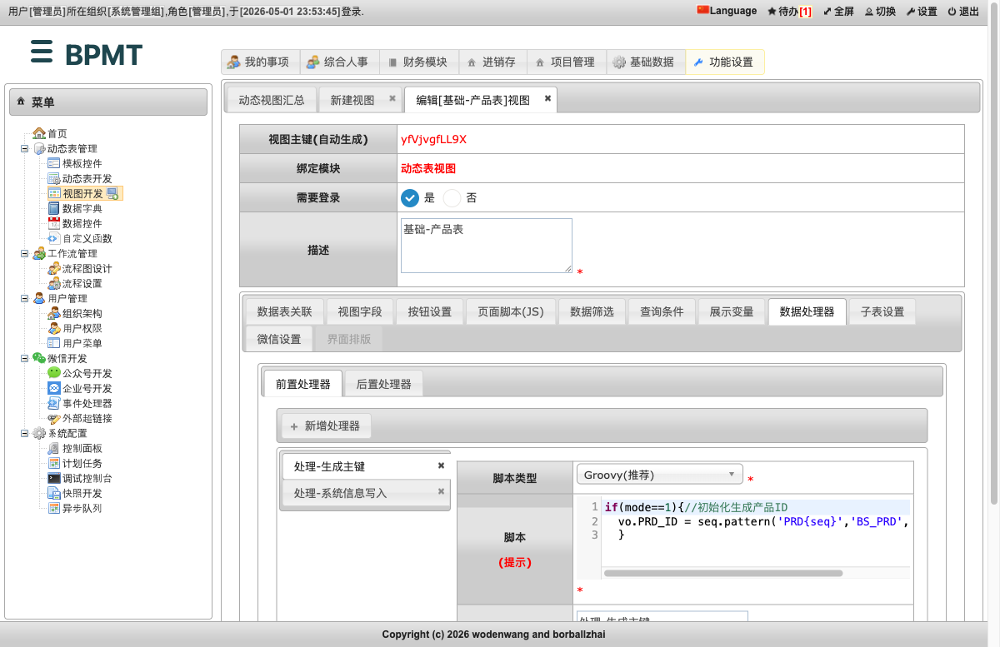
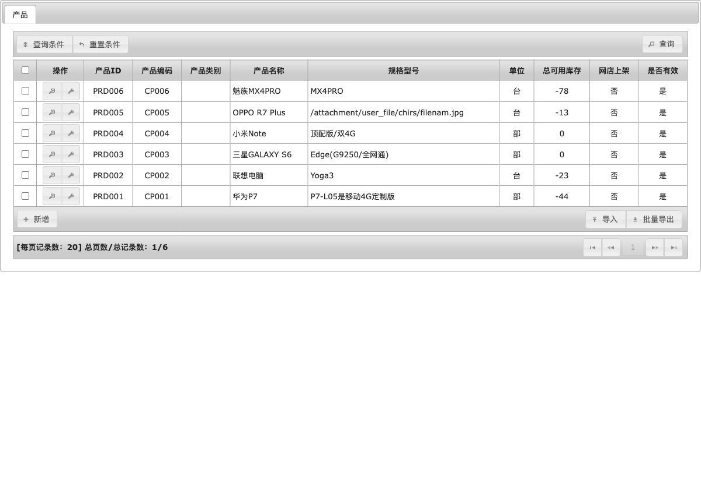
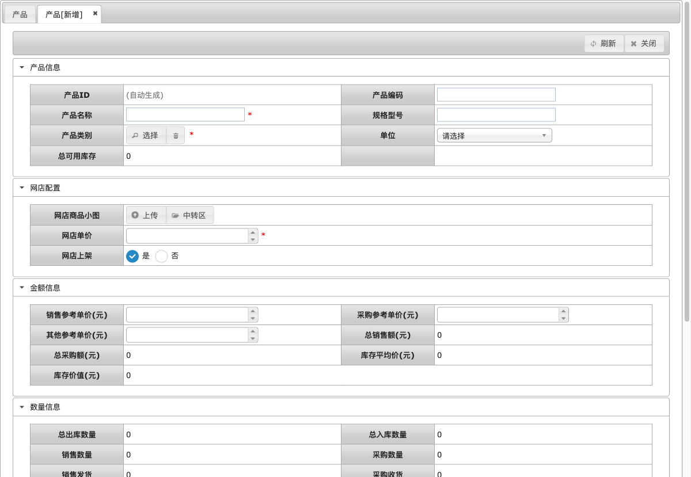

# 动态表视图

动态表视图用于把一张已经设计好的动态表，发布成普通用户可以使用的业务维护页面。发布后，用户可以在页面里查询数据、查看明细、新增记录、编辑记录、导入和导出数据。

它适合做“基础资料维护”和“业务台账维护”，例如产品档案、客户档案、供应商档案、事项资料库、库存台账等。

如果你的目标是做跨表统计、汇总查询、只读分析页面，请优先使用[报表视图](5.3.报表视图.md)。如果你的目标是让数据经过审批流程，请使用[工作流视图](5.2.工作流视图.md)。

## 一、先理解动态表视图做什么

动态表视图不是重新设计数据库表，而是给已有动态表配置一个使用界面。

可以把它理解成三层：

| 层次 | 低代码用户要做什么 | 最终用户看到什么 |
| --- | --- | --- |
| 动态表 | 先准备字段，例如产品编码、产品名称、规格型号、单位 | 数据被保存到这张表 |
| 动态表视图 | 选择哪些字段展示、哪些字段可填写、哪些按钮可用、哪些条件可查询 | 列表页、查询区、录入表单、明细页 |
| 菜单或入口 | 把视图挂到菜单、首页、按钮或其他入口 | 用户点击入口后进入业务页面 |

本节用系统里的“基础-产品表”作为示例，说明如何从视图开发入口创建并检查一个动态表视图。

## 二、进入视图开发

以管理员账号进入系统后，点击顶部的“功能设置”，左侧菜单选择“动态表管理 > 视图开发”。

进入后会看到“动态视图汇总”页面。这里列出了系统中已有的动态表视图、工作流视图、报表视图和控制器视图。

在汇总列表底部点击“新建视图”，开始创建新的动态表视图。

## 三、选择“动态表视图”

在“绑定模块”中选择“动态表视图”。

选择后，页面下方会出现动态表视图专用的配置页签，包括“数据表关联”“视图字段”“按钮设置”“查询条件”“数据处理器”“子表设置”“界面排版”等。

页面上方需要先填写几个基础信息：

| 字段 | 建议填写方式 |
| --- | --- |
| 绑定模块 | 选择“动态表视图” |
| 需要登录 | 通常选择“是”，表示登录用户才能访问 |
| 描述 | 写给管理员看的视图名称，例如“基础-产品表”“客户档案维护” |

描述会出现在视图汇总列表中，建议用“模块-用途”的格式，后续查找和维护更方便。

## 四、配置数据表关联

“数据表关联”决定这个视图维护哪一张动态表。

以下是系统中“基础-产品表”的真实配置示例。

主要字段说明如下：

| 配置项 | 含义 | 建议 |
| --- | --- | --- |
| 关联表 | 选择要维护的动态表 | 先在动态表开发中建好表，再回来选择 |
| 展示名 | 最终用户页面显示的名称 | 用业务名，例如“产品”“客户”“供应商” |
| 关联日志表 | 记录数据变化的日志表 | 有审计要求时选择对应日志表 |
| 展示分列数量 | 表单页面每行显示几列字段 | 常用 2 列；字段很长时可用 1 列 |
| 自动查询 | 进入页面后是否立即加载数据 | 数据量小时可自动查询；数据量大时建议主动查询 |
| 每页条数 | 列表页每页显示多少条 | 常用 20 条 |
| 排序字段 | 列表默认按哪个字段排序 | 建议选择主键、创建时间或业务编号 |
| 排序方向 | 升序或降序 | 新数据优先时选择降序 |

这一步是动态表视图最重要的配置。只要关联表选错，后面的字段、按钮、查询条件都会跟着错。

## 五、配置视图字段

“视图字段”用于决定最终用户能看到哪些字段、录入哪些字段，以及字段在表单里的分组顺序。

系统会根据关联表自动生成一批默认字段。创建简单台账时，通常先使用默认字段，再按需要微调。

常见操作如下：

| 操作 | 用途 |
| --- | --- |
| 展示字段 | 控制列表页和明细页中显示哪些字段 |
| 表单字段 | 控制新增、编辑表单中可以填写哪些字段 |
| 分割线 | 把表单字段分成“基础信息”“金额信息”“备注信息”等分组 |
| 拖拽排序 | 调整字段在页面中的显示顺序 |
| 重新加载 | 关联表字段变更后，重新从动态表同步字段 |

建议从最终用户的录入习惯出发配置字段：

- 高频字段放在前面，例如名称、编码、类别、状态。
- 系统自动生成的字段可以展示，但不要让用户手工填写。
- 不常用字段可以放到靠后的分组里，避免表单一打开就显得复杂。
- 列表页只放最常用于识别和筛选的数据，详细信息放到查看页或编辑页。

## 六、配置按钮

“按钮设置”决定用户在列表和每条数据上可以做什么。

动态表视图有两类按钮：

| 按钮位置 | 常见按钮 | 用户作用 |
| --- | --- | --- |
| 明细按钮 | 查看、编辑、删除 | 针对某一条记录操作 |
| 汇总按钮 | 新增、导入、批量导出、批量删除 | 针对整个列表或多条记录操作 |

系统中“基础-产品表”的配置示例如下：

第一次创建动态表视图时，建议先保留默认按钮：

- 需要让用户维护数据时，保留“新增”和“编辑”。
- 数据有审计要求时，谨慎开放“删除”和“批量删除”。
- 需要线下整理或统计时，开放“批量导出”。
- 需要批量初始化数据时，再开放“导入”。

如果按钮在运行页面中没有出现，通常要同时检查两个地方：视图里的按钮设置，以及该用户是否有对应权限。

## 七、配置查询条件

“查询条件”用于配置列表上方的筛选区。动态表视图的查询条件一般来自关联表字段，不需要写复杂 SQL。

常见查询条件建议如下：

| 业务字段 | 推荐条件 | 说明 |
| --- | --- | --- |
| 编码、名称 | 模糊查询 | 用户通常只记得一部分关键词 |
| 状态、是否有效 | 下拉选择 | 避免用户输入不一致 |
| 日期 | 大于等于、小于等于 | 适合按时间范围查找 |
| 组织、人员、类别 | 选择控件 | 适合从已有数据中选择 |

不要把所有字段都放进查询区。查询条件太多时，用户反而不知道该用哪个。通常保留 3 到 6 个最常用条件即可。

运行页面中点击“查询条件”后，用户会看到这里配置出来的筛选项。

## 八、按需配置数据处理器

“数据处理器”用于在保存数据前后自动执行规则。普通台账页面可以先不配置；当业务有自动编号、自动写入系统信息、保存后联动其他数据等要求时，再使用它。

常见用途包括：

| 场景 | 处理器可以做什么 |
| --- | --- |
| 新增时自动编号 | 保存前生成业务编号或主键 |
| 保存时补充系统信息 | 自动写入创建人、创建时间、组织等 |
| 保存后联动数据 | 同步库存、金额、状态等衍生数据 |
| 保存前校验 | 阻止明显不符合规则的数据进入表 |

如果只是制作一个普通维护页面，可以先跳过此页签。等页面跑通后，再逐步增加自动处理规则。

## 九、提交并预览

配置完成后点击“提交”。回到“动态视图汇总”列表，可以通过“视图预览”打开最终用户页面。

下面是“基础-产品表”的运行效果。

最终用户在这个页面可以完成几类日常操作：

- 点击“查询条件”展开筛选区。
- 点击每行左侧的“查看”进入明细页。
- 点击每行左侧的“编辑”修改当前记录。
- 点击底部“新增”创建一条新记录。
- 点击“导入”批量导入数据。
- 点击“批量导出”导出列表数据。

点击“新增”后，会进入录入表单。表单中的分组、字段顺序、必填项和控件类型，都来自前面“视图字段”和动态表字段的配置。

在新增表单里，低代码用户需要重点检查：

- 必填项是否合理，是否会让用户无法保存。
- 字段分组是否清晰，是否符合业务录入顺序。
- 下拉、选择、上传、日期等控件是否符合字段含义。
- 自动生成字段是否不需要用户手工填写。
- 保存按钮是否能完成一次正常录入。

## 十、最小可用配置清单

如果只是先做一个可用的动态表维护页面，可以按下面清单完成：

| 步骤 | 最小配置 |
| --- | --- |
| 1 | 在动态表开发中准备好业务表和字段 |
| 2 | 新建视图，绑定模块选择“动态表视图” |
| 3 | 在“数据表关联”中选择关联表，填写展示名 |
| 4 | 在“视图字段”中保留常用列表字段和表单字段 |
| 5 | 在“按钮设置”中保留查看、编辑、新增、导出 |
| 6 | 在“查询条件”中配置 3 到 6 个常用筛选项 |
| 7 | 提交后通过“视图预览”检查列表、查询和新增表单 |

这套配置完成后，就能得到一个基础的业务维护页面。后续再根据用户反馈补充导入、批量删除、子表、数据处理器和界面排版。

## 十一、常见问题

### 找不到要关联的表

先确认动态表是否已经创建并保存。动态表视图只能绑定系统已经识别到的动态表。

### 运行页面没有“新增”或“编辑”

先检查“按钮设置”中是否启用了对应按钮，再检查当前用户是否有这个视图和按钮的权限。

### 列表里字段太多或顺序不对

回到“视图字段”调整展示字段和顺序。列表页建议只保留识别记录所需的关键字段。

### 查询条件展开后没有想要的字段

回到“查询条件”页签新增普通查询或高级查询。字段如果来自动态表，优先使用系统提供的字段选择。

### 新增表单太长

在“视图字段”里增加分割线，把字段分成多个业务分组；必要时把低频字段放到靠后分组。

### 保存时报错

优先检查必填字段、字段类型、选择控件是否配置正确。如果配置了数据处理器，还要检查处理器规则是否阻止了保存。

## 十二、与系统实现的对应关系

从低代码使用角度，只需要记住动态表视图的类型是“动态表视图”。系统内部对应的视图类型为 `dyn`，运行页面会根据视图配置自动生成列表、查询、表单、导入和导出能力。

本节内容已按当前运行实例重新核对，不再沿用旧 GitBook 中“动态表-主表管理”等过时说法。
