# 工作流表视图
工作流表视图是将工作流生成的表用视图的方式展现出来，给使用者更直观的体验。

##流程图设计
详见3.工作流设计。

## 流程设置
### 流程概况
此处可以查看[流程唯一key]、[版本]等信息,或者解绑[历史表]/[审批意见表]
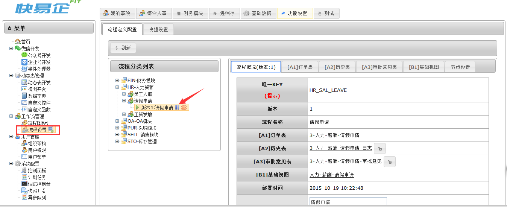
### 订单表
订单表是工作流的数据库。系统会默认生成关键字段(请勿随意删除),开发人员可根据需要另外添加业务字段。具体操作可参考 2.数据库设计
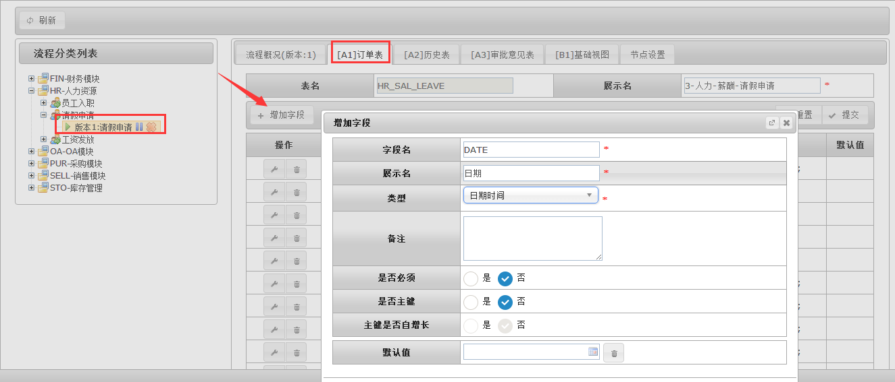
### 历史表和审批意见表
一旦部署完成,系统会默认生成[历史表]和[审批意见表]。若非特殊情况请勿更改,可编辑[展示名]以更好的标识。

### 基础视图
[基础视图]用于工作流的总体界面和具体内容设置。
####基础视图设置主界面
基础视图包含[订单表关联]、[视图字段]、[按钮设置]、[数据筛选]、[查询条件]、[展示变量]、[数据处理器]、[子表设置]、[消息通知]、[界面排版]等
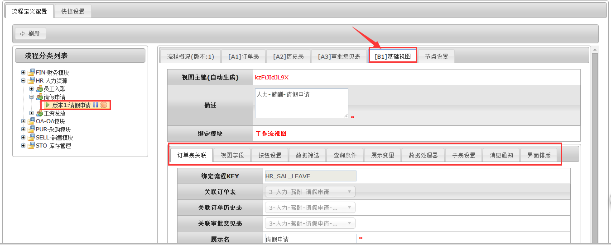
#### *a.订单表关联*
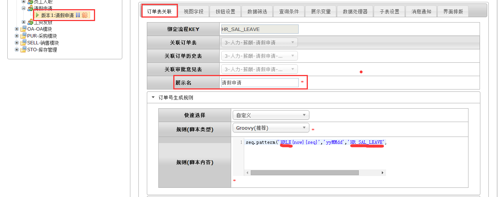
[展示名]和[订单生成规则]效果如下;提示:关于[seq]函数更多详情，请查看"6.2内置函数"章节。
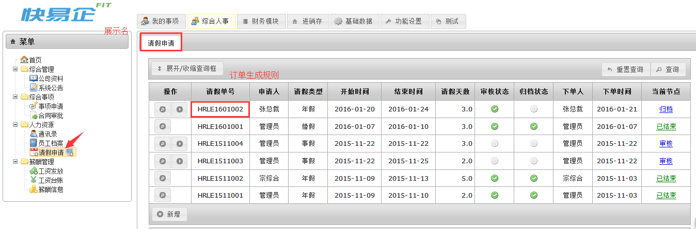

* 展示分类数量：明细页面中竖直列数，系统默认为2；<br>
* 自动查询：查询框的3种方式默认设置方式；<br>
* 每页条数：流程页面订单条数；若不填，系统默认20条；<br>
* 排序字段：流程页面订单的排序；系统默认为主键排序。

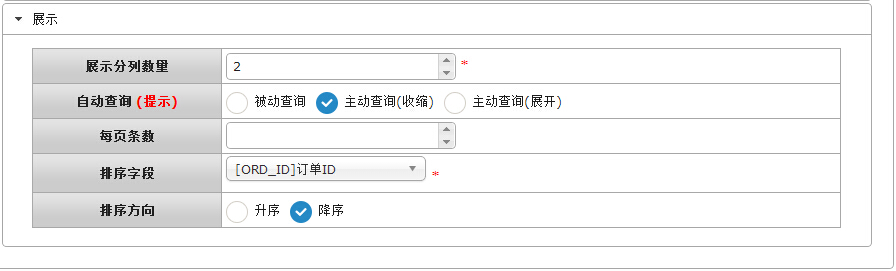

#### *b.视图字段*
此处用于配置流程的[展示字段]的相关属性。<br>
流程部署后系统会自动生成一些系统字段，开发人员再根据具体业务加入[展示字段]；[展示字段]具体效果体现在流程查看时的展示页面。
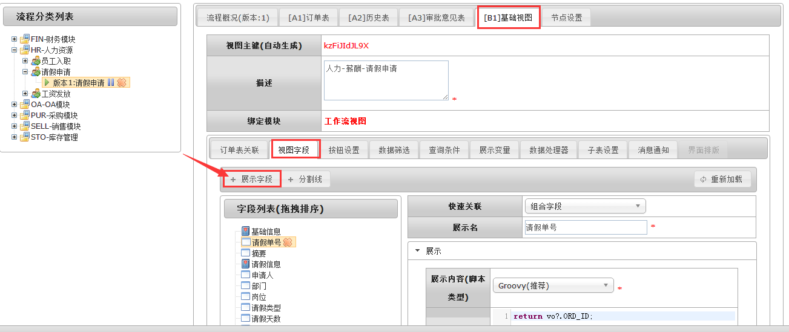

* 快速关联：下拉选择的是[订单表]中的字段，系统会自动生成对应的展示代码、样式、展示权限；<br>
* 展示内容(脚本类型)：一般默认Groovy；<br>
* 展示内容(脚本内容)：Groovy代码具体内容展示；<br>
* 排序字段：举例,用[下单时间]排序,具体效果如下图；<br>
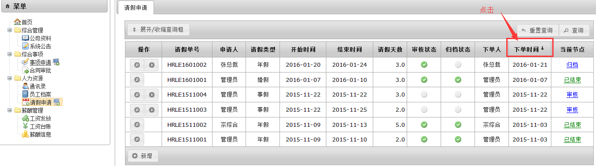

样式布局:
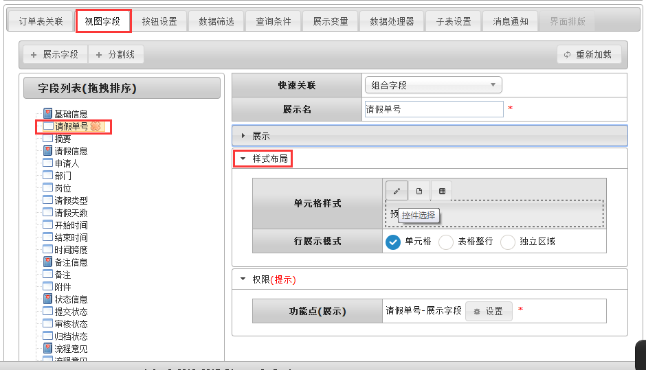
* 单元格格式(控件选择):
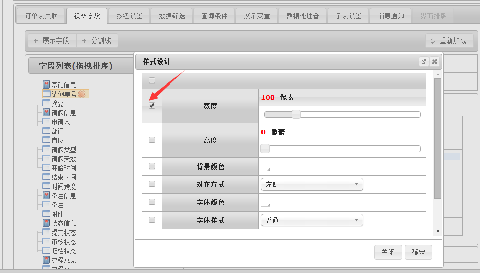

权限:功能点(展示)，该展示字段是否展示出来的权限。权限具体参考8.2

分割线
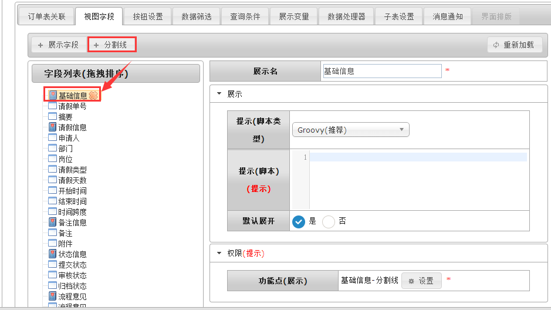

#### *c.按钮设置*
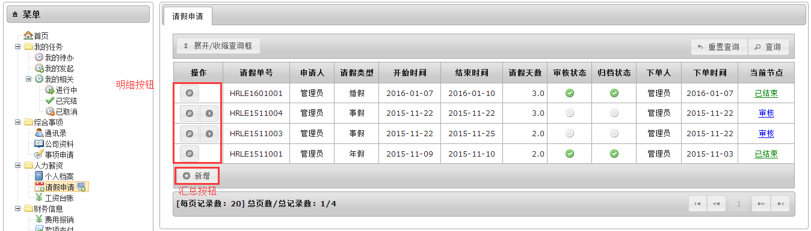
按钮的设置：按钮是否展示的权限；新增[按钮]，比如[打印]之类。
#### *d.数据筛选*
[数据筛选]用于根据不同条件,展示对应的内容实例。
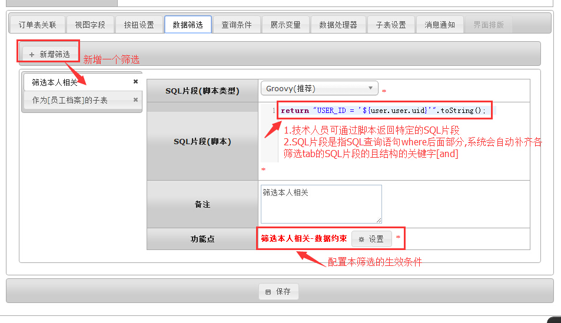
**经验**:[数据筛选]各子表的SQL片段的颗粒度越细越好,一个子表的SQL片段最好只负责一个原子粒度的筛选处理,这样在后期才有更大的空间进行权限的自由组合配置.

#### *e.查询条件*
配置查询，方便查找订单。
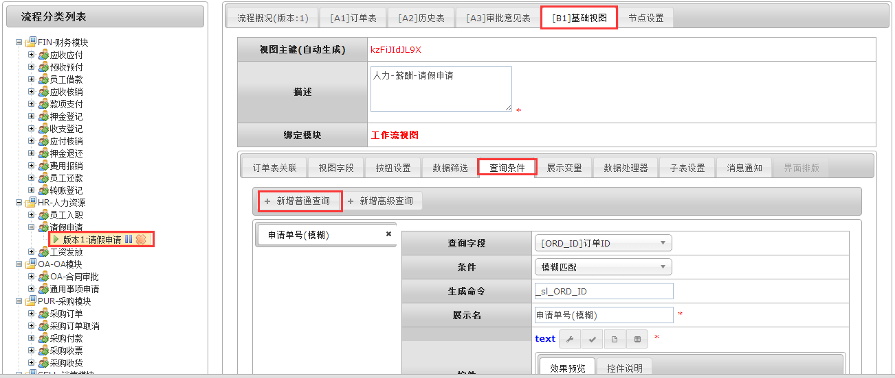
普通查询：<br>

 *  展示内容：选择[订单表]中的字段；
 *  条件：由[查询字段]中具体字段的类型决定；
比如,订单表中字段[BUSI_DATE(日期)]的[类型]是[日期时间]，对应的条件可选择就有[小于等于]等等不同的条件选择。
 *  控件：调用控件 <br>
高级查询：用于设置[订单表]中不存在字段的查询，请在[SQL片段(脚本)]中填写代码；

#### *f.展示变量*
查看 最佳实践
#### *g.数据处理器*
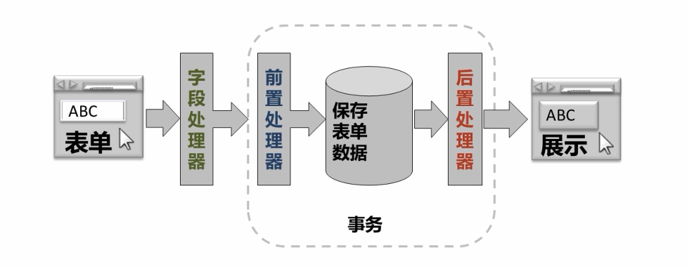
前置处理器：用于保存之前，业务数据的验证。

举例 1
功能菜单>菜单>动态视图开发，在“数据处理器”标签页中点击新增前置处理器。脚本类型选择Grooy后，将下面脚本输入脚本框。
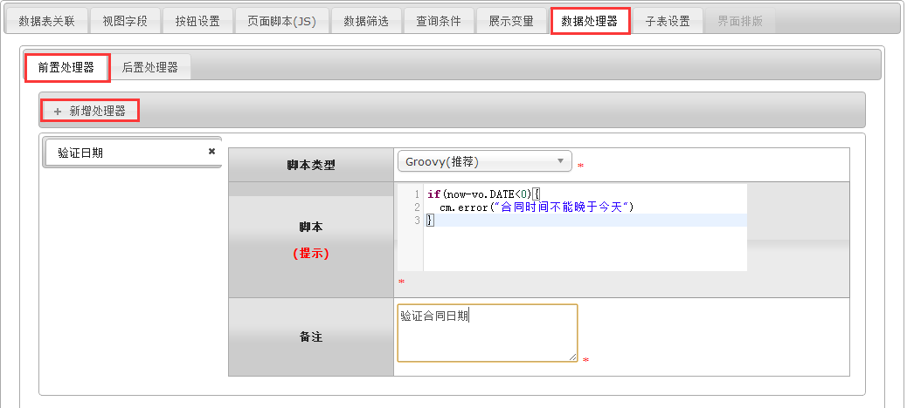

```groovy
if(now-vo.DATE<0){
cm.error("合同时间不能晚于今天");	
}
```
后置处理器：用于数据保存之后，关联表之间的数据回写。


#### *h.子表设置*
用于关联不同的视图，使之建立联系。
举例 1：[采购订单]下挂子表[采购收货单],一张[采购订单]可以有N张收货单，把[采购收货单]挂在[采购订单]下面，可以打通数据，查看[采购订单]时就可以看到这张单是否收货了，收了多少货。
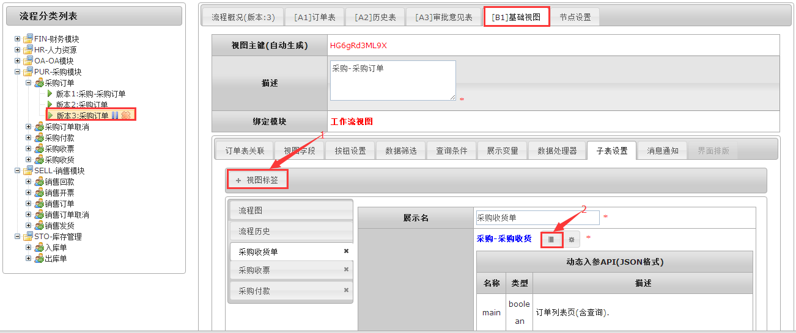
注意：链接视图时需要填写动态入参，具体参考···
#### *i.消息通知*
暂无...
#### *j.界面排版*
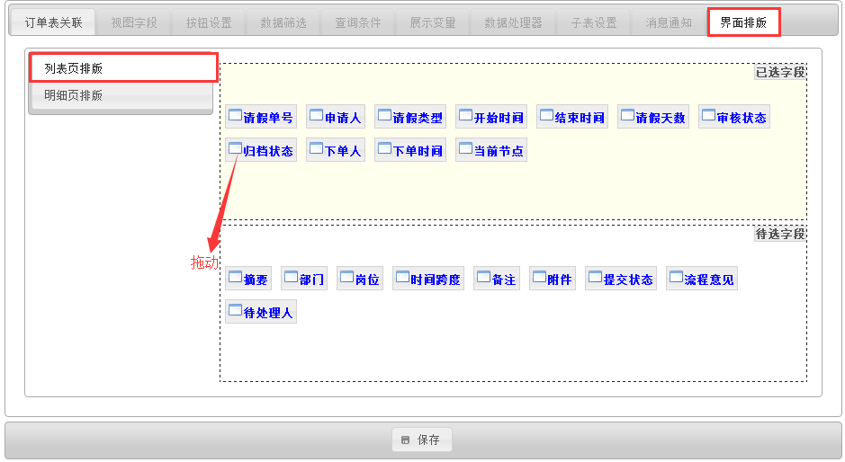
已选字段：页面展示的字段(效果如下图)；
待选字段：页面不展示字段；
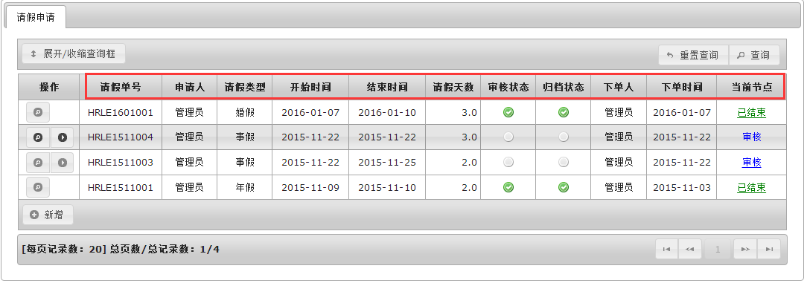
### 节点设置
针对流程中的各个节点做个性化设置。
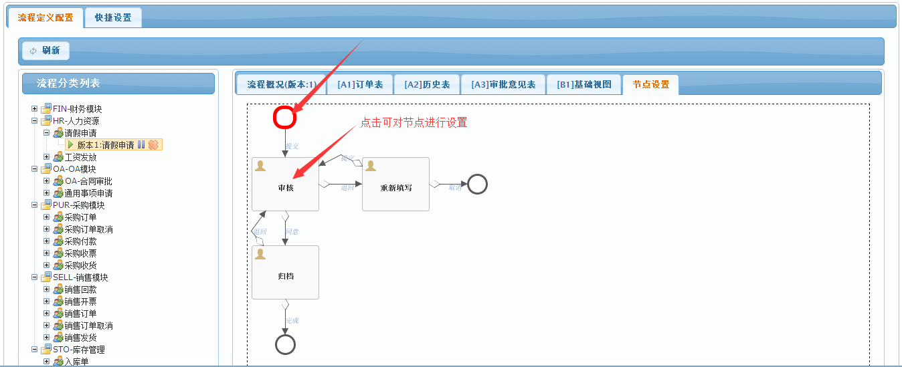
#### *a.字段设置*
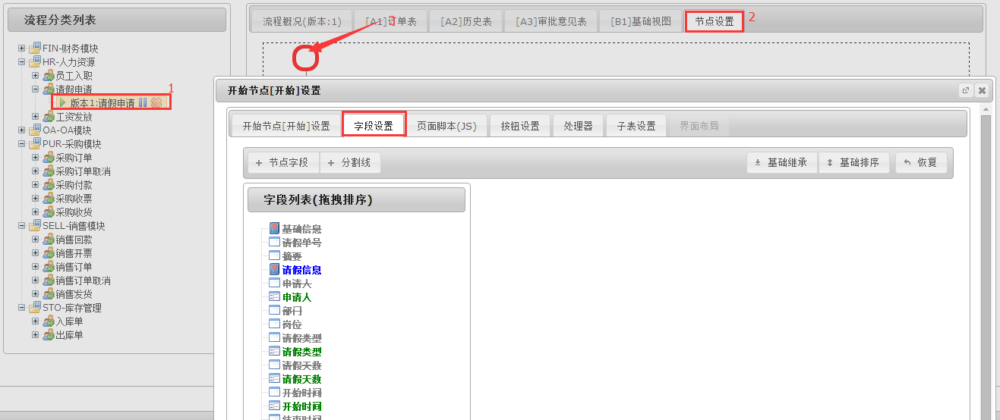

* [节点字段]：能够让用户填写具体信息的字段；

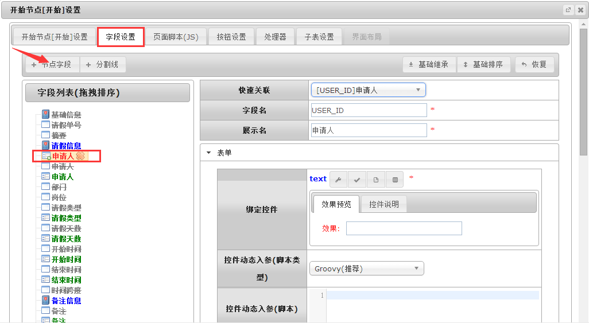
填写提示：
选择[快速关联]订单表字段，系统会自动生成相应信息；
绑定控件请参考：控件开发7.1和7.2。

* 继承

用于继承节点中的展示内容，开始节点默认为空。
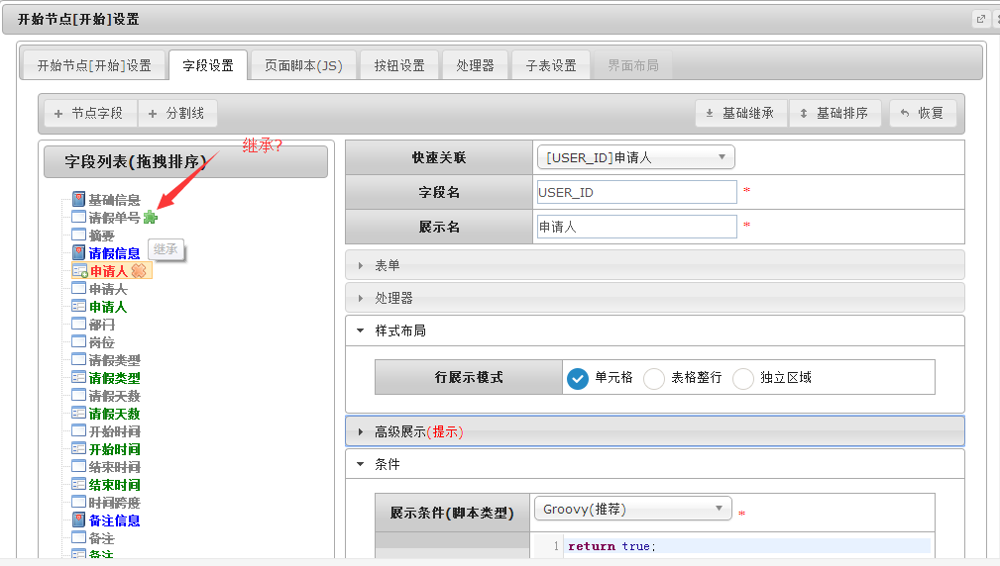

* 基础继承、基础排序、恢复

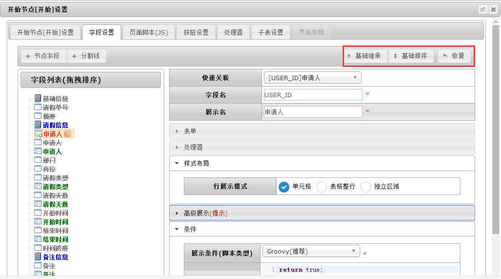
基础继承：继承基础视图中所有字段；
基础排序：按照基础视图中的排序排列；
恢复：恢复上一次字段设置保存结果；
#### *b.页面脚本(JS)*
参考最佳实践...
#### *c.人员分配*
分配该节点由谁来审批，开始节点是无需人员分配。如下图具体分配到用户，将该节点具体分配给[vo.FIRST_APPROVE]。也可以分配给角色、组织＋角色等，请在[分配类型]中选择。
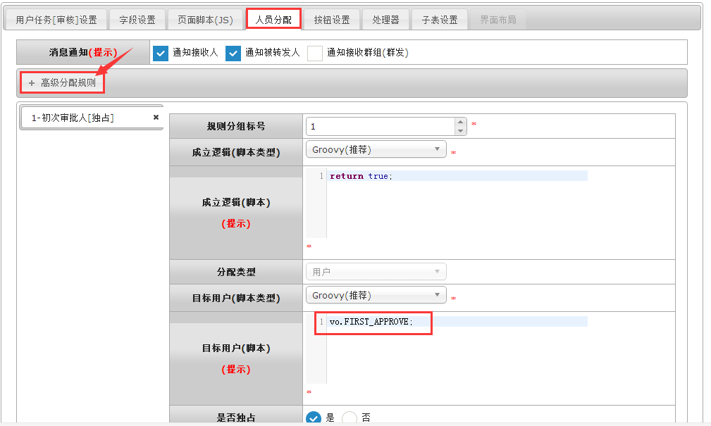

* 是否独占：流程流转到该节点时，是否由该用户独占。如果[分配类型]选择角色,该角色又有多个用户,则无法独占。

#### *d.按钮设置*
对具体流程节点中的按钮做设置。
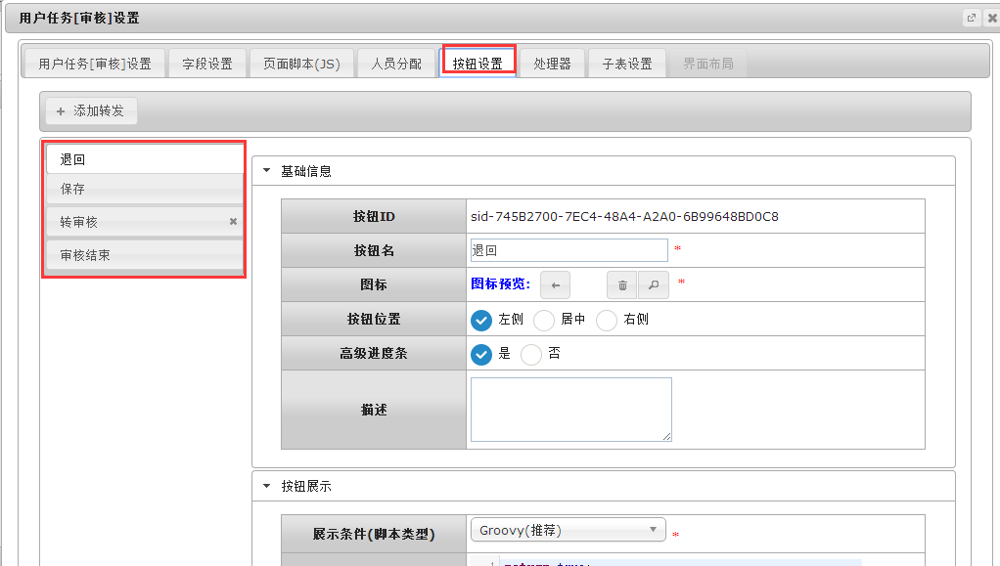
效果如下图：
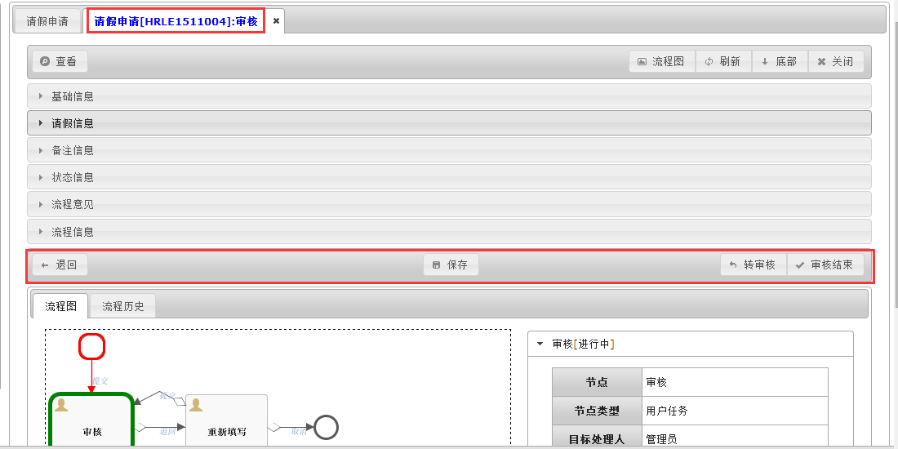

#### *e.处理器*
具体节点中的前置和后置处理器，作用与基础视图中的前后置处理器功能相似。区别在于两点： 

* 基础视图处理器中的内容对整个流程都有效,每一次触动(退回、保存、转交、审核)等
按钮基础视图处理器均会触发；
* 处理器存在触发先后顺序：节点前置处理器->基础视图前置处理器->订单保存逻辑->基础视图后置处理器->节点后置处理器->工作流引擎调用逻辑。

#### *f.子表设置*
具体节点中下挂的子表是否展示权限。
#### *g.界面布局*
具体节点中的字段排序(支持拖拽)。
#### *h.特殊节点*
流程中的取消节点和完成节点。


`by kimlin`
