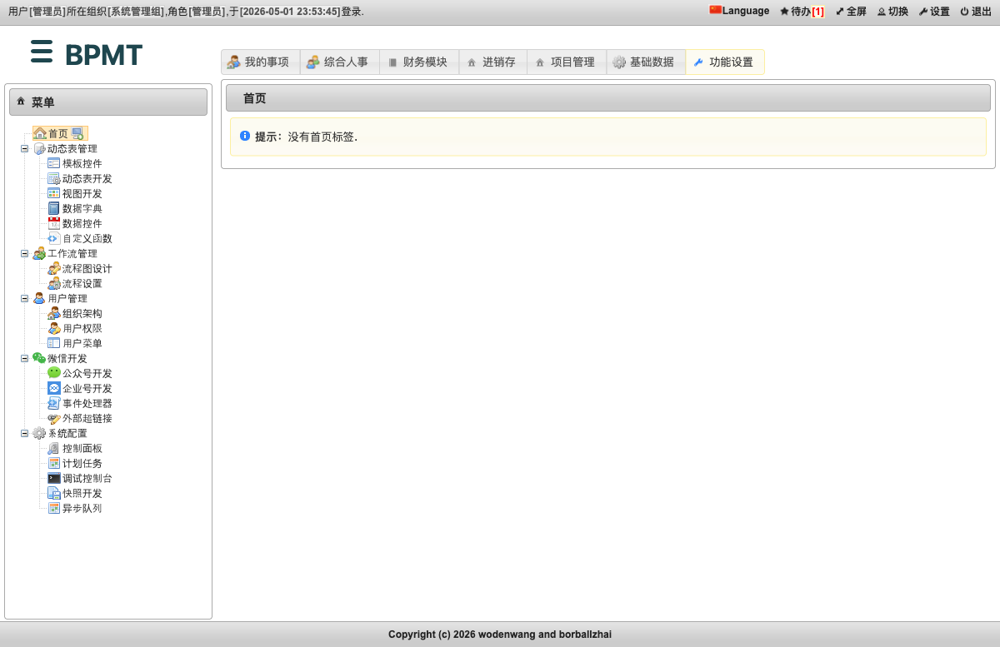
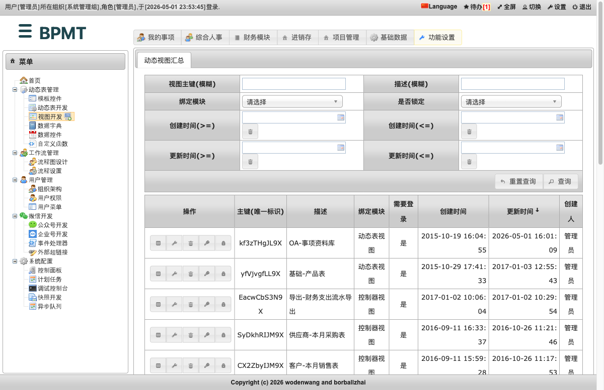
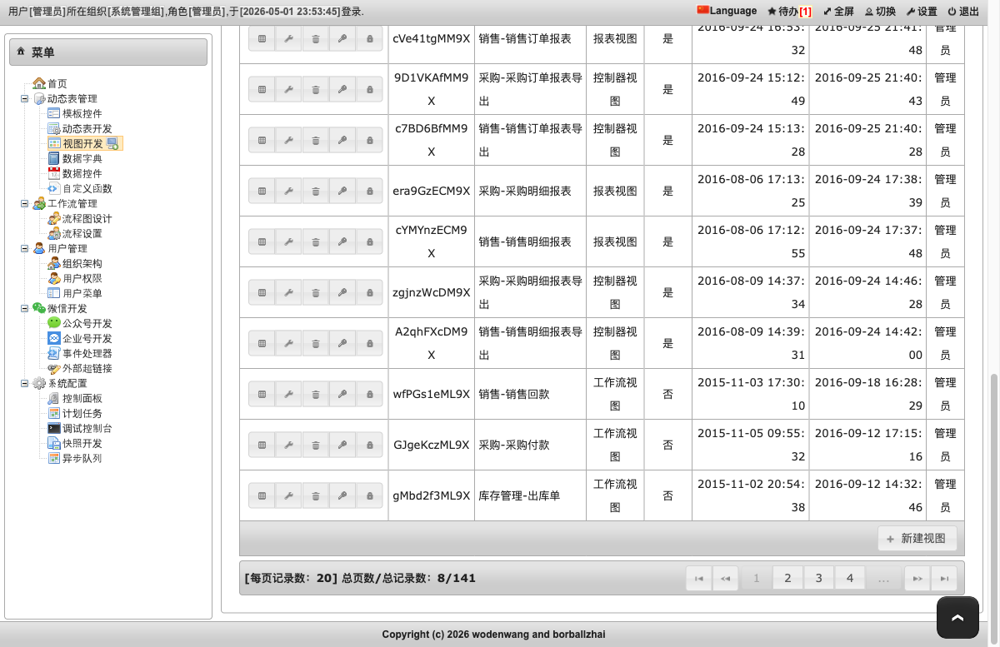
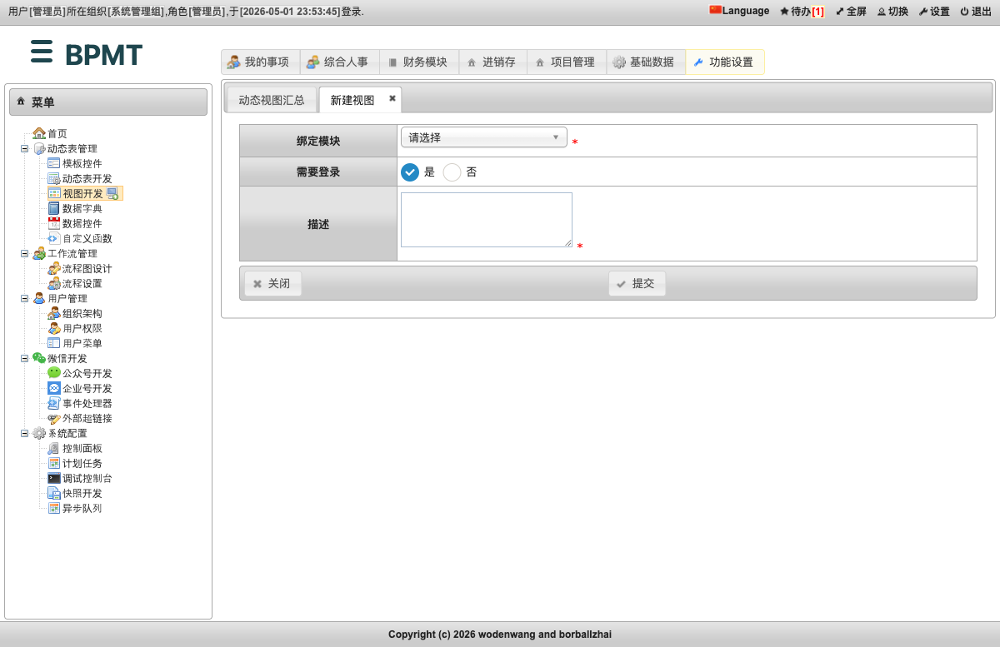
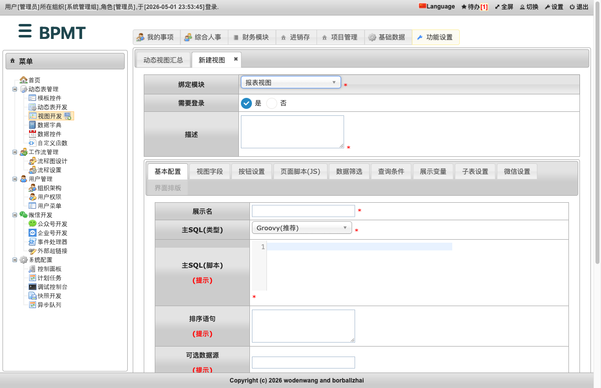
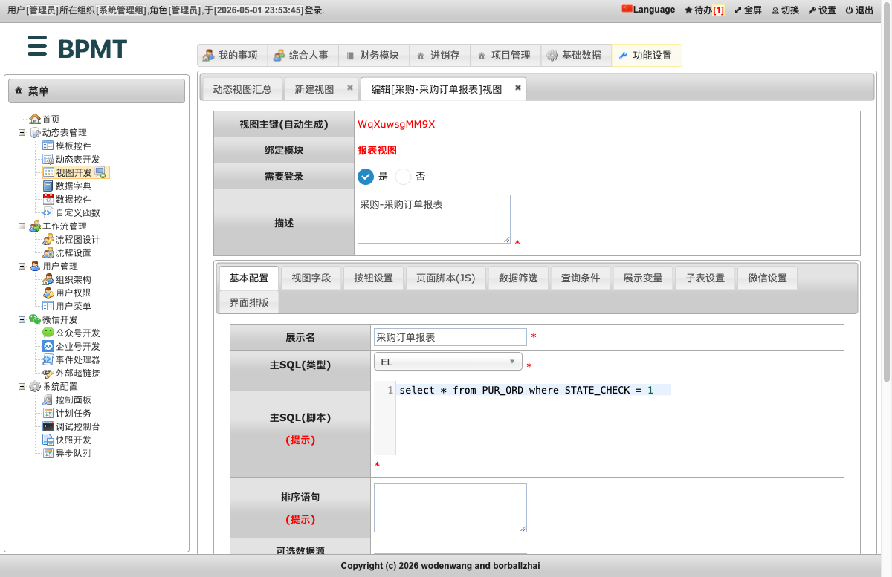
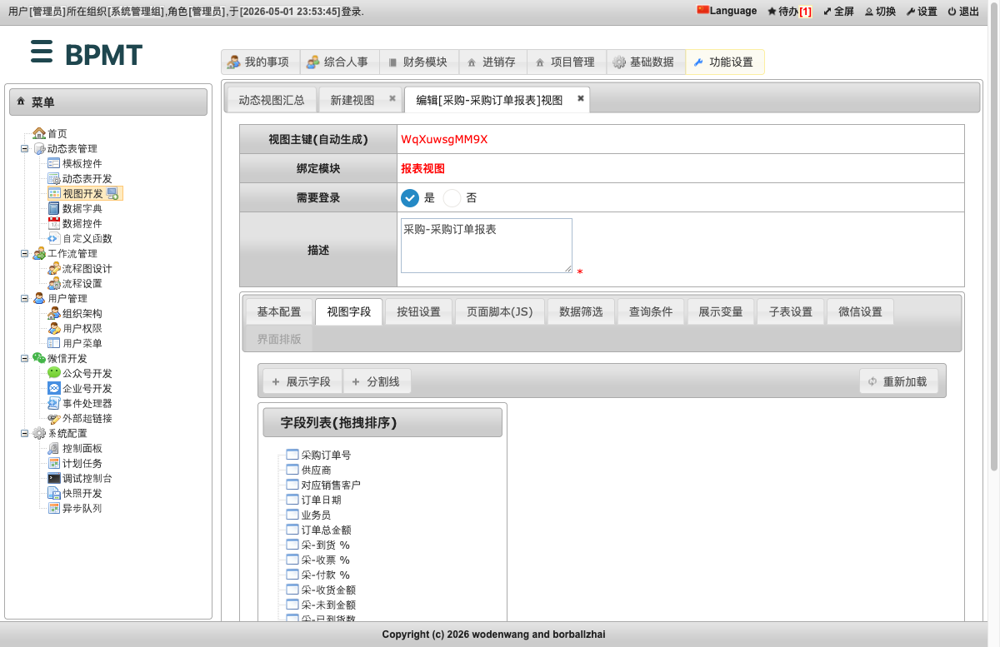
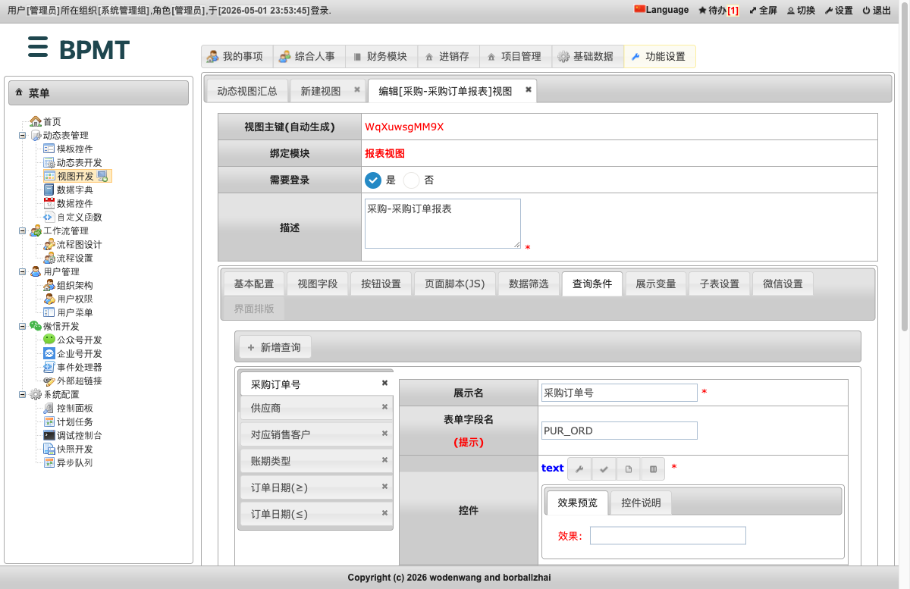
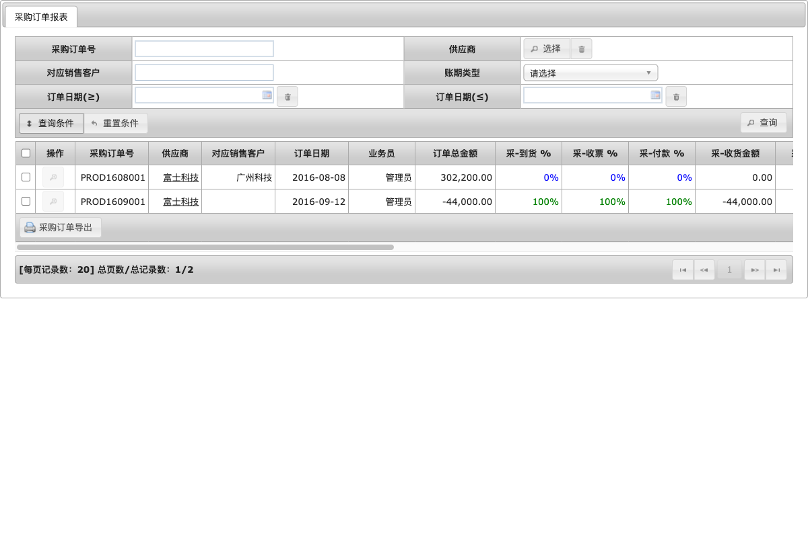
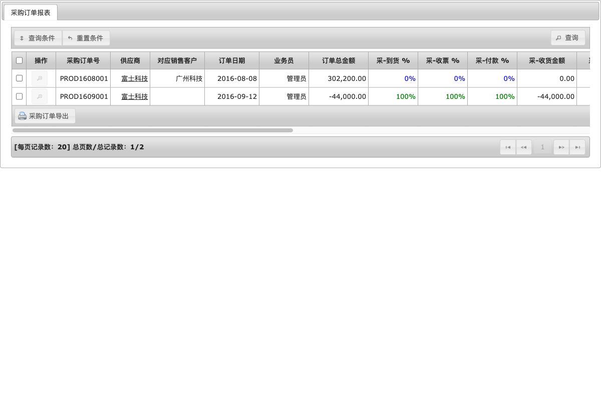

# 报表视图

报表视图适合做“只看数据、按条件查询、需要导出”的页面。例如采购订单报表、销售明细报表、库存统计报表、员工通讯录等，都可以用报表视图完成。

和动态表视图、工作流视图不同，报表视图不要求先绑定一张动态表或一个流程。它的核心是：先写一段主 SQL 取出数据，再配置页面上要显示哪些列、提供哪些查询条件、是否允许导出。

本页按低代码用户的操作顺序说明如何创建一个报表视图。截图来自本地完整业务库中的实际运行页面。

## 使用场景

适合使用报表视图的情况：

- 要把一张表或多张表的数据做成列表。
- 页面主要用于查询、查看和导出，不需要用户在报表页直接新增业务单据。
- 需要按条件筛选，例如按订单号、客户、日期、状态查询。
- 需要把字段做成业务可读格式，例如把供应商 ID 显示成供应商名称，把金额显示成带千分位的数字。

不适合使用报表视图的情况：

- 用户需要在页面上新增、编辑、删除记录，优先考虑动态表视图。
- 页面是流程审批、待办办理、节点流转，优先考虑工作流视图。

## 创建入口

进入：

```text
功能设置 -> 动态表管理 -> 视图开发
```



进入“视图开发”后，页面会显示已有视图列表。这里可以看到动态表视图、工作流视图、报表视图、控制器视图等不同类型。



列表底部有“新建视图”按钮。



点击“新建视图”后，先填写视图的基础信息。



在“绑定模块”中选择“报表视图”。



选择“报表视图”后，系统会展开报表专用配置页签：

- 基本配置
- 视图字段
- 按钮设置
- 页面脚本(JS)
- 数据筛选
- 查询条件
- 展示变量
- 子表设置
- 微信设置
- 界面排版

初学者先完成“基本配置、视图字段、查询条件”三块，就可以得到一个可用的报表页面。

## 第一步：填写视图说明

在新建视图顶部填写：

| 字段 | 怎么填 | 示例 |
| --- | --- | --- |
| 绑定模块 | 选择“报表视图” | 报表视图 |
| 需要登录 | 一般选择“是” | 是 |
| 描述 | 给这个视图起一个业务名称 | 产品清单报表 |

“描述”会出现在视图列表中，也会影响后续维护时能否快速找到这个报表。建议使用“业务域 + 报表名称”的写法，例如“采购-采购订单报表”“库存-产品库存统计”。

## 第二步：基本配置

“基本配置”决定这个报表从哪里取数、打开后如何显示。

下图是已有“采购-采购订单报表”的配置示例：



常用字段说明：

| 字段 | 用途 | 初学者建议 |
| --- | --- | --- |
| 展示名 | 报表页面顶部显示的名称 | 与“描述”保持一致 |
| 主SQL(类型) | 主 SQL 的脚本类型 | 不确定时选 `EL` 或普通脚本类型；需要拼接复杂 SQL 时再选 Groovy |
| 主SQL(脚本) | 报表取数的 SQL | 先写最简单的 `select ... from ... where 1=1` |
| 排序语句 | 默认排序 | 例如 `CREATE_TIME desc` |
| 可选数据源 | 是否使用外部数据源 | 一般留空，表示使用系统默认数据库 |
| 展示分列数量 | 明细页字段分几列展示 | 一般填 `2` |
| 自动查询 | 打开页面是否立即加载数据 | 常用“自动查询” |
| 列表页汇集 | 是否显示合计行 | 金额、数量报表可开启 |
| 是否分页 | 是否分页显示 | 一般开启 |
| 每页条数 | 每页显示多少条 | 常用 `20` |

一个最小可用的主 SQL 示例：

```sql
select PRD_ID, PRD_NO, PRD_NAME, SPEC, UNIT, IS_EFF
from BS_PRD
where 1=1
```

注意保留 `where 1=1`。后面配置的查询条件会追加到这段 SQL 后面，例如：

```sql
and PRD_NO like '%输入的产品编号%'
```

如果主 SQL 没有 `where 1=1`，后续查询条件可能无法正确拼接。

## 第三步：配置视图字段

“视图字段”决定列表中显示哪些列、明细中显示哪些字段。



操作方式：

1. 点击“视图字段”。
2. 点击“展示字段”。
3. 为每一个要显示的列添加一个字段。
4. 在字段列表中拖拽排序，决定页面展示顺序。

常用填写项：

| 字段 | 用途 | 示例 |
| --- | --- | --- |
| 字段名 / 展示名 | 页面上看到的列名 | 产品编号 |
| 展示内容 | 这一列显示什么 | `return vo.PRD_NO;` |
| 排序字段 | 点击列头排序时用哪个数据库字段 | `PRD_NO` |
| 权限 | 谁能看到这个字段 | 不需要限制时留空 |

如果字段直接来自主 SQL，可以按下面方式写展示内容：

```groovy
return vo.PRD_NO;
```

如果要把编码翻译成名称，可以调用字典或组件。例如库存统计报表中，产品类别不是直接显示 `CATE_ID`，而是显示类别名称：

```groovy
return cm.invoke('bs_dict', 'STO_CATE_ID', vo?.CATE_ID);
```

初学者可以先记住一个原则：主 SQL 查出来的字段，字段脚本里用 `vo.字段名` 显示。

## 第四步：配置查询条件

“查询条件”决定用户在报表顶部能按什么条件筛选数据。



运行时效果如下：



操作方式：

1. 点击“查询条件”。
2. 点击“新增查询”。
3. 填写查询项名称。
4. 选择控件，例如文本框、下拉框、日期框。
5. 填写 SQL 片段脚本。

常见查询配置：

| 需求 | 控件 | SQL 片段示例 |
| --- | --- | --- |
| 按编号模糊查询 | 文本框 | `return "PRD_NO like '%${value}%'";` |
| 按名称模糊查询 | 文本框 | `return "PRD_NAME like '%${value}%'";` |
| 按状态精确查询 | 下拉框 | `return "IS_EFF = ${value}";` |
| 按开始日期查询 | 日期框 | `return "CREATE_TIME >= '${value}'";` |
| 按结束日期查询 | 日期框 | `return "CREATE_TIME <= '${value}'";` |
| 按多选类别查询 | 多选框 | `return "CATE_ID in ('${values.join(\"','\")}')";` |

这里的 `value` 表示用户输入或选择的值。多选控件使用 `values`。

SQL 片段只写条件本身，不要写 `where`。系统会自动把它追加到主 SQL 后面。

## 第五步：配置按钮

“按钮设置”决定报表里有哪些操作按钮。

报表视图常用按钮有两类：

- 行按钮：出现在每一行，例如“查看”。
- 汇总按钮：出现在列表底部，例如“导出”。

如果只是做查询报表，可以先保留默认按钮。需要导出时，配置导出按钮；需要点击进入明细时，配置“查看”按钮，并在基本配置中补充主键脚本。

例如一张产品报表要点击查看产品明细，可以这样理解：

| 配置项 | 作用 | 示例 |
| --- | --- | --- |
| 主键脚本 | 从当前行取出主键 | `return vo.PRD_ID;` |
| 主键SQL脚本 | 用主键找到明细记录 | `return "PRD_ID = ${value}";` |

如果没有配置主键脚本，“查看”按钮可能不可用。截图中的采购订单报表运行页里，“查看”按钮就是灰色不可点的状态。

## 第六步：保存并预览

配置完成后，点击页面底部“提交”保存视图。

保存后回到“视图开发”列表，可以在记录左侧看到几个常用操作：

- 视图预览：打开最终用户看到的报表页面。
- 修改：回到配置页面继续调整。
- 删除：删除该视图。
- 权限设置：设置谁能访问该视图。
- 锁定：锁定后减少误修改。

预览后的报表页面如下：



这个页面中可以看到：

- 顶部是查询区按钮。
- 中间是报表数据列表。
- 表头就是“视图字段”里配置的字段。
- 底部是导出按钮和分页信息。

点击“查询条件”后，系统展开查询表单：


用户填写条件后点击“查询”，报表会按配置的 SQL 片段重新加载数据。

## 一个最小报表示例

如果要做一个“产品清单报表”，可以按下面配置入门。

### 1. 基本配置

| 字段 | 示例值 |
| --- | --- |
| 描述 | 库存-产品清单报表 |
| 展示名 | 产品清单报表 |
| 主SQL(类型) | EL |
| 主SQL(脚本) | 见下方 SQL |
| 排序语句 | `PRD_ID asc` |
| 自动查询 | 是 |
| 是否分页 | 是 |
| 每页条数 | `20` |

主 SQL：

```sql
select PRD_ID, PRD_NO, PRD_NAME, SPEC, UNIT, IS_EFF
from BS_PRD
where 1=1
```

### 2. 视图字段

| 展示名 | 展示内容 |
| --- | --- |
| 产品ID | `return vo.PRD_ID;` |
| 产品编号 | `return vo.PRD_NO;` |
| 产品名称 | `return vo.PRD_NAME;` |
| 规格型号 | `return vo.SPEC;` |
| 单位 | `return vo.UNIT;` |
| 生效 | `return vo.IS_EFF;` |

### 3. 查询条件

| 展示名 | 控件 | SQL 片段 |
| --- | --- | --- |
| 产品编号 | text | `return "PRD_NO like '%${value}%'";` |
| 产品名称 | text | `return "PRD_NAME like '%${value}%'";` |
| 生效 | select | `return "IS_EFF = ${value}";` |

完成以上三块后，就可以保存并预览。后续再根据需要补导出、汇总行、权限和子表。

## 常见问题

### 打开报表没有数据

先检查主 SQL 是否能查到数据，再检查查询条件是否默认带了限制。初学者建议先只写主 SQL，不配置查询条件；确认列表能出数据后，再逐个加查询条件。

### 查询后报 SQL 错误

大多是主 SQL 或查询条件拼接不正确。建议检查：

- 主 SQL 是否包含 `where 1=1`。
- 查询条件 SQL 片段是否只写了 `and` 后面的条件，不要写完整 `where`。
- 文本值是否加了引号。

### 列表字段显示为空

检查展示字段脚本里的字段名是否和主 SQL 查询出来的字段一致。例如主 SQL 查的是 `PRD_NO`，展示内容就应使用：

```groovy
return vo.PRD_NO;
```

### 查看按钮不可点

通常是没有配置主键脚本。需要在基本配置中补上主键脚本和主键 SQL 脚本，让系统知道点击某一行时应该用哪个字段找到明细。

### 什么时候用数据筛选

查询条件是给用户主动筛选用的；数据筛选是系统自动限制数据范围用的。例如“普通员工只能看自己的订单”“部门经理只能看本部门数据”，适合放在“数据筛选”里。

## 与实现的对应关系

日常配置不需要关心代码。遇到排障时，可以知道报表视图在系统中的名称是 `rep_list`，配置主要保存在 `VW_REPORT` 和 `VW_REPORT_COLUMN_SHOW`、`VW_REPORT_QUERY` 等表中。

运行时页面会按下面顺序工作：

1. 执行“基本配置”里的主 SQL。
2. 读取用户填写的查询条件。
3. 把查询条件生成的 SQL 片段追加到主 SQL。
4. 按“视图字段”渲染列表。
5. 按按钮设置显示查看、导出等按钮。

因此排查报表问题时，先看“主 SQL”，再看“查询条件”，最后看“视图字段”，通常能最快定位问题。
