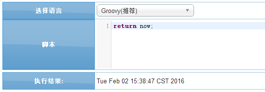
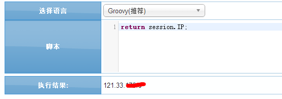
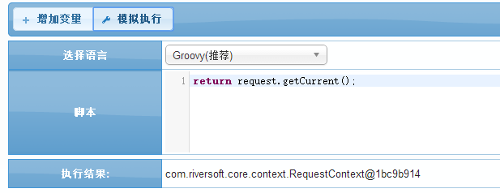

# 上下文介绍

在BPMT平台脚本引擎中上下文可用的属性包括以下:

| 序号 | 关键字 | 说明  |
|------|-------	-|-----|
| 1 | request | 当前请求参数 |
| 2 | session | 获取当前会话,包含以下参数:<br>USER(当前用户); GROUP(当前组织);<br>ROLE(当前角色);RELATION_SHIP(当前用户,组织,角色关系);PRI_GROUP(权限组列表);<br>SUPER_PRI_FLAG(超级权限标识);DATE(登陆时间);IP(登陆IP);<br>LOG(界面请求LOG堆栈);RANDOM_CODE(登陆时随机验证码);LANGUAGE(当前系统语言) |
| 3 | variable | 全局上下文,里面包含以下参数:<br>_INCLUSIVE_GATEWAY_OUTCOME :(包容节点判断用,保存目标线的ID) <br> _EXCLUSIVE_GATEWAY_OUTCOME:(判断节点判断用,保存目标线的ID) <br> _ORDER_TABLE_NAME:(订单表名) <br> _ORDER_HISTORY_TABLE_NAME:(订单历史表名)|
| 4 | now | 当前时间 |

##示例 1:获取当前时间
```groovy
return now;
```


##示例 2:返回当前登陆的IP
```groovy
return session.IP;
```



##示例 3:获取当前request实例
```groovy
return request.getCurrent();
```



`by Chris`
