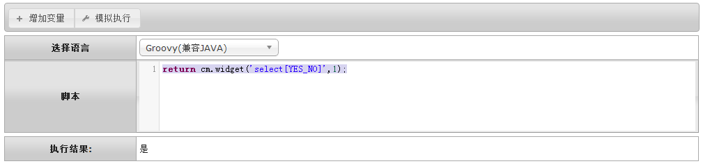
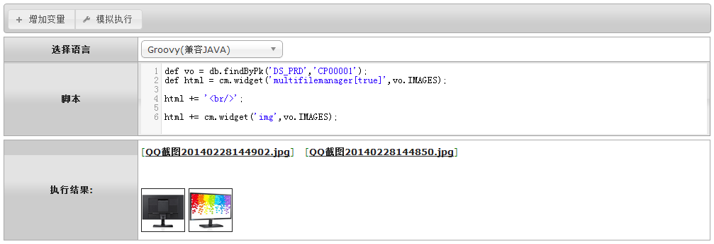
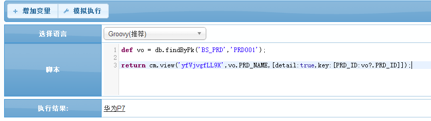
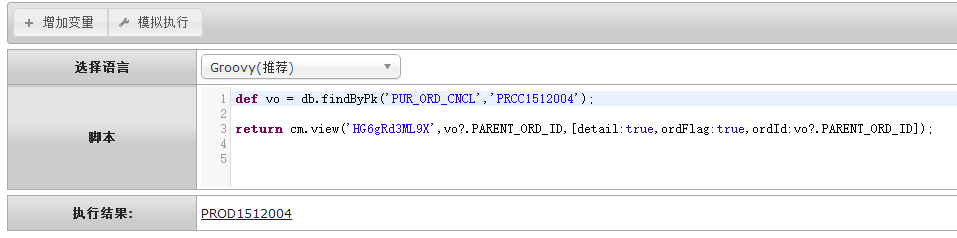
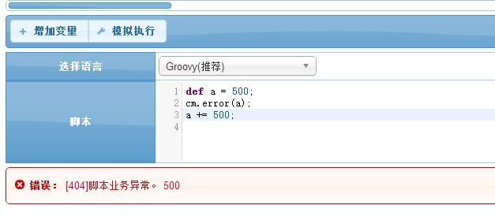
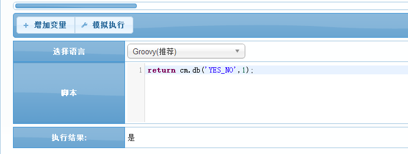
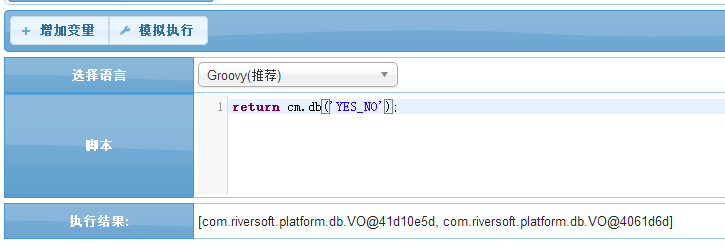
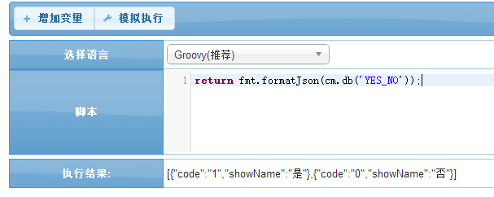

# cm 通用函数库

BPMT专有能力配套函数库,通过本函数库可以在脚本中使用BPMT的各种基础概念,例如"动态入参","控件","视图","自定义函数"等.


## *cm.widget* 调用控件翻译 ##
	调用控件进行翻译。关于BPM-Table中“控件”的概念和详细信息，请参考 [控件] 章节。

#### 参数API ####
| 序号 | 参数类型 | 说明  |
|------|-------	-|-----|
| 1		| 字符 	| 控件命令cmd。（如：text，select[YES_NO]等，详情参考：[控件] 章节）。 |
| 2		| 无限制 | 待翻译值，一般为直接保存在数据库中的原始数据。 |
|返回值  | 字符 	  |翻译、美化过的可浏览数据。|

#### 示例1 : 调用select下拉控件翻译 ####
```groovy
return cm.widget('select[YES_NO]',1);
```


#### 示例2 : 调用文件上传控件和图片展示控件美化 ####
```groovy
def vo = db.findByPk('DS_PRD','CP00001');
def html = cm.widget('multifilemanager[true]',vo.IMAGES);
html += '<br/>';
html += cm.widget('img',vo.IMAGES);
```


## *cm.params* 获取动态传参
    获取动态传参的对象.

####参数API
| 序号 | 参数类型 | 说明  |
|------|-------	-|-----|
| 返回值 | 无限制 | 返回传递的对象 |

#### 示例 1:获取传递过来的HOUSE_ID的值
```groovy
//传递过来的一般为map数组;
def houseId=cm.params()?.HOUSE_ID;
```

## *cm.view* 调用视图做自定义链接
    调用视图作为超链接

####参数API
| 序号 | 参数类型 | 说明  |
|------|-------	-|-----|
| 1 | 字符串 | 入参为想要链接的视图主键 |
| 2 | 字符串 | 入参为最终想要显示的字符串 |
| 3 | 无限制 | 可以对链接的一些设定 |
| 返回值 | 字符串 | 返回带链接的字符串 |

####示例 1:链接动态表视图
```groovy
// 链接显示的用控件翻译成展示名,然后第三个参数设定链接视图主键
def vo = db.findByPk('BS_PRD','PRD001');
return cm.view('yfVjvgfLL9X',vo.PRD_NAME,[detail:true,key:[PRD_ID:vo?.PRD_ID]]);
```


####示例 2:链接工作流视图
```groovy
//第三个参数与动态表视图不同
def vo = db.findByPk('PUR_ORD_CNCL','PRCC1512004');

return cm.view('HG6gRd3ML9X',vo?.PARENT_ORD_ID,[detail:true,ordFlag:true,ordId:vo?.PARENT_ORD_ID]);
```



## *cm.error* 主动抛出异常
    可以主动中断执行,然后抛出想要抛出的对象

####参数API
| 序号 | 参数类型 | 说明  |
|------|-------	-|-----|
| 1 | 无限制 | 入参一个想要抛出的对象 |
| 返回值 | 异常 | 抛出异常对象信息 |

####示例 1:中断程序执行,抛出a的数值
```groovy
def a = 500;
cm.error(a); //中断执行,并抛出
a += 500;
```


## *cm.db* 字典翻译
    调用数据字典对字符串进行翻译   
 
####参数API
| 序号 | 参数类型 | 说明  |
|------|-------	-|-----|
| 1 | 字符串 | 入参为字典的类型主键 |
| 2 | 无限制 | 入参为想要翻译的对象,这里没入参就直接返回数据字典的列表 |
| 返回值 | 字符串 | 返回翻译后的结果 |

####示例 1: 调用YES_NO的数据字典翻译数字1
```groovy
return cm.db('YES_NO',1);
```



####示例 2: 返回YES_NO数据字典的列表
```groovy
return cm.db('YES_NO');
```


   
    上面结果可以转为Json格式


## *cm.lan* 根据语言环境翻译文字
    对于特定的字符串,可以根据用户所在语言环境来进行展示不同的文字;   
 
####参数API
| 序号 | 参数类型 | 说明  |
|------|-------	-|-----|
| 1 | 字符串 | 需要为"#:zh[保存]:en[Save]#"这样的格式,在不同环境下显示不同的内容,中文就显示zh后面[]里的内容;英文就显示en后面[]里的内容;
| 返回值 | 字符串 | 返回最终翻译的结果 |

####示例 1: 根据语言环境的不同,返回字符串保存和Save
```groovy
return cm.lan("#:zh[保存]:en[Save]#");
// 中文环境下返回保存;英文环境下返回Save;
```

`by Chris`
