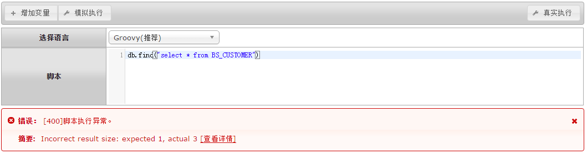
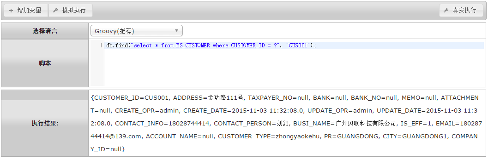
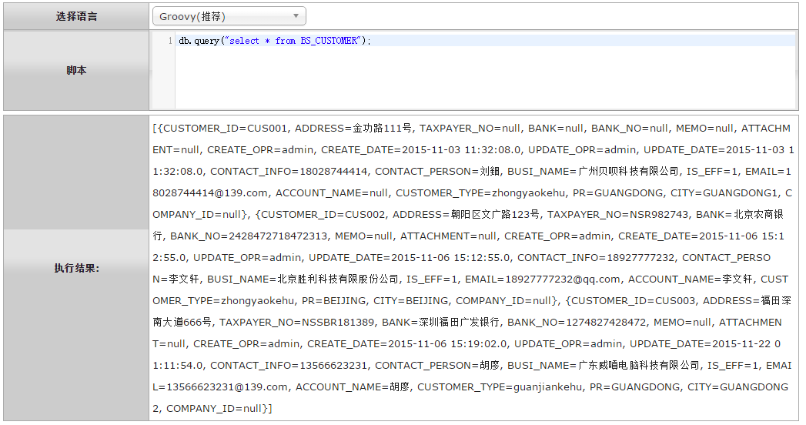
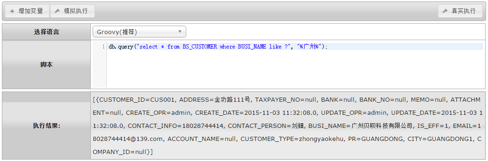
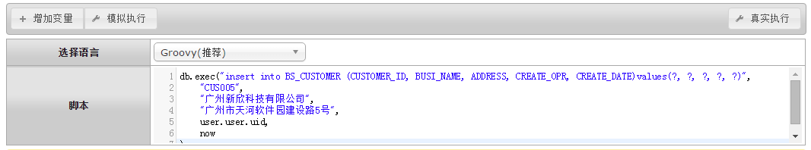
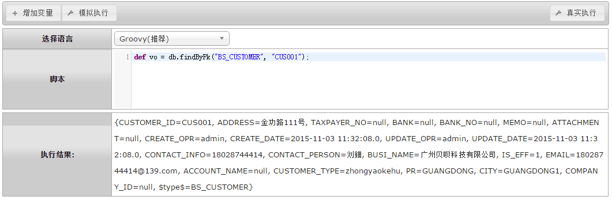
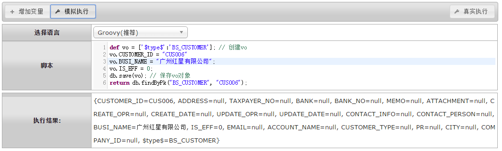
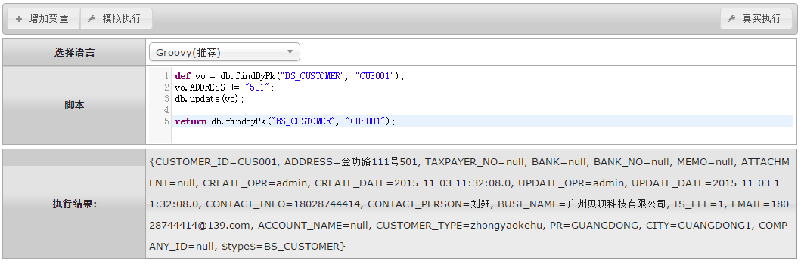
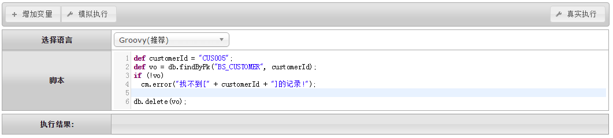

# db 通用函数库

<!-- CODE-CALIBRATION:START -->

## 当前代码校准

来源：`bpmt-lite/platform/src/main/java/com/riversoft/platform/db/DbHelper.java`，类上标注 `@ScriptSupport("db")`。脚本中通常以 `db.方法名(...)` 调用。

面向动态表和原生 SQL 的数据库函数。动态表对象通常需要 `$type$` 标识表名。

| 函数签名 | 说明 |
| --- | --- |
| `save(Map<String, Object> vo)` | 保存动态表对象。 |
| `update(Map<String, Object> vo)` | 更新动态表对象。 |
| `saveOrUpdate(Map<String, Object> vo)` | 保存或更新动态表对象。 |
| `delete(Map<String, Object> vo)` | 删除动态表对象。 |
| `findByPk(String entityName, Serializable pk)` | 按表名和主键查询唯一记录。 |
| `findByPk(Map<String, Object> vo)` | 按带 `$type$` 的动态表对象主键查询唯一记录。 |
| `find(String sql, Object... args)` | 执行 SQL 并返回唯一记录。 |
| `query(String sql, Object... args)` | 执行 SQL 并返回列表。 |
| `exec(String sql, Map<String, Object> params)` | 用命名参数执行 SQL。 |
| `exec(String sql, Object... args)` | 用位置参数执行 SQL。 |
| `save(String sql, Object... args)` | 执行新增 SQL 并返回自动递增 ID。注意该重载与保存动态表对象的 `db.save(vo)` 同名。 |

<!-- CODE-CALIBRATION:END -->


    db为常用数据库操作函数，主要用于数据库表的增删改查。

##db.find
```
通过SQL语句查询唯一记录，当查询到多个记录时根据SQL语句排序规则返回第一个；
无记录时返回NULL；多个记录时抛出异常。
```
#### 参数API ####
| 序号 | 参数类型 | 说明  |
| --- | --- | --- |
|1| 字符串 	| SQL串（可用问号代替入参）。 |
| 2...N		| 无限制 	| 问号替换参数（比如`db.find("select * from BS_CUSTOMER where CUSTOMER_ID = ? and ADDRESS like ?", "CUS001", "%11号%");`）。 |
|返回值  | 对象 	  |对象Map|

###示例1：
```groovy
db.find("select * from BS_CUSTOMER");
```

执行时报异常“Incorrect result size: expected 1, actual 4”，是因为表BS_CUSTOMER中有4条记录，find函数在记录时超过1条时会抛异常。
###示例2：
```groovy
db.find("select * from BS_CUSTOMER where CUSTOMER_ID = ?", "CUS001");
```



##db.query
```
通过SQL语句查询一组记录；无记录时返回size为0的集合。
```
#### 参数API ####
| 序号 | 参数类型 | 说明  |
| --- | --- | --- |
|1| 字符串 	| SQL串（可用问号代替入参）。 |
| 2...N		| 无限制 	| 问号替换参数（比如`db.query("select * from BS_CUSTOMER where ADDRESS like ?", "%广州%");`）。 |
|返回值  | 列表 	  |对象列表|
###示例1：
```groovy
db.query("select * from BS_CUSTOMER");
```


###示例2：
```groovy
db.query("select * from BS_CUSTOMER where BUSI_NAME like ?", "%广州%");
```


##db.exec
```
执行insert/update/delete语句。
```
#### 参数API ####
| 序号 | 参数类型 | 说明  |
| --- | --- | --- |
|1| 字符串 	| SQL串（可用问号代替入参）。 |
| 2...N		| 无限制 	| 参考db.find和db.query |
|返回值  | 无 	  |无|
###示例1：
```groovy
db.exec("insert into BS_CUSTOMER (CUSTOMER_ID, BUSI_NAME, ADDRESS, CREATE_OPR, CREATE_DATE)values(?, ?, ?, ?, ?)",
	"CUS005",
	"广州新欣科技有限公司",
	"广州市天河软件园建设路5号",
	user.user.uid,
	now
);
```


###示例说明：
```
执行insert语句，在BS_CUSTOMER表插入1条记录。
其中CREATE_OPR字段（创建人），引用系统内置user对象；user.user.uid为当前登录的操作员编号。now为当前系统时间。
```
##db.findByPk
```
根据主键查询唯一值；查询不到结果则返回NULL；当动态表采用缓存模式时，此对象从缓存中获取。
```
#### 参数API ####
| 序号 | 参数类型 | 说明  |
| --- | --- | --- |
| 1 | 字符串	| 表名。 |
| 2	| 字符串	| 表主键字段值。 |
|返回值  | 对象 |对象Map。|

###示例1：
```groovy
def vo = db.findByPk("BS_CUSTOMER", "CUS001");
```


##db.save
```
保存vo实体到数据库表中。
需要定义vo，vo对应的表名，表中对应必填的字段也必须要传。
```
#### 参数API ####
| 序号 | 参数类型 | 说明  |
| --- | --- | --- |
| 1		| vo 	| value object值对象。 |
|返回值  | 无 	  |无。|

###示例1：
```groovy
def vo = ['$type$':'BS_CUSTOMER']; // 创建vo
vo.CUSTOMER_ID = "CUS006"
vo.BUSI_NAME = "广州红星有限公司";
vo.IS_EFF = 0;
db.save(vo); // 保存vo对象

return db.findByPk("BS_CUSTOMER", "CUS006");
```


##db.update
```
更新vo实体到数据库表中。
参数API参考db.save()函数。
```
###示例1：
```groovy
def vo = db.findByPk("BS_CUSTOMER", "CUS001");
vo.ADDRESS += "501";
db.update(vo);

return db.findByPk("BS_CUSTOMER", "CUS001");
```


##db.delete
```
删除数据库表记录。
参数API参考db.save()函数。
```
###示例1：
```groovy
def customerId = "CUS005";
def vo = db.findByPk("BS_CUSTOMER", customerId);
if (!vo)
  cm.error("找不到[" + customerId + "]的记录!");

db.delete(vo);
```

<br/>
`by Wilmer`
