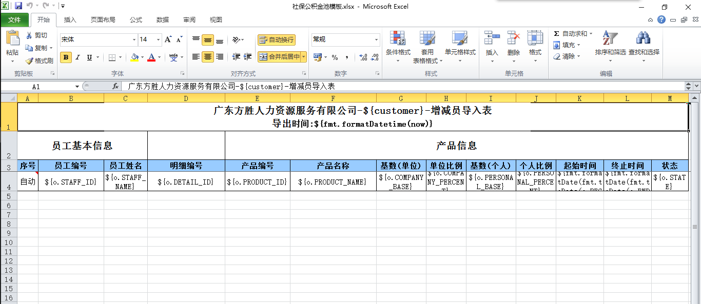
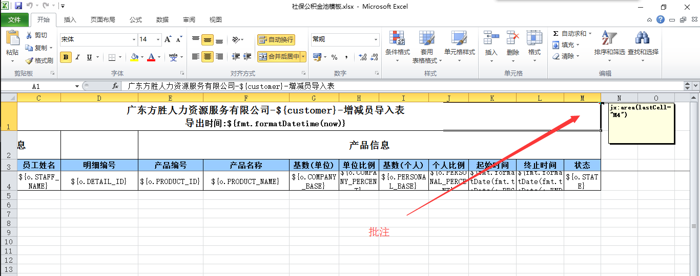
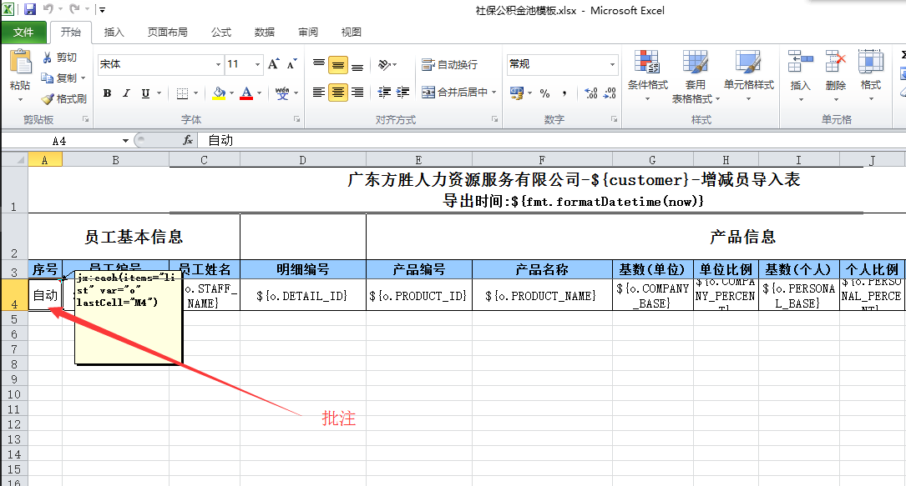

# excel Excel操作

<!-- CODE-CALIBRATION:START -->

## 当前代码校准

来源：`bpmt-lite/platform/src/main/java/com/riversoft/platform/script/function/ExcelHelper.java`，类上标注 `@ScriptSupport("excel")`。脚本中通常以 `excel.方法名(...)` 调用。

解析 Excel 上传文件，或按模板生成 Excel 文件。

| 函数签名 | 说明 |
| --- | --- |
| `parseSheetListWithEnd(Object file, String sheetName, String endChecker, int titleRow, String... fields)` | 解析文件-列表 |
| `parseSheetList(Object file, String sheetName, int titleRow, String... fields)` | 解析文件-列表 |
| `parseSheetList(Object file, String sheetName, int titleRow)` | 解析文件-列表 |
| `parseSheetList(Object file, String sheetName, String... fields)` | 解析文件-列表 |
| `parseSheetList(Object file, String sheetName)` | 解析文件-列表 |
| `parseList(Object file, String... fields)` | 解析文件-列表 |
| `parseList(Object file)` | 解析文件-列表 |
| `parseList(Object file, int titleRow, String... fields)` | 解析文件-列表 |
| `parseList(Object file, int titleRow)` | 解析文件-列表 |
| `parseTitleListWhithEnd(Object file, String sheetName, String endChecker, int titleRow)` | 解析文件-按表头生成列表 |
| `parseTitleList(Object file, int titleRow)` | 解析文件-按表头生成列表 |
| `parseTitleList(Object file)` | 解析文件-按表头生成列表 |
| `parseSheetTitleList(Object file, String sheetName, int titleRow)` | 解析文件-按表头生成列表 |
| `parseSheetTitleList(Object file, String sheetName)` | 解析文件-按表头生成列表 |
| `parseSheetMap(Object file, String sheetName, String... fields)` | 解析文件-MAP |
| `parseMap(Object file, String... fields)` | 解析文件-MAP |
| `toFile(Object template, String fileName, Map<String, Object> context)` | 生成文件 |
| `toFile(Object template, Map<String, Object> context)` | 生成文件 |

<!-- CODE-CALIBRATION:END -->


## 定义

在BPMT中, 通过自定义函数去调用内置的函数, 可以对给定的EXCEL模板进行数据的导出, 也可对导入的EXCEL文件进行数据获取并分析.

## 用法

### 1.导出EXCEL模板

在自定义函数中, 使用内置的函数, 将数据插入EXCEL表中.核心函数: excel.toFile()
```groovy
excel.toFile(模板文件,"生成的EXCEL名.xlsx".toString(),上下文内容);
```

实际用例:
```groovy
def vo = args[0];

log.print("正在准备数据.");
def template = db.findByPk('BS_TEMPLATE','CUS_HR_SSF_ADD');//模板
def staffList = db.query('select * from CUST_STAFF  where CUSTOMER_ID = ? order by STAFF_ID',vo?.CUSTOMER_ID);//客户员工列表
def customer = db.find('select CUSTOMER_NAME C from BS_CUSTOMER where CUSTOMER_ID = ?',vo?.CUSTOMER_ID)?.C;

def list = [];

log.loop("开始生成员工信息,请耐心等待.",staffList.size());
for (def o : staffList) {
  log.signal();

  if (o.STATE == 'quit') {//去掉离职的员工
    log.debug("员工" + o.STAFF_NAME + "为离职状态");
    continue;
  }

  list.add(o);
}


log.print("正在生成盘点文件.");

def context = [:];//定义上下文
context.customer = customer;
context.list = list;

// 用模板生成文件toFile函数
def file = excel.toFile(template.FILE_NAME,"${customer}_${fmt.formatDate(now)}_增减员信息表.xlsx".toString(),context);

// 将生成的问题保存在表中
db.exec("update CUS_HR_SSF_ADD set CUS_HR_SSF_SHEET = ? where ORD_ID = ?",file,vo.ORD_ID);
```

在系统的EXCEL模板, 需要使用表去保存, 用于调用, EXCEL模板也要做相对应的编辑.

(1)在不同列中引用对应的字段数据:



(2)在需要插入数据的首行首页添加批注, lastCell后跟的是数据覆盖的范围, 这里是到M列4行

	jx:area(lastCell="M4")



(3)在开始插入数据的那行的首列添加批注,items后跟的是数据组(在上文的自定义函数中有提及), var 是每一行的数据, 一条vo, lastCell后跟的是最后那一列, 这里是到M列4行

	jx:each(items="list" var="o" lastCell="M4")



(4)上传EXECL模板文件, 就可以实现将数据导出的功能了.

### 2.对导入EXCEL进行分析

在自定义函数中, 使用内置的函数, 对上传的EXCEL文件进行分析.核心函数: excel.parseList();

```groovy
excel.parseList(上传的EXCEL文件,EXCEL中分析的第一行,EXCEL中需要分析的列);
```

实际用例:
```groovy
def vo = args[0];

// vo.SSF_ORD_FILE 订购关系文件

log.print("正在校验文件.");

// 解析的字段

def fields = """
A,B,C,D,E,F,G,H,I,J,K,L,M
""".replace('\n','').split(',');

def list = excel.parseList(vo.SSF_ORD_FILE,4,fields);// 获取数据
def count = 3;
log.loop("正在解析试算表.",list.size());

for (def o : list) {  
  count = count + 1;
  log.signal();

  if (o.M == '1') {
    def po = ['$type$':'CUST_SSF_ORD'];// 指定表名
    def id = seq.pattern('CSOD{seq}','CUST_SSF_ORD','ID',8);
    po.ID =  id;
    po.STAFF_ID = o.B;
    po.DETAIL_ID = o.D;
    po.PRODUCT_ID = o.E;
    po.COMPANY_BASE = o.G;
    po.COMPANY_PERCENT = o.H;
    po.PERSONAL_BASE = o.I;
    po.PERSONAL_PERCENT = o.J;
    def beginDate = fmt.toDate(o.K);
    def endDate = fmt.toDate(o.L);
    po.BEGIN_DATE = beginDate;
    po.END_DATE = endDate;
    po.CREATE_TIME = now;
    po.CREATE_OPR = user.user.uid;

    // 将POOL池中的未执行状态0改为已执行1
    db.exec("update CUST_SSF_POOL set STATE = 1 where STAFF_ID = ? and PRODUCT_ID = ? and STATE = 0",o.B,o.E);
    db.save(po);
  }
}
```

(1)先定义EXCEL中需要分析字段对应的列号

```
def fields = """
A,B,C,D,E,F,G,H,I,J,K,L,M
""".replace('\n','').split(',');
```

(2)将上传的EXCEL数据存在数组中

```
def list = excel.parseList(vo.SSF_ORD_FILE,4,fields);// 获取数据
```

(3)通过遍历每一行, 对要插入的表进行指定

```
def po = ['$type$':'CUST_SSF_ORD'];// 指定表名
```

(4)指定表的列名, 然后通过db.save();插入数据表中

```
po.DETAIL_ID = o.D;
db.save(po);
```


`by Tony`
