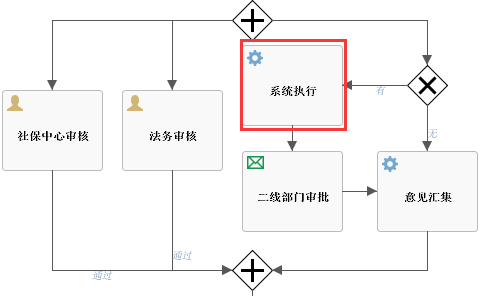
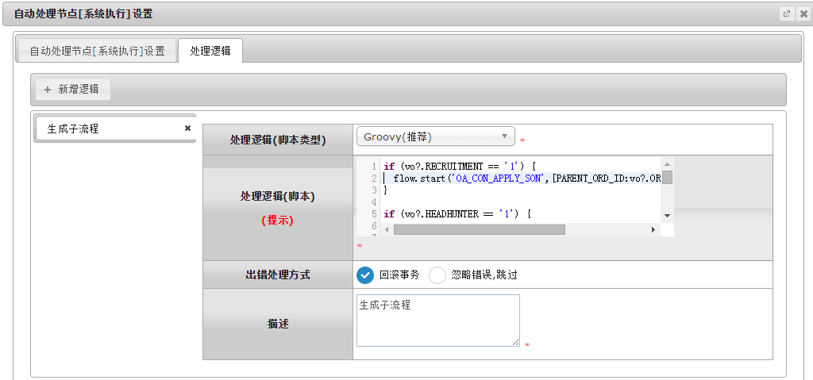
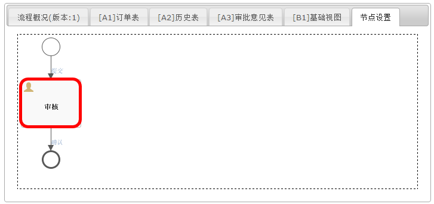
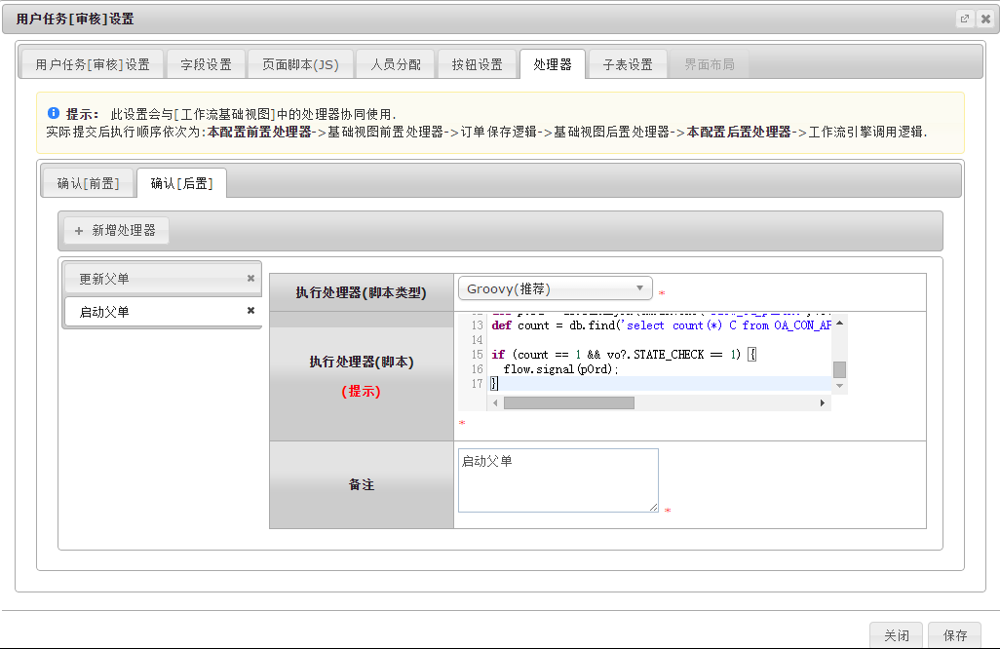

# flow 工作流函数库
flow为工作流函数库，主要功能为主流程和子流程之间的处理，启动子流程、触发主流程状态等。

## flow.start ##
```
在主流程启动子流程，这时节点进入等待状态。
```
#### 参数API ####
| 序号 | 参数类型 | 说明  |
|:--:|:--:|:--|
| 1	| 字符串 | 流程Key。|
| 2	| 对象 | 调用流程传入的参数。 |
|返回值  | 无  |无|



###示例1：
```groovy
flow.start('OA_CON_APPLY_SON',[PARENT_ORD_ID:vo?.ORD_ID,RECRUITMENT:1]);
```


## flow.signal ##
```
触发等待任务，比如触发前面flow.start进行中的任务。
```
#### 参数API ####
| 序号 | 参数类型 | 说明  |
|:--:|:--:|:--|
| 1	| 对象 | 调用流程传入的参数。 |
| 返回值 | 无 | 无 |



###示例1：
```groovy
flow.signal(pOrd);
```

<br/>
`by Wilmer`
