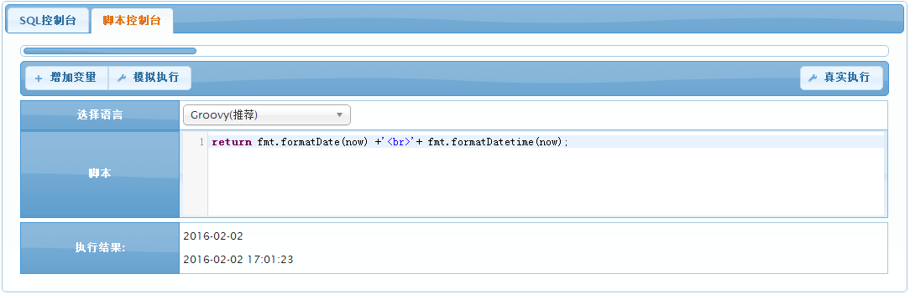
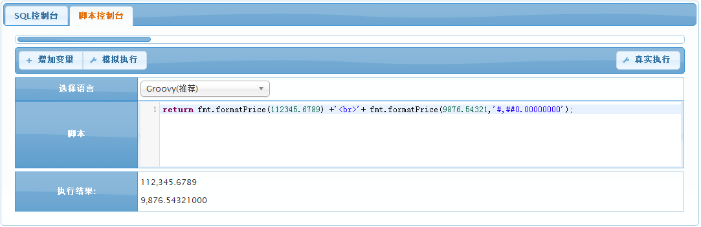
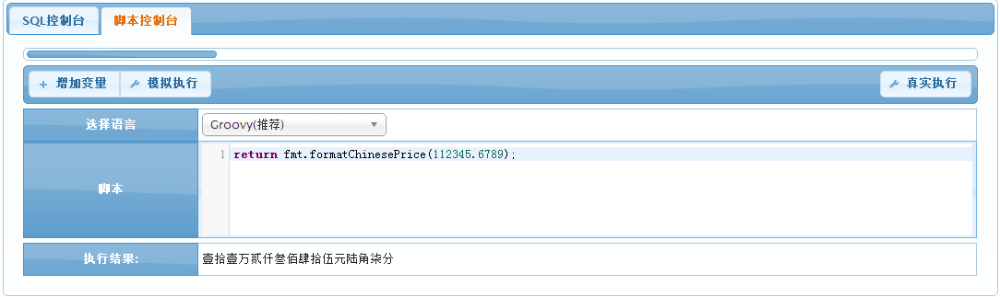
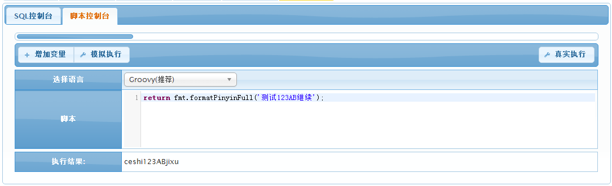
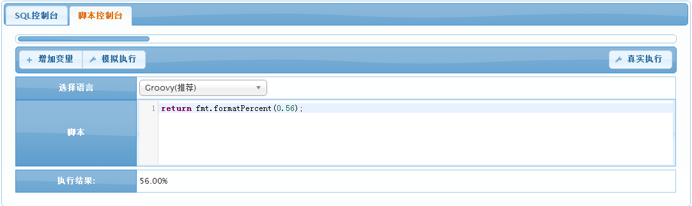
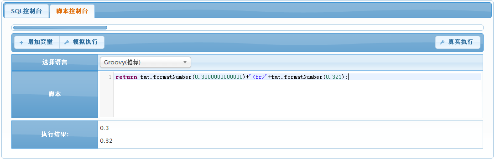
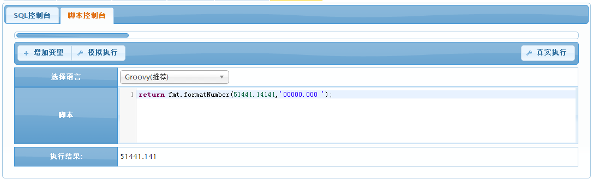
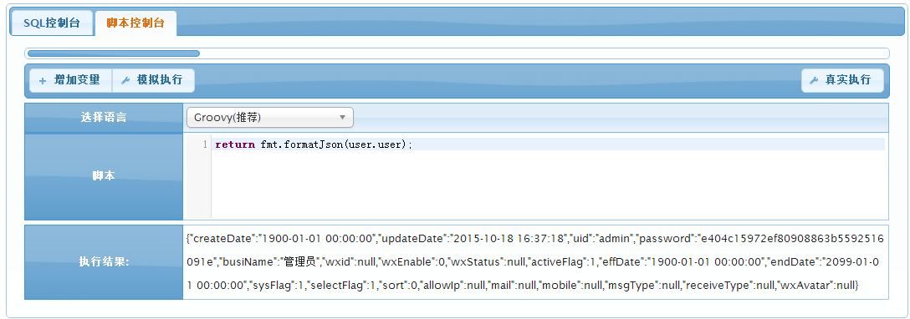
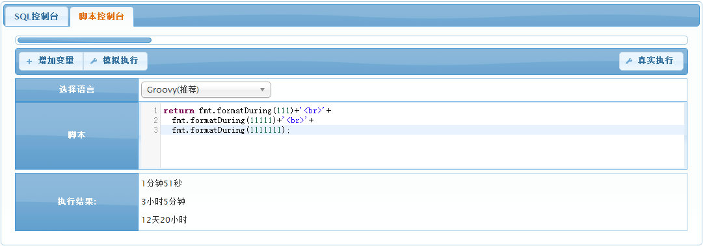
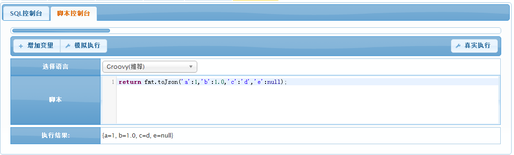

# fmt 格式化
fmt函数库提供各类属性格式化以及转换的函数。
##formatDatetime
根据自定义规则格式化日期/时间。
#### 参数API ####
| 序号 | 参数类型 | 说明  |
|------|-------	-|-----|
| 1		| 日期 	| 日期对象，一般为从数据库中查询到的某个值，或BPM-Table的内置对象now。 |
| 2		| 无限制 | 格式化格式。如:yyyy-MM-dd HH:mm:ss等。|
|返回值  | 字符 	  |格式化完成的时间，如：2016-01-02 00:00:00|
#### 示例1:将一个时间转换成指定格式####
```groovy
return fmt.formatDatetime(now,'yyyy-MM-dd HH:mm:ss.SSS');
```


##formatDate/formatDatetime
根据ISO标准格式化日期/时间。
#### 参数API ####
| 序号 | 参数类型 | 说明  |
|------|-------	-|-----|
| 1		| 日期 	| 日期对象，一般为从数据库中查询到的某个值，或BPM-Table的内置对象now。 |
|返回值  | 字符 	  |格式化完成的时间|
#### 示例1:格式化ISO标准时间格式####
```groovy
return fmt.formatDate(now) +'<br>'+ fmt.formatDatetime(now);
```

##formatPrice
根据自定义规则格式化金额。
#### 参数API ####
| 序号 | 参数类型 | 说明  |
|------|-------	-|-----|
| 1		| 数字 	| 金额对象，可以为整数或复数。 |
| 2		| 字符 | 格式化格式，可空，默认值为：#,##0.00##。|
|返回值  | 字符 	  |格式化完成的时间，如：2,343,44.22|
#### 示例1:将一个金额转换成指定格式####
```groovy
return fmt.formatPrice(112345.6789) +'<br>'+ fmt.formatPrice(9876.54321,'#,##0.00000000');
```

##formatChinesePrice
格式化中文价格（将金额转换成中文大写）。
#### 参数API ####
| 序号 | 参数类型 | 说明  |
|------|-------	-|-----|
| 1		| 数字 	| 金额对象，可以为整数或复数。 |
|返回值  | 字符 	  |格式化完成的时间，如：壹拾壹万贰仟叁佰肆拾伍元陆角柒分|
#### 示例1:将一个金额转换成大写格式####
```groovy
return fmt.formatChinesePrice(112345.6789);
```

##formatPinyin/formatPinyinFull
格式化中文为拼音。
#### 参数API ####
| 序号 | 参数类型 | 说明  |
|------|-------	-|-----|
| 1		| 字符 	| 中文字符。 |
|返回值  | 字符 	  |拼音字符|
#### 示例1:将一句话进行首字母拼音转换####
```groovy
return fmt.formatPinyin('测试123AB继续');
```

#### 示例2:将同一句话进行全拼转换####
```groovy
return fmt.formatPinyinFull('测试123AB继续');
```

##formatPercent
格式化百分比。
#### 参数API ####
| 序号 | 参数类型 | 说明  |
|------|-------	-|-----|
| 1		| 数字 	| 可以是整数或复数。 |
|返回值  | 字符 	  |百分比数字字符。|
#### 示例1:将数字0.56转换成百分比####
```groovy
return fmt.formatPercent(0.56);
```

##formatNumber
根据自定义规则格式化数字。
#### 参数API ####
| 序号 | 参数类型 | 说明  |
|------|-------	-|-----|
| 1		| 数字 	| 可以是整数或复数。 |
| 2		| 字符 | 格式化格式，可空，默认值为：#,##0.00##。|
|返回值  | 字符 	  |数字字符。|
#### 示例1:将数字未指定格式进行格式化####
```groovy
return fmt.formatNumber(0.3000000000000)+'<br>'+fmt.formatNumber(0.321);
```
可以看出未指定格式则默认保留小数点后2位

#### 示例2:将数字自定义格式返回数字####
```groovy
return fmt.formatNumber(51441.14141,'00000.000 ');
```
可以看出未指定格式则默认保留小数点后2位

##formatJson
将对象转换为Json类型。
#### 参数API ####
| 序号 | 参数类型 | 说明  |
|------|-------	-|-----|
| 1		| object 	| 对象，可以是一条vo,也可以是BPMT内置对象。 |
|返回值  | Json 	  |主要以{string1:value1,string2:value2......}形式。|
#### 示例1:将1个用户转成Json类型####
```groovy
return fmt.formatJson(user.user);
```

##formatDuring
将秒数转换成2段式的时间。
#### 参数API ####
| 序号 | 参数类型 | 说明  |
|------|-------	-|-----|
| 1		| 数字 	| 长整型秒数。 |
|返回值  | 字符 	  |时间字符。|
#### 示例1:将3个秒数转换成2段式的时间####
```groovy
return fmt.formatDuring(111)+'<br>'+
  fmt.formatDuring(11111)+'<br>'+
  fmt.formatDuring(1111111);
```

##toJson
将字符串转换成Json类型。
#### 参数API ####
| 序号 | 参数类型 | 说明  |
|------|-------	-|-----|
| 1		| 字符串 	| 以string:value形式，中间用逗号隔开。 |
|返回值  | Json 	  |该字符串转成的Json类型。|
#### 示例1:将1个字符串转成Json类型####
```groovy
return fmt.toJson('a':1,'b':1.0,'c':'d','e':null);
```

##toDate
将字符串转换为日期类型。
#### 参数API ####
| 序号 | 参数类型 | 说明  |
|------|-------	-|-----|
| 1		| 字符 	| 日期字符串。以yyyy-MM-dd HH:mm:ss形式。 |
|返回值  | 日期 	  |返回该字符串对应的日期类型。|
#### 示例1:将字符串’2016-02-01’转换成一个日期格式。####
```groovy
return fmt.toDate('2016-02-01');
```

##toNumber
将字符串转换为数字类型。
#### 参数API ####
| 序号 | 参数类型 | 说明  |
|------|-------	-|-----|
| 1		| 字符串 	| 数字字符串。 |
|返回值  | 数字 	  |返回该字符串对应的数字。|
#### 示例1:将字符串’2016-02-01’转换成一个日期格式。####
```groovy
return  2013+(fmt.toNumber('123'));
```


`by jimlin`
