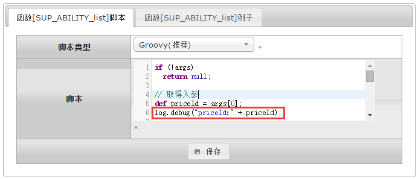
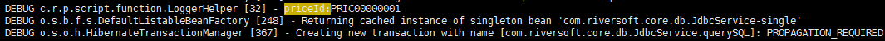

# log 系统日志

<!-- CODE-CALIBRATION:START -->

## 当前代码校准

来源：`bpmt-lite/platform/src/main/java/com/riversoft/platform/script/function/LoggerHelper.java`，类上标注 `@ScriptSupport("log")`。脚本中通常以 `log.方法名(...)` 调用。

脚本运行日志和 Web 进度日志函数。

| 函数签名 | 说明 |
| --- | --- |
| `debug(String msg, Object... args)` | 登记后台日志 |
| `info(String msg, Object... args)` | 登记后台日志 |
| `warn(String msg, Object... args)` | 登记后台日志 |
| `error(String msg, Object... args)` | 登记后台日志 |
| `print(String msg)` | 登记web日志 |
| `loop(String msg, int max)` | 开始循环 |
| `signal()` | 循环标记 |

<!-- CODE-CALIBRATION:END -->


```
log日志函数，主要是为了运行时记录和定位信息，用法同log4j。
在动态脚本中添加打印跟踪信息，跟踪信息会打印在平台目录中的logs文件夹内的platform.log文件中。
```

## debug日志 ##
#### 参数API ####
| 序号 | 参数类型 | 说明  |
|:--:|:--:|:--|
| 1	| 字符串 	| 1.需要打印的日志字符串；2.需要打印的日志格式（比如`"%s%d"`）。 |
| 2...N		| 无限制 	| 如果第1个参数为日志格式，则根据日志格式中替换入参进行传参数（比如`log.debug("%s%d", "ABCD", 123);`）。 |
|返回值  | 无 	  |无|

####示例1：


```groovy
if (!args)
    return null;

// 取得入参
def priceId = args[0];
log.debug("priceId:" + priceId);

def detailList = null;
if (priceId) {
    // 查询记录
	detailList = db.query("""
		select a.*, b.PRODUCT_NAME, b.PRODUCT_TYPE, 
		b.AREA_ID from SUP_ABILITY a left join 
		BS_PRODUCT b on a.PRODUCT_ID = b.PRODUCT_ID 
		where 1 = 1 and a.PRICE_ID = ?
        order by a.ABILITY_ID
	    """,
        priceId                  
    );
}

log.debug("detailList:" + detailList);
return detailList;
```

**调用后，在后台查看logs/platform.log日志：**

    tail -f platform.log 

注：查看debug级别日志，需要把conf/log.properties日志级别调整为debug级别。



## info日志
    用法同log.debug，日志级别为info级别。
#### 参数API ####
| 序号 | 参数类型 | 说明  |
|:--:|:--:|:--|
| 1	| 字符串 	| 1.需要打印的日志字符串；2.需要打印的日志格式（比如`"%s%d"`）。 |
| 2...N		| 无限制 	| 如果第1个参数为日志格式，则根据日志格式中替换入参进行传参数（比如`log.info("%s%d", "ABCD", 123);`）。 |
|返回值  | 无 	  |无|

####示例1：
```groovy
log.info("this is info log.");
```

## warn日志
    用法同log.debug，日志级别为warn级别。
#### 参数API ####
| 序号 | 参数类型 | 说明  |
|:--:|:--:|:--|
|1| 字符串 	| 1.需要打印的日志字符串；2.需要打印的日志格式（比如`"%s%d"`）。 |
| 2...N		| 无限制 	| 如果第1个参数为日志格式，则根据日志格式中替换入参进行传参数（比如`log.warn("%s%d", "ABCD", 123);`）。 |
|返回值  | 无 	  |无|

####示例1：
```groovy
log.warn("this is warn log.");
```

## error日志
    用法同log.debug，日志级别为error级别。
#### 参数API ####
| 序号 | 参数类型 | 说明  |
|:--:|:--:|:--|
|1| 字符串 	| 1.需要打印的日志字符串；2.需要打印的日志格式（比如`"%s%d"`）。 |
| 2...N		| 无限制 	| 如果第1个参数为日志格式，则根据日志格式中替换入参进行传参数（比如`log.error("%s%d", "ABCD", 123);`）。 |
|返回值  | 无 	  |无|
####示例1：
```groovy
log.error("this is error log.");
```
<br/>
`by Wilmer`
