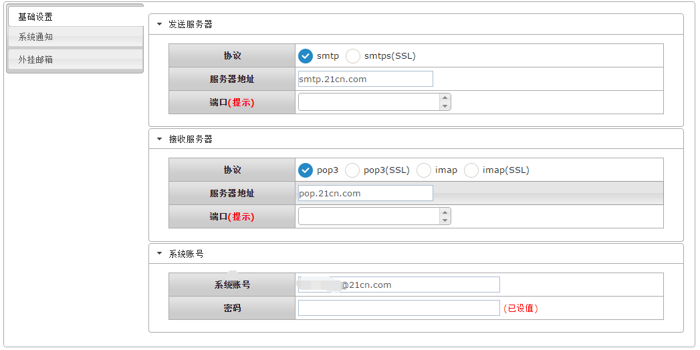
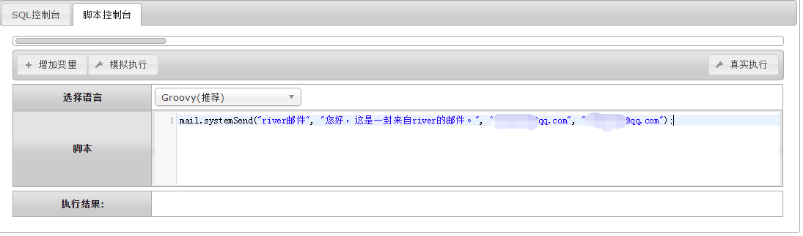

# mail 邮件操作

<!-- CODE-CALIBRATION:START -->

## 当前代码校准

来源：`bpmt-lite/platform/src/main/java/com/riversoft/platform/mail/script/MailHelper.java`，类上标注 `@ScriptSupport("mail")`。脚本中通常以 `mail.方法名(...)` 调用。

普通邮件、系统邮件和异步系统邮件发送函数。

| 函数签名 | 说明 |
| --- | --- |
| `send(String subject, String content, byte[] attachment, String... toAddrs)` | 邮件发送 |
| `send(String subject, String content, String... toAddrs)` | 邮件发送 |
| `systemSend(String subject, String content, String... toAddrs)` | 系统邮件发送 |
| `systemSend(String subject, String content, byte[] attachment, String... toAddrs)` | 系统邮件发送 |
| `systemSend(String subject, String content, List<String> toAddrs, List<String> toCCs)` | 系统邮件发送 |
| `systemSend(String subject, String content, byte[] attachment, List<String> toAddrs, List<String> toCCs)` | 系统邮件发送 |
| `asyncSystemSend(String subject, String content, byte[] attachment, String... toAddrs)` | 系统邮件发送(异步) |
| `asyncSystemSend(String subject, String content, String... toAddrs)` | 系统邮件发送(异步) |

<!-- CODE-CALIBRATION:END -->


mail函数为发送邮件函数库。

## mail.systemSend ##
```
通过mail.systemSend发送系统邮件。
```
#### 参数API ####
| 序号 | 参数类型 | 说明  |
| --- | --- | --- |
| 1	| 字符串 | 邮件标题。|
| 2	| 字符串 | 邮件内容。 |
| 3...N	| 字符串 | 接收邮箱。 |
|返回值 | 无 |无|

## 相关配置 ##
```
需要在【控制面板】-【邮箱设置】，配置对应的发送服务器、接收服务器，系统账号。
协议配置参考对应邮箱服务器的协议进行配置，比如21cn.com的邮箱，发送协议为smtp协议，服务器地址为：smtp.21cn.com；比如接收服务器，服务器地址为pop.21cn.com。
```



###示例1：
```groovy
mail.systemSend("river邮件", "您好，这是一封来自river的邮件。", "111@qq.com", "222.qq.com");
```

<br/>
`by Wilmer`
