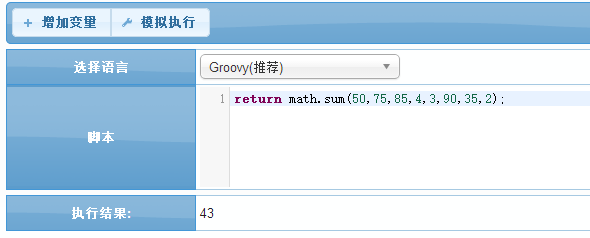
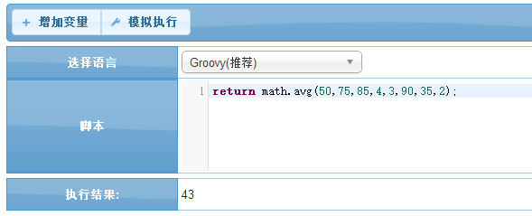
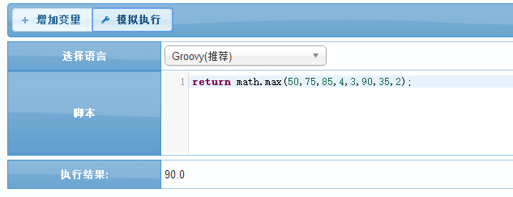
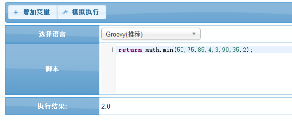

# math 数学操作

<!-- CODE-CALIBRATION:START -->

## 当前代码校准

来源：`bpmt-lite/platform/src/main/java/com/riversoft/core/script/function/MathUtil.java`，类上标注 `@ScriptSupport("math")`。脚本中通常以 `math.方法名(...)` 调用。

数字集合的汇总、平均、最大值和最小值。

| 函数签名 | 说明 |
| --- | --- |
| `sum(Number... list)` | 汇总 |
| `sum(List<?> list)` | 汇总 |
| `avg(Number... list)` | 平均 |
| `avg(List<?> list)` | 平均 |
| `max(Number... list)` | 最大 |
| `max(List<?> list)` | 最大 |
| `min(Number... list)` | 最小 |
| `min(List<?> list)` | 最大 |

<!-- CODE-CALIBRATION:END -->


BPMT中内建的一套对数字的数学操作函数,比如汇总,计算平均值等  

## *math.sum* 汇总
    对一系列的数进行汇总计算

#### 参数API ####
| 序号 | 参数类型 | 说明  |
| --- | --- | --- |
| 1 | List | 入参为数字的集合 |
| 返回值 | Number | 返回数字的集合汇总结果 |

#### 示例 1 :对数字集合(50,75,85,4,3,90,35,2)进行汇集计算
```groovy
return math.sum(50,75,85,4,3,90,35,2);
```


## *math.avg* 计算平均数
    对一系列的数进行平均计算,返回平均数

#### 参数API ####
| 序号 | 参数类型 | 说明  |
| --- | --- | --- |
| 1 | List | 入参为数字的集合 |
| 返回值 | Number | 返回数字的集合的平均结果 |

#### 示例 1 :对数字集合(50,75,85,4,3,90,35,2)进行平均计算
```groovy
return math.avg(50,75,85,4,3,90,35,2);
```


## *math.max* 返回最大值
    返回一系列数中的最大值

#### 参数API ####
| 序号 | 参数类型 | 说明  |
| --- | --- | --- |
| 1 | List | 入参为数字的集合 |
| 返回值 | Number | 返回数字的集合中的最大值 |

#### 示例 1 :返回数字集合(50,75,85,4,3,90,35,2)中的最大值
```groovy
return math.max(50,75,85,4,3,90,35,2);
```


## *math.min* 返回最小值
    返回一系列数中的最小值

#### 参数API ####
| 序号 | 参数类型 | 说明  |
| --- | --- | --- |
| 1 | List | 入参为数字的集合 |
| 返回值 | Number | 返回数字的集合中的最小值 |

#### 示例 1 :返回数字集合(50,75,85,4,3,90,35,2)中的最小值
```groovy
return math.min(50,75,85,4,3,90,35,2);
```



`by Chris`
