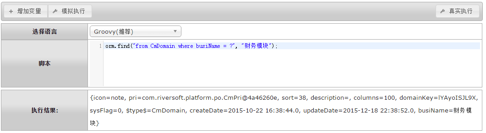
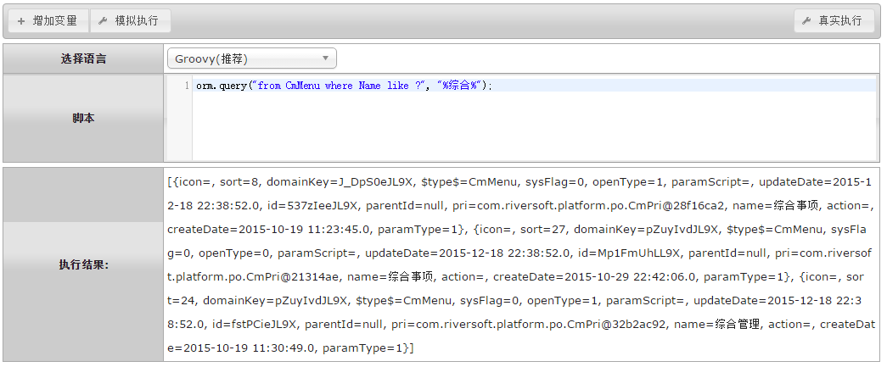
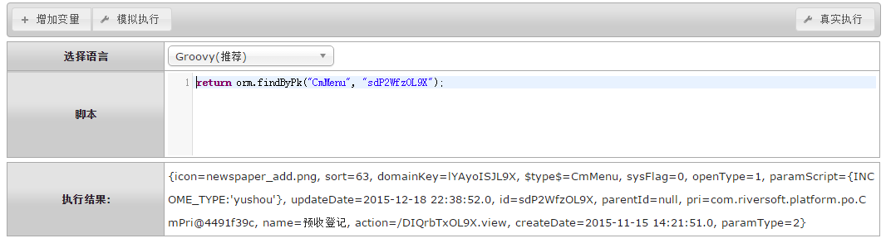
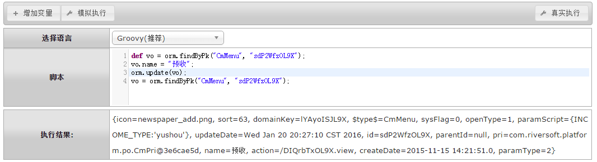

# orm 内建数据库(Hibernate)

<!-- CODE-CALIBRATION:START -->

## 当前代码校准

来源：`bpmt-lite/platform/src/main/java/com/riversoft/platform/db/ORMHelper.java`，类上标注 `@ScriptSupport("orm")`。脚本中通常以 `orm.方法名(...)` 调用。

面向 BPMT 内建 Hibernate 实体的 HQL 和实体操作函数。

| 函数签名 | 说明 |
| --- | --- |
| `save(Object o)` | 增 |
| `update(Object o)` | 改 |
| `remove(Object o)` | 删 |
| `removeByPk(String entityName, Serializable pk)` | 根据主键删 |
| `findByPk(String entityName, Serializable pk)` | 根据主键查找 |
| `find(String hql, Object... values)` | 根据HQL返回唯一值 |
| `query(String hql, Object... values)` | 根据HQL返回列表 |
| `exec(String hql, Object... values)` | 根据HQL执行 |

<!-- CODE-CALIBRATION:END -->


orm内建函数库，为操作BPMT内置系统表的函数库，区别于自建的动态表，动态表使用的是db函数库。

## orm.find ##
```
通过HQL语句查询唯一记录，当查询到多个记录时根据HQL语句排序规则返回第一个；
无记录时返回NULL；多个记录时抛出异常。
```
#### 参数API ####
| 序号 | 参数类型 | 说明  |
| --- | --- | --- |
| 1		| 字符串 	| 1.HQL串（可用问号代替入参）。 |
| 2...N		| 无限制 	| 问号替换参数（比如`orm.find("from CmDomain where busiName = ?", "财务模块");`）。 |
|返回值  | 对象 	  |对象Map|

###示例：
```groovy
orm.find("from CmDomain where busiName = ?", "财务模块");
```



## orm.query ##
```
通过HQL语句查询一组记录；无记录时返回size为0的集合。
```
#### 参数API ####
| 序号 | 参数类型 | 说明  |
| --- | --- | --- |
| 1		| 字符串 	| 1.HQL串（可用问号代替入参）。 |
| 2...N		| 无限制 	| 问号替换参数（比如`orm.query("from CmMenu where Name like ?", "%综合%");`）。 |
|返回值  | 对象列表 	  |无|

###示例：
```groovy
orm.query("from CmMenu where Name like ?", "%综合%");
```


## orm.findByPk ##
```
根据主键查询唯一值；查询不到结果则返回NULL。
```
#### 参数API ####
| 序号 | 参数类型 | 说明  |
| --- | --- | --- |
| 1		| 字符串 	| 表名。 |
| 2		| 字符串 	| 表主键字段值。 |
|返回值  | 对象 	  |对象Map。|

###示例：
```groovy
return orm.findByPk("CmMenu", "sdP2WfzOL9X");
```


##orm.update/orm.save
```
保存vo实体到数据库表中。
需要定义vo，vo对应的表名，表中对应必填的字段也必须要传。
```
#### 参数API ####
| 序号 | 参数类型 | 说明  |
| --- | --- | --- |
| 1		| vo 	| value object值对象。 |
|返回值  | 无 	  |无。|

###示例：
```groovy
def vo = orm.findByPk("CmMenu", "sdP2WfzOL9X");
vo.name = "预收";
orm.update(vo);
vo = orm.findByPk("CmMenu", "sdP2WfzOL9X");
```



<br/>
<br/>
<br/>
<br/>
<br/>
`by Wilmer`
