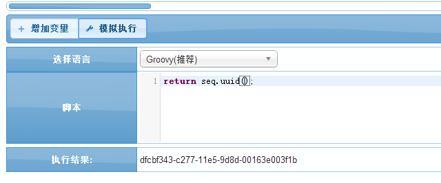
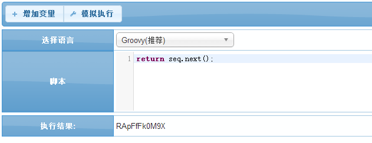
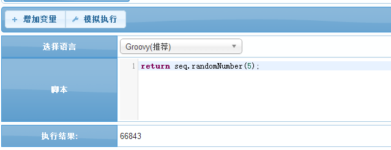
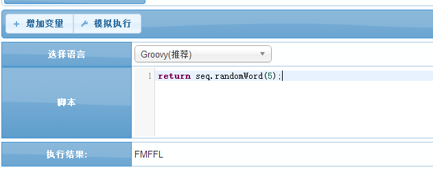
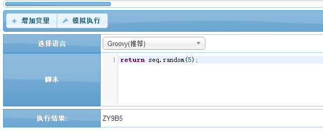

# seq 流水与随机数

BPMT里面特有的用于生成数据库特定流水号或者随机数的函数库;

## *seq.pattern* 模式组合创建流水号
    通过模式组合创建特定的流水号

####目前支持以下三种模式
| 序号 | 模式类型 | 传参1  | 传参2 |
|------|-------	-|-----|-----|
| 1 | 时间模式 | '{now}' | yyyyMMdd(根据该入参返回当前年月日) |
| 2 | 表单传参模式 | '{req}' | 表单字段名 |
| 3 | 自动序列号 | '{seq}' | '表名','字段名','长度' |

####示例1:时间模式
```groovy
// 返回当前年月,可以生成年月流水号
return seq.pattern('{now}','yyyyMM');
```

####示例2:表单传参模式
```groovy
// 返回当前表单字段的内容,可以通过抓取页面表单的字段内容,来生成特定流水号
return seq.pattern('{req}','PARENT_ID');
```

####示例3:自动递增生成序列号
```groovy
// 第一个参数是数据表名,第二个是字段名,最后一个是生成序列流水的长度;
// 下面的会生成一个XS0001的序列号,会自动递增生成;
return seq.pattern('XS{seq}','TABLE_NAME','FIELDS_NAME',4);

```

####示例4:混合模式
```groovy
//通常使用几种模式混合使用来生成流水号
return seq.pattern('PR{now}{req}{seq}','yyyy','PRAENT_ID','TABLE_NAME','FIELDS_NAME',5);

//上面的会生成类似PR2015XXX00001的序列号,并自动增长;
```

## *seq.uuid* 获取uuid
    获取一个全局的uuid

####参数API
| 序号 | 参数类型 | 说明  |
|------|-------	-|-----|
| 返回值 | 字符串 | 返回一个全局的uuid字符串 |

####示例1:获取一个全局唯一的uuid字符串
```groovy
return seq.uuid();
```


## *seq.next* 获取下一个唯一字符
    获取唯一字符

####参数API
| 序号 | 参数类型 | 说明  |
|------|-------	-|-----|
| 返回值 | 字符串 | 返回一个唯一识别的唯一字符 |

####示例1:获取下一个唯一字符串
```groovy
return seq.next();
```
;

## *seq.randomNumber* 生成随机数字
    通过入参的位数来生成相应位数的随机数字

####参数API
| 序号 | 参数类型 | 说明  |
|-----|-------	-|-----|
| 1 | 整数 | 通过入参的整数来确定返回字符串的长度 |
| 返回值 | 字符串 | 返回相应位数的随机数字字符串 |

####示例1:获取一个5位的随机数字字符串
```groovy
return seq.randomNumber(5);
```


## *seq.randomWord* 生成随机字符
    通过入参的位数来生成相应位数的随机字符

####参数API
| 序号 | 参数类型 | 说明  |
|------|-------	-|-----|
| 1 | 整数 | 通过入参的整数来确定返回字符串的长度 |
| 返回值 | 字符串 | 返回相应位数的随机字符字符串 |

####示例1:获取一个5位的随机字符字符串
```groovy
return seq.randomWord(5);
```


## *seq.random* 生成随机字符+数字混合
    通过入参的位数来生成相应位数的随机字符+数字混合

####参数API
| 序号 | 参数类型 | 说明  |
|------|-------	-|-----|
| 1 | 整数 |通过入参的整数来确定返回字符串的长度 |
| 返回值 | 字符串 | 返回相应位数的随机字符+数字的字符串 |

####示例1:获取一个5位的随机字符+数字字符串
```groovy
return seq.random(5);
```


`by Chris`
