# user 用户与组织架构

BPMT中对于用户与组织专门配套的函数库,通过该函数库,可以对用户与组织进行一系列操作,例如"获取当前用户"、"获取当前组织"、"获取当前角色"等;

## *user.getUser* 获取当前用户
     获取当前登陆用户的基本信息;

####参数API
| 序号 | 参数类型 | 说明  |
|------|-------	-|-----|
|返回值 | UsUser类 | 返回当前登陆用户的UsUser类实例 |

####示例1: 返回当前登陆的用户信息
```groovy
return user.getUser();
```
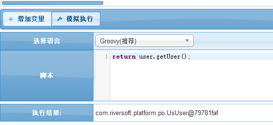

上面可以通过内置的函数转为Json格式;以下类似的均可用该函数转为Json格式;

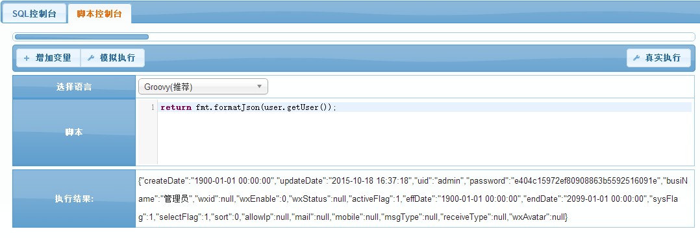

## *user.getGroup* 获取当前组织
    获取当前登陆用户的所在组织的基本信息;

####参数API
| 序号 | 参数类型 | 说明  |
|------|-------	-|-----|
| 1 | 整数 | 上推层级,获取上层父组织,代表上推多少个层级,不填和填0一样,返回当前组织 |
| 返回值 | UsGroup类 | 返回UsGroup类实例 |

####示例1:返回当前登陆的用户所在组织信息
```groovy
return user.getGroup();
```
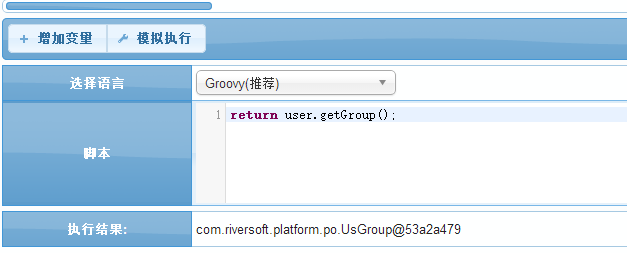

####示例2:返回当前用户向上推两个层级的父组织信息
```groovy
return user.getGroup(2);
```
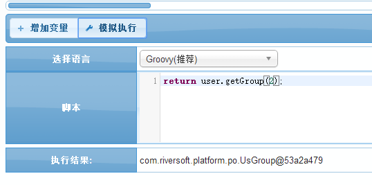

## *user.getParentGroup* 获取父组织
    获取特定组织的父组织;

####参数API
| 序号 | 参数类型 | 说明  |
|------|-------	-|-----|
| 1 | UsGroup类 | 入参一个UsGroup,以获取该组织的父组织 |
| 返回值 | UsGroup类 | 返回UsGroup类实例 |

####示例1:返回指定组织的父组织
```groovy
return user.getParentGroup(user.getGroupByUser('xinxinxi'));
```
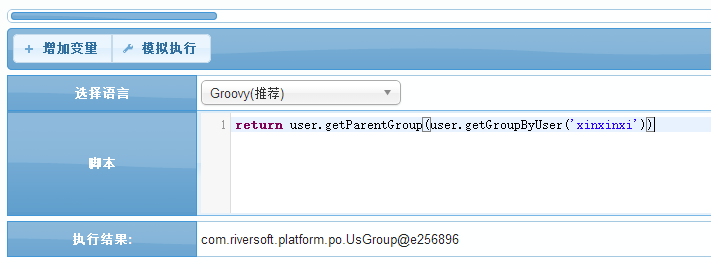

## *user.getRole* 获取当前角色
    获取当前登陆用户的所在角色;

####参数API
| 序号 | 参数类型 | 说明  |
|------|-------	-|-----|
| 返回值 | UsRole类 | 返回当前登陆用户的UsRole类实例 |

####示例1:返回当前登陆用户的角色信息
```groovy
return user.getRole();
```
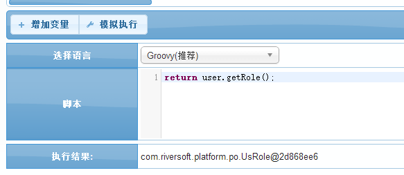

## *user.getUid* 获取当前登陆用户主键
    获取当前登陆用户的主键

####参数API
| 序号 | 参数类型 | 说明  |
|------|-------	-|-----|
| 返回值 | 字符串 | 返回当前登陆用户的用户主键 |

####示例1:返回当前登陆用户的用户主键
```groovy
return user.getUid();
```
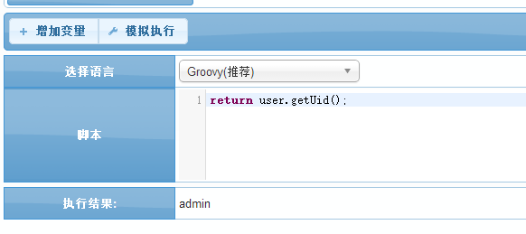

## *user.getRoleKey* 获取当前角色主键
    获取当前登陆用户的角色主键

####参数API
| 序号 | 参数类型 | 说明  |
|------|-------	-|-----|
| 返回值 | 字符串 | 返回当前登陆用户所在角色的角色主键 |

####示例1:返回当前登陆用户的角色主键
```groovy
return user.getRoleKey();
```
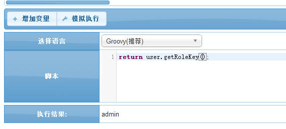

## *user.getGroupKey* 获取当前组织主键
    获取当前登陆用户的组织主键

####参数API
| 序号 | 参数类型 | 说明  |
|------|-------	-|-----|
| 返回值 | 字符串 | 返回当前登陆用户所在组织的组织主键 |

####示例1：返回当前登陆用户的组织主键
```groovy
return user.getGroupKey();
```


## *user.listSubGroup* 获取组织及其所有子组织
    通过组织主键(groupKey)来获取该组织还有其子组织

####参数API
| 序号 | 参数类型 | 说明  |
|------|-------	-|-----|
| 1 | 字符串 | 入参一个组织主键 |
| 返回值 | Collection &lt;UsGroup> | 返回该主键下所有组织包括子组织的集合 |

####示例1:返回特定组织下的所有组织
```groovy 
//返回组织key('gs')下的所有组织
return user.listSubGroup('gs');
```

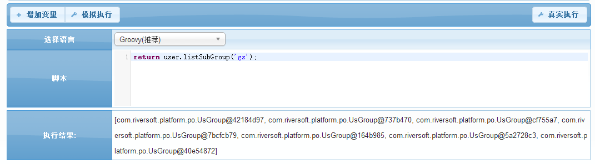 

## *user.listSubGroupKey* 获取所有组织主键
    通过组织主键(groupKey)来获取该组织及子组织的主键

####参数API
| 序号 | 参数类型 | 说明  |
|------|-------	-|-----|
| 1 | 字符串 | 入参一个组织主键 |
| 返回值 | Collection&lt;String> | 返回该组织主键下所有组织包括子组织的主键集合 |

####示例1:返回特定组织下的所有组织主键
```groovy
//返回组织key('gs')下的所有组织主键
return user.listSubGroupKey('gs');
```

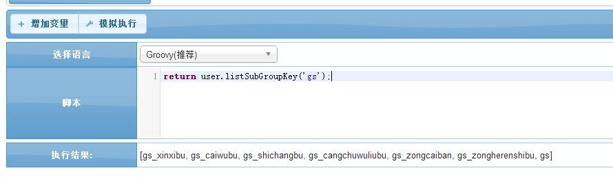

## *user.listUidByGroup* 获取组织下属所有员工ID
    通过组织主键(groupKey)来获取该组织下(包括子组织)所有员工ID

####参数API
| 序号 | 参数类型 | 说明  |
|------|-------	-|-----|
| 1 | 字符串 | 入参一个组织主键 |
| 返回值 | Collection&lt;String> | 返回该组织主键下的所有员工主键集合 |

####示例1:返回特定组织下的所有员工用户主键
```groovy
return user.listUidByGroup('gs');
```

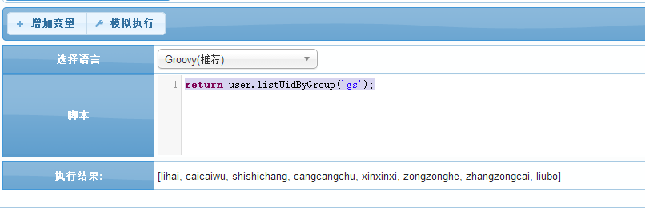

## *user.listUserByNameLike* 通过名字模糊查询用户
    通过用户名模糊查找用户的信息

####参数API
| 序号 | 参数类型 | 说明  |
|------|-------	-|-----|
| 1 | 字符串 | 入参一个用户名的一部分,用以模糊查找 |
| 返回值 | Collection&lt;UsUser> | 返回查找到的用户实例集合 |

####示例1:通过用户名模糊查找相关的用户
```groovy
return user.listUserByNameLike('综合');
```

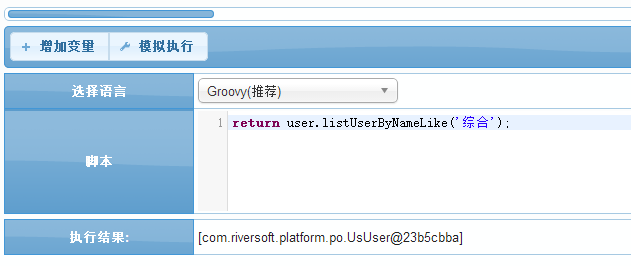

## *user.listUserByName* 通过名字获取用户
    通过用户名精确查找用户的信息

####参数API
| 序号 | 参数类型 | 说明  |
|------|-------	-|-----|
| 1 | 字符串 | 入参一个准确的用户名,用以精确查找 |
| 返回值 | Collection&lt;UsUser> | 返回查找到的用户实例集合 |

####示例1:通过用户名精确查找相关的用户
```groovy
return user.listUserByName('宗综合');
```

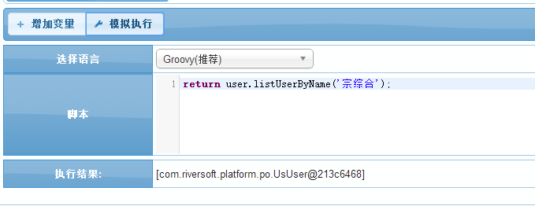

## *user.listUserByGroup* 获取组织下属所有员工
    获取特定组织下的所有员工
   
####参数API
| 序号 | 参数类型 | 说明  |
|------|-------	-|-----|
| 1 | 字符串 | 入参一个组织主键groupKey |
| 返回值 | Collection&lt;UsUser> | 返回该组织下所有员工的实例集合 |

####示例1:返回特定组织下的所有员工信息
```groovy
return user.listUserByGroup('gs');
```

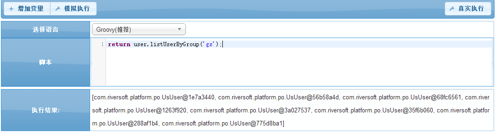

## *user.listGroupByUser* 获取员工对应组织(多组织)
    获取特定用户的对应组织集合

####参数API
| 序号 | 参数类型 | 说明  |
|------|-------	-|-----|
| 1 | 字符串 | 入参一个用户主键 |
| 返回值 | Collection&lt;UsGroup> | 返回该用户的组织对象集合 |

####示例1:通过用户主键查找对应用户组织的信息
```groovy
return user.listGroupByUser('xinxinxi');
```

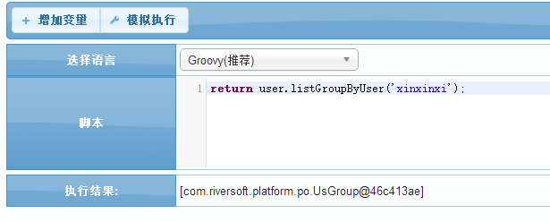

## *user.listRoleByUser* 获取员工对应角色(多角色)
    获取特定用户的对应角色集合
    
####参数API
| 序号 | 参数类型 | 说明  |
|------|-------	-|-----|
| 1 | 字符串 | 入参一个用户主键 |
| 返回值 | Collection&lt;UsRole> | 返回该用户的角色对象集合 |

####示例1:通过用户主键查找对应用户角色的信息
```groovy
return user.listRoleByUser('xinxinxi');
```

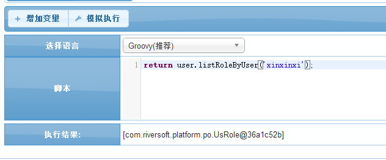

## *user.getGroupByUser* 获取员工对应组织(单组织)
    获取特定用户的对应组织信息

####参数API
| 序号 | 参数类型 | 说明  |
|------|-------	-|-----|
| 1 | 字符串 | 入参一个用户主键 |
| 返回值 | UsGroup类 |  返回该用户的组织对象 |

####示例1:通过用户主键查找对应用户的组织信息
```groovy
return user.getGroupByUser('xinxinxi');
```

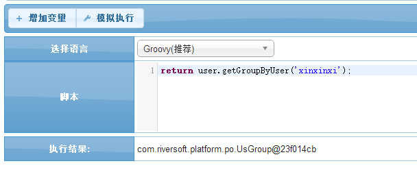

## *user.getRoleByUser* 获取员工对应角色(单角色)
    获取特定用户的对应角色信息

####参数API
| 序号 | 参数类型 | 说明  |
|------|-------	-|-----|
| 1 | 字符串 | 入参一个用户主键 |
| 返回值 | UsRole类 | 返回该用户的角色对象 |

####示例1:通过用户主键查找对应用户的角色信息
```groovy
return user.getRoleByUser('xinxinxi');
```

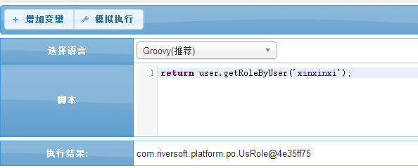

## *user.checkSameGroup* 判断指定用户是否与当前用户同在一个组织
    判断当前用户和指定用户的组织关系

####参数API
| 序号 | 参数类型 | 说明  |
|------|-------	-|-----|
| 1 | 字符串 | 入参一个用户主键 |
| 2 | 整数 | 入参一个整数,代表上推层级,没有代表当前层级 |
| 返回值 | 布尔值 | 返回判定结果 |

####示例1:判断当前登陆用户的组织是否和指定用户在同一个组织
```groovy 
return user.checkSameGroup('xinxinxi');
```

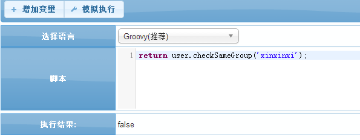

####示例2:判断当前登陆用户的组织是否和指定用户的前两层组织相同
```groovy
 return user.checkSameGroup('xinxinxi',2);
```

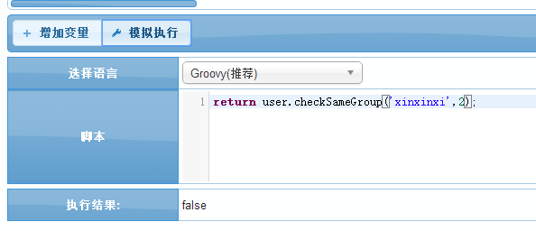

## *user.findRole* 翻译角色
    通过角色主键查找对应角色信息   

####参数API
| 序号 | 参数类型 | 说明  |
|------|-------	-|-----|
| 1 | 字符串 | 入参一个角色主键 |
| 返回值 | UsRole类 | 返回该角色对象 |

####示例1:通过特定角色主键查找相应角色信息
```groovy
return user.findRole('bumenjingli');
```

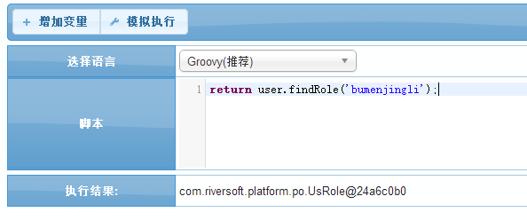

## *user.findGroup* 翻译组织
    通过组织主键查找对应组织信息    

####参数API
| 序号 | 参数类型 | 说明  |
|------|-------	-|-----|
| 1 | 字符串 | 入参一个组织主键 |
| 返回值 | UsGroup类 | 返回该组织对象 |

####示例1:通过特定组织主键查找相应组织信息
```groovy
return user.findGroup('gs');
```

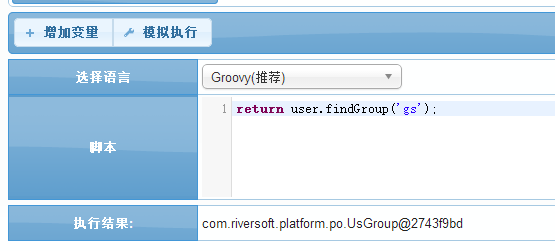

## *user.findUser* 翻译用户
    通过用户主键查找对应用户信息

####参数API
| 序号 | 参数类型 | 说明  |
|------|-------	-|-----|
| 1 | 字符串 | 入参一个用户主键 |
| 返回值 | UsUser类 | 返回该用户对象 |

####示例1:通过特定用户主键查找相应用户信息
```groovy
return user.findUser('xinxinxi');
```

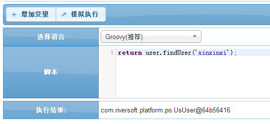

## *user.checkAdmin* 校验当前登录用户是否管理员
    校验当前登陆用户是否是管理员

####参数API
| 序号 | 参数类型 | 说明  |
|------|-------	-|-----|
| 返回值 | 布尔值 | 返回判断是否管理员的结果 |

####示例1:校验当前登陆用户是否管理员
```groovy
return user.checkAdmin();
```

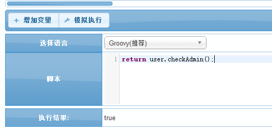


`by Chris`
