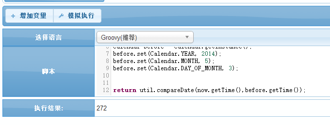
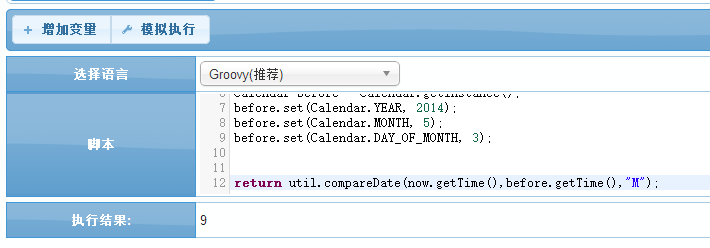
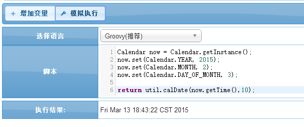
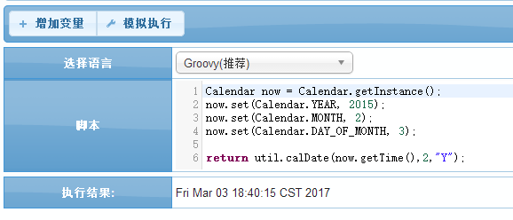

# util 通用工具

<!-- CODE-CALIBRATION:START -->

## 当前代码校准

来源：`bpmt-lite/platform/src/main/java/com/riversoft/platform/script/function/Util.java`，类上标注 `@ScriptSupport("util")`。脚本中通常以 `util.方法名(...)` 调用。

日期差值、日期加减、压缩包处理和 URL 编码函数。

| 函数签名 | 说明 |
| --- | --- |
| `compareDate(Date date1, Date date2)` | 计算两个时间之间的差值 |
| `compareDate(Date date1, Date date2, String pattern)` | 计算两个时间之间的差值 |
| `calDate(Date date, Integer offset)` | 日期加减计算(单位:天) |
| `calDate(Date date, Integer offset, String pattern)` | 日期加减计算 待计算时间 正数为加,复数为减 单位,默认为天 |
| `unzip(Object obj)` | 文件解压 |
| `zip(Object obj)` | 压缩附件 |
| `urlEncode(String value)` | url encode |

<!-- CODE-CALIBRATION:END -->


BPMT通用的函数库,包含了比如说对于日期的操作函数;

## *util.compareDate* 计算两个时间之间的差值
    比较两个日期之间的差值;(前一个日期减去第二个日期)

#### 参数API ####
| 序号 | 参数类型 | 说明  |
| --- | --- | --- |
| 1 | Date日期 | 入参一个想要比较的第一个日期 |
| 2 | Date日期 | 入参一个想要比较的第二个日期 |
| 3 | 字符串(可选) | 可选,默认差值为天;可以选择入参选择年月日时分等;<br>如年:"Y"/"y"; 月:"M"; 天:"D"/"d"(默认); 小时:"H"/"h"; 分:"m"; 秒:"s"; 毫秒:"S";
| 返回值 | 长整数 | 返回相应的差值,正或负 |

#### 示例1 : 对比2015/02/03和2014/05/03之间相差的天数
```groovy
Calendar now = Calendar.getInstance();
now.set(Calendar.YEAR, 2015);
now.set(Calendar.MONTH, 2);
now.set(Calendar.DAY_OF_MONTH, 3);

Calendar before = Calendar.getInstance();
before.set(Calendar.YEAR, 2014);
before.set(Calendar.MONTH, 5);
before.set(Calendar.DAY_OF_MONTH, 3);

return util.compareDate(before.getTime(),now.getTime());
```


#### 示例2 : 对比2015/02/03和2014/05/03之间相差的月数
```groovy
Calendar now = Calendar.getInstance();
now.set(Calendar.YEAR, 2015);
now.set(Calendar.MONTH, 2);
now.set(Calendar.DAY_OF_MONTH, 3);

Calendar before = Calendar.getInstance();
before.set(Calendar.YEAR, 2014);
before.set(Calendar.MONTH, 5);
before.set(Calendar.DAY_OF_MONTH, 3);

return util.compareDate(before.getTime(),now.getTime(),"M");
```


## 关于 diffYear 和 diffMonth

旧文档曾列出 `util.diffYear(...)`、`util.diffMonth(...)`。当前 `bpmt-lite` 代码中这两个方法是 `Util` 的私有实现方法，没有暴露为 `@ScriptSupport("util")` 可调用函数。

脚本中需要按年或按月比较时，使用 `util.compareDate(date1, date2, "Y")` 或 `util.compareDate(date1, date2, "M")`。

## *util.calDate*  日期加减计算
    对一个特定的日期进行加减计算(单位可选,默认为天)

#### 参数API ####
| 序号 | 参数类型 | 说明  |
| --- | --- | --- |
| 1 | Date日期 | 输入待计算的日期 |
| 2 | 整数 | 对日期的操作数,正数为加,负数为减 |
| 3 | 字符串(可选) | 操作数的单位,可选,可以选择入参选择年月日时分等;<br>如年:"Y"/"y"; 月:"M"; 天:"D"/"d"(默认); 小时:"H"/"h"; 分:"m"; 秒:"s"; 毫秒:"S";
| 返回值 | 日期 | 返回计算过后的日期 |

#### 示例 1:对日期2015/02/03 进行加10天计算
```groovy
Calendar now = Calendar.getInstance();
now.set(Calendar.YEAR, 2015);
now.set(Calendar.MONTH, 2);
now.set(Calendar.DAY_OF_MONTH, 3);

return util.calDate(now.getTime(),10);
```


#### 示例 2:对日期2015/02/03 进行加两年计算
```groovy
Calendar now = Calendar.getInstance();
now.set(Calendar.YEAR, 2015);
now.set(Calendar.MONTH, 2);
now.set(Calendar.DAY_OF_MONTH, 3);

return util.calDate(now.getTime(),2,"Y");
```


`by Chris`
