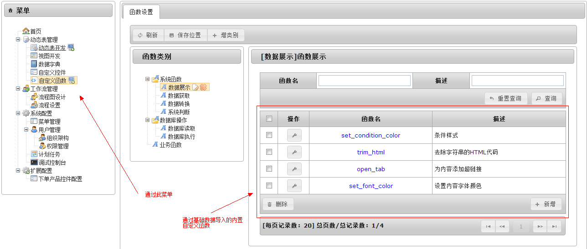
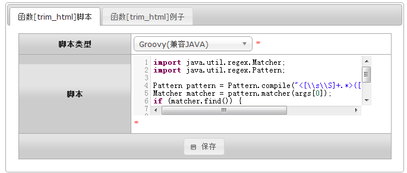
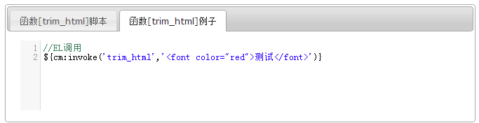

# 自定义函数

在BPM-Table系统中，允许开发配置人员通过界面编写函数，并且允许在系统任意位置调用这些自编写的函数。这些函数我们一般叫做“自定义函数”。

## 定义
自定义函数通过“自定义函数”菜单可以编写，如下图：

## 规范
自定义函数中，允许使用所有系统 [上下文](6.1.上下文介绍.md)、[内置函数](6.2.内置函数/README.md)与自定义函数（例如自定义函数fun_a中调用fun_a，其实就是递归调用效果）。

自定义函数的入参通过内置的args对象获取。args是一个对象数组，对应于调用时传入的各项入参，例如：cm.invoke(‘test’,1,’test’,now); 例子中args[0]对应第一项入参数字1；args[1]对应第二项入参字符’test’，args[2]对应第三项入参对象now。

编写自定义函数要求在配置界面中详细描述函数功能，入参、返回值，条件允许时还应编写部分实例代码。如下图所示：

## 调用

自定义函数通过内置函数库中的cm.invoke方法调用,详见本文档: [cm函数库](6.2.内置函数/cm.md)。
