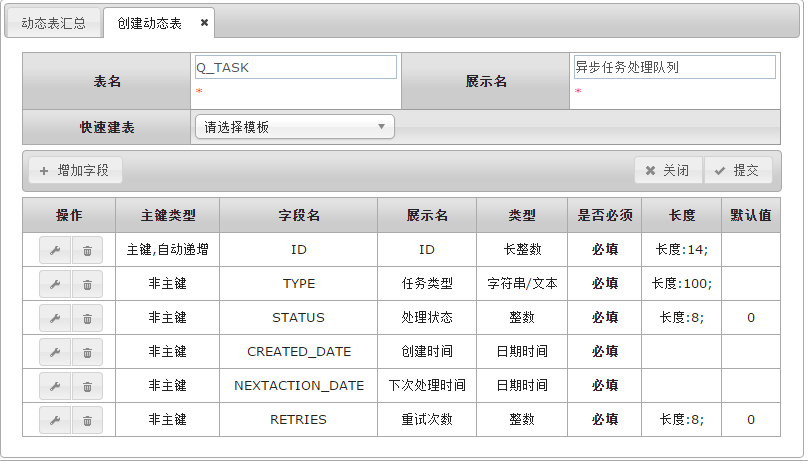
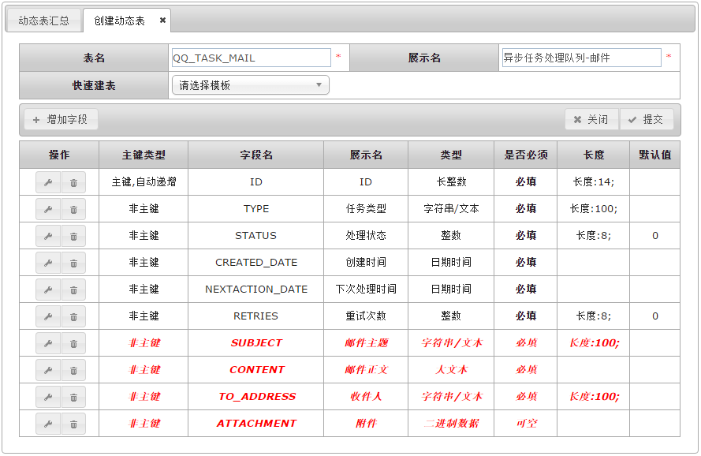
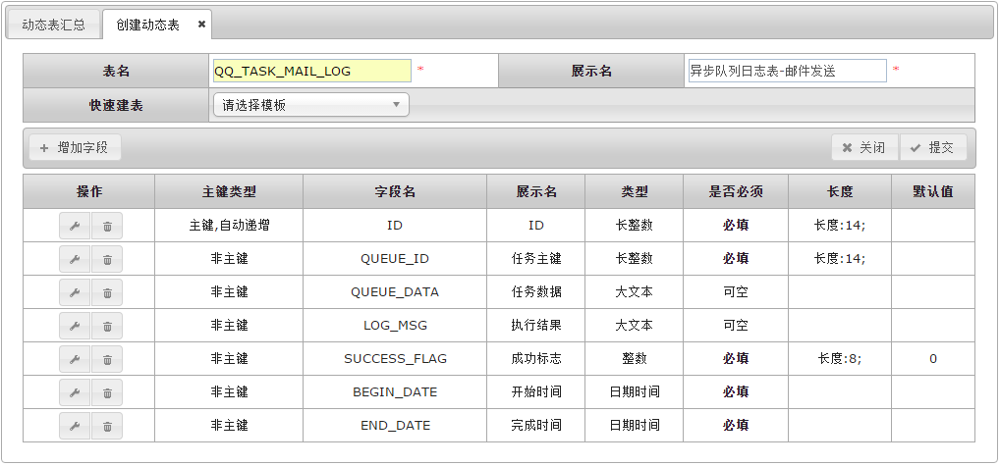
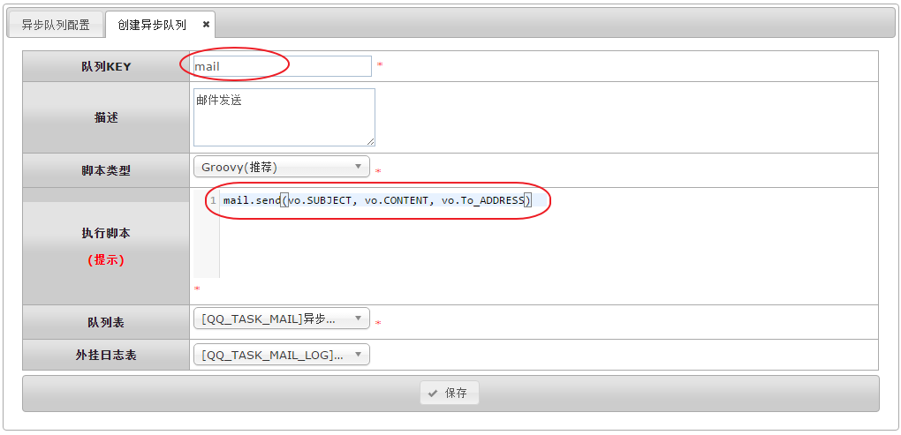

# 异步队列

BPMT的**异步队列**是指将一些耗时且实时性要求不高的任务通过后台异步进行处理,以此实现主业务流程快速响应，优化用户体验。

一个例子具体是工作流流转触发邮件进行通知，发送邮件本身比较比较耗时，通过异步队列可以将发送邮件的任务存放于队列(动态表来实现)中，异步队列框架对任务进行异步处理。框架本身提供了出错重发等机制。

BPMT提供了2个动态表模板：


- 异步队列-队列表
- 异步队列-处理日志

## 队列表

**队列表**模板结构如下：



队列表用于存在将要被异步处理的任务，需要注意的是上面队列表模板还需要添加额外字段才能被使用。 以邮件发送为例，一般来说发送邮件需要以下信息：邮件标题，正文，发件人，收件人，附件等；所以上面的动态表可以自己扩展需要的字段，例如下图中红色字段：



在需要发送邮件的地方可以通过内置函数： [queue 异步队列](6.2.内置函数/queue.md) 添加邮件任务，例如邮件发送：

```groovy
def mail = ['SUBJECT':'这是邮件标题', 'CONTENT':'这是邮件正文', 'TO_ADDRESS':'123@abc.com']
queue.add('mail', mail)
```

至此发送邮件的任务已经添加到动态表，上面脚本中的第一个参数 "mail" 表示一个任务的类别，该类别会在配置异步队列处理逻辑（见下）的时候继续使用。

## 处理日志

异步队列的处理日志可以通过配置动态表来保存，以下是日志表模板：



## 处理逻辑

异步队列的处理逻辑可以通过groovy脚本进行实现。同样以上面邮件发送为例，配置异步队列如下：




- 队列KEY为 ‘mail’（见上）。
- 执行脚本中可以使用vo来访问队列中存放的任务，比如 vo.SUBJECT, vo.CONTENT和 vo.TO_ADDRESS。
- 执行脚本可以使用其它内置函数或者自定义函数来实现自有逻辑。


@by borball
