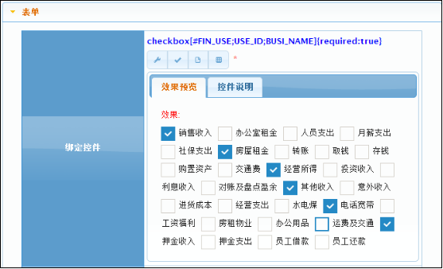
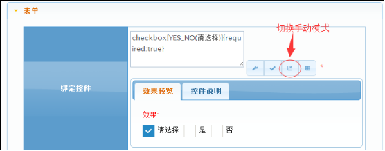

# checkbox 复选框
checkbox复选框
## 效果展示

## 参数API
*无参数，不支持动态入参*
## 界面脚本
无
## 示例1：通过视图字段的表单设置checkbox控件
BMPT里暂时不能直接选择checkbox控件，只能通过代码调用：
通过手动模式输入代码绑定checkbox控件：
```groovy
checkbox[YES_NO(请选择)]{required:true}
```




`by jimlin`
