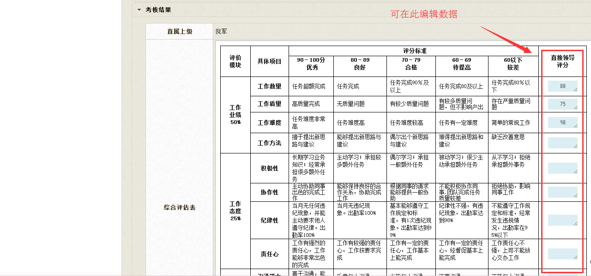
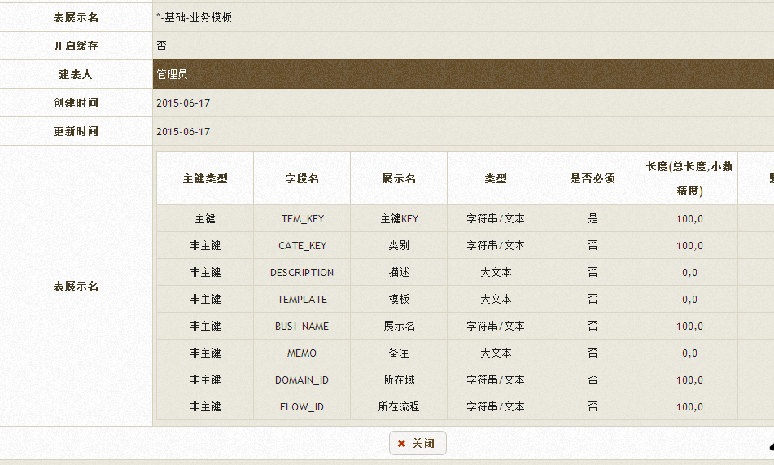
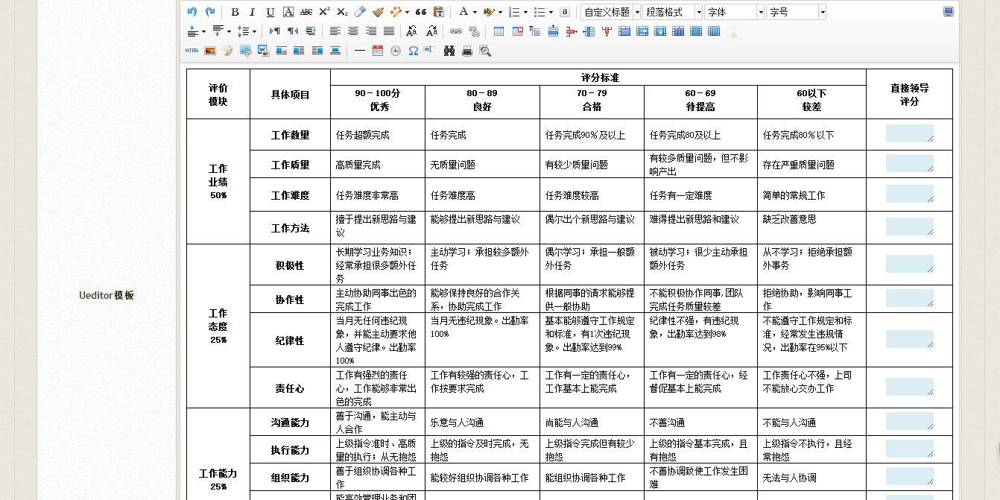
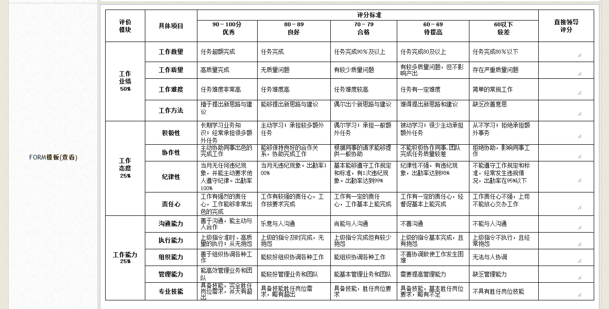
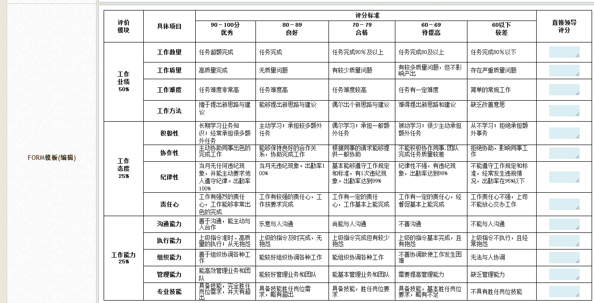
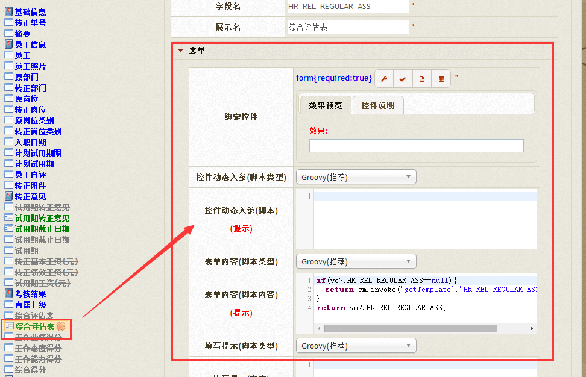
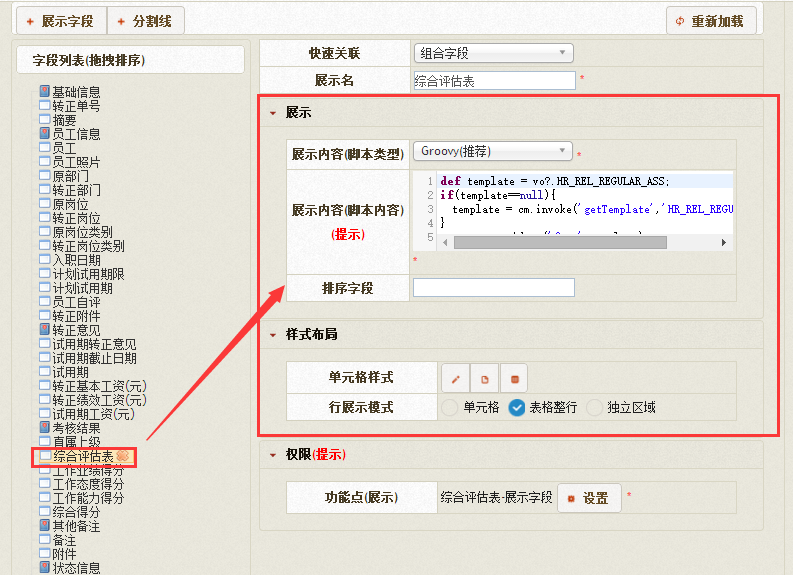

# form 自定义表单

form自定义表单支持在ueditor控件中编辑表单内容并可以get到.

## 效果展示



## 参数API

描述 : 超级富文本编辑框(UEditor)

### 固定参数 API

| 序号 | 类型 | 描述 |
| --- | --- | --- |
|1|可选|宽度<br>`示例1(宽度800像素):ueditor[800px]`<br>`示例2(宽度占外部区域90%):ueditor[90%]`|
|2|可选|高度<br>`示例1(宽度600像素,高度400像素):ueditor[600px;400px]`<br>`示例2(宽度使用系统默认值,高度200像素):ueditor[null;200px]`|

### 动态参数 API

| 名称 | 类型 | 描述 |
| --- | --- | --- |
| (无) | 此控件不支持动态入参,不支持表单校验(包括"是否为空"校验) | 无 |

### 页面JS API

| 名称 | 参数说明 | 描述 |
| --- | --- | --- |
| init() | 无 | 将控件设置为初始化状态.<br>调用示例:<br>`Widget.init($form,name);` |
| val(value) | value:可选参数,目标值(用于赋值). | 设置控件值.当val未传入时返回控件值.<br>调用示例:<br>`Widget.val($form,name,’1’);` |

## 示例

### 创建模板

创建模板表, 将要在form控件中展示的模板先用表保存起来, 如下图:



在视图中填写模板的信息, 分别分为Ueditor模板, FORM模板(查看), FORM模板(编辑)三块:

Ueditor模板:



FORM模板(查看):



FORM模板(编辑):



### 在表单中调用

在表单字段的表单内容(脚本填写):
```
if(vo?.HR_REL_REGULAR_ASS==null){
  return cm.invoke('getTemplate','HR_REL_REGULAR_ASS',null);
}
return vo?.HR_REL_REGULAR_ASS;
```


### 在展示字段调用:

在展示字段填写展示内容(脚本内容):
```
def template = vo?.HR_REL_REGULAR_ASS;
if(template==null){
  template = cm.invoke('getTemplate','HR_REL_REGULAR_ASS',null);
}
return cm.widget('form',template);
```


`by Tony`
