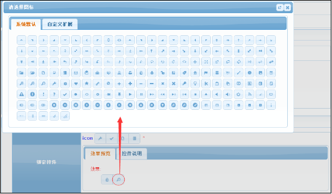
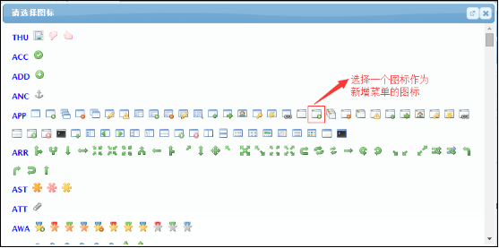
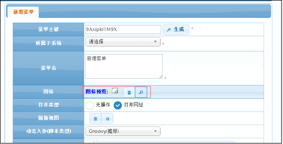

# icon 图标选择器
用于选择图标的控件。
## 效果展示 ##

## 参数API ##
| 序号 | 类型 | 说明  |
|:------:|:--------:|-------------------------|
| 1		|   可选 	|选择图标风格.可选值如下: jquery: 默认值.jquery ui风格图标,仅用于系统按钮. sys: 扩展图标,可用于菜单,自定义展示等
## 界面脚本 ##
界面脚本(待补充)
##示例1:为一个菜单配置一个图标##

`by jimlin`
