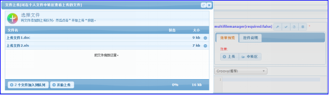

# multifilemanager 多选附件
用于上传多个附件的控件。
## 效果展示

## 参数API
| 序号 | 类型 | 说明  |
|:------:|:--------:|-------------------------|
| 1		|   可选 	|数据保存模式: db:文件保存在数据库,默认值.(注意:直接以二进制形式保存在数据库,数据量不宜过大)  disk:文件保存在磁盘空间,数据库中只保留链接.  
## 界面脚本
|函数| 序号 | 类型 | 说明  |描述|
|:------:|:--------:|:--------:|:--------|:--------|
|init |无 |无 |无 |将控件设置为初始化状态. 调用示例:Widget.init($form,name);|

`by jimlin`
