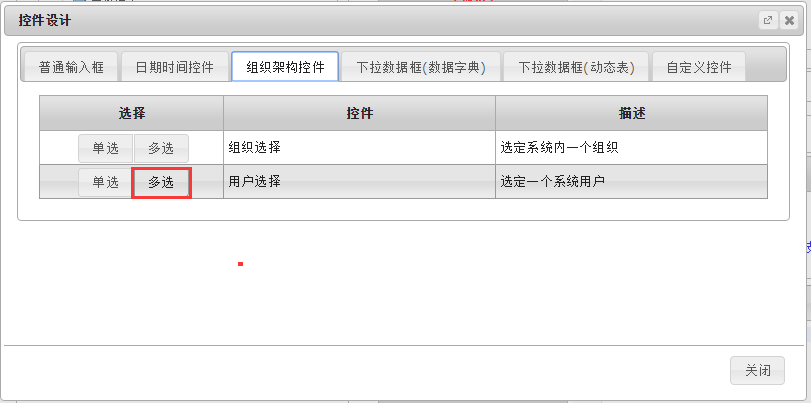
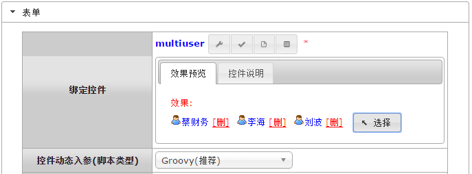
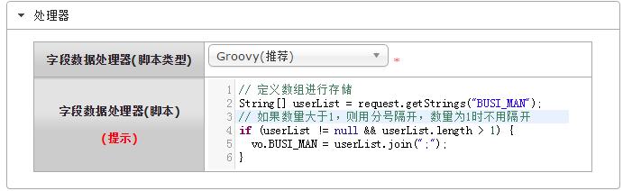

# multiuser 用户多选框
可同时选择多个系统用户的控件。

###示例：

<br/>


<br/>
```
字段数据处理器中获取代码如下：
```


```groovy
// 定义数组进行存储
String[] userList = request.getStrings("BUSI_MAN");
// 如果数量大于1，则用分号隔开，数量为1时不用隔开
if (userList != null && userList.length > 1) {
  vo.BUSI_MAN = userList.join(";");
}
```

<br/>
<br/>
<br/>
<br/>
<br/>
`by Wilmer`
