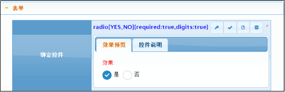
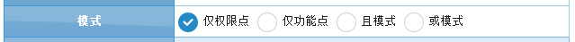

# radio 单选框
单选框多用于系统本身界面，通过radio命令调用，比如radio[YES_NO]
## 效果展示 ##

## 参数API ##
| 序号 | 类型 | 说明  |
|:------:|:--------:|------------|
| 1		|   必填 	|支持四类数据入参模式：                                                                             1) 字典分组字段，如：YES_NO。直接使用系统字段做为下拉数据。     2) #开头+表名，如：#PRD_ITEM。采用动态表做为下拉数据。         3) $开头+对象名，如：$com.riversoft.platform.po.CmUser。采用系统内置对象翻译。                                           4) @开头+枚举类名，如：@com.riversoft.platform.script.ScriptTypes。              采用系统内置枚举进行翻译，此方式一般配合SDK使用。 此项可包含子参数（子参数的定义详见.....），如: select[YES_NO(请选择)] 表示初始状态包含默认值（值为空），展示名为“请选择”； select[YES_NO(推荐:1)] 表示初始状态包含默认值（值为1），展示名为“推荐”。 |
| 2		| 动态表与内置对象翻译时必填 | 1）动态表模式时的CODE字段，如：PRD_ITEM表中的ID字段； 2）内置对象模式时的CODE字段，如CmUser表中的uid字段。 |
|3  | 动态表与内置对象翻译时必填	  |1）动态表模式时的NAME字段，如：PRD_ITEM表中的BUSI_NAME字段； 2）内置对象模式时的NAME字段，如CmUser表中的busiName字段。|
|4|可选|约束条件。 1）动态表模式时为sql语句where之后的值； 2）内置对象模式时为hql语句where之后的值； 3）字典模式时为hql语句where之后的值； 4）枚举模式不支持。
|5|可选|布尔类型，默认值false；下拉框中是否展示“CODE”的值。|
## 界面脚本 ##
|函数| 序号 | 类型 | 说明  |描述|
|:------:|:--------:|:--------:|:--------|:--------|
|init |无 |无 |无 |将控件设置为初始化状态. 调用示例:Widget.init($form,name);|
|enabled|1| 可选| true:可用,默认值;false:不可用.|将控件设置为可用/不可用(disabled)状态. 调用示例:Widget.enabled($form,name);|
|disabled |无 |无 |无 |将控件设置为不可用状态. 调用示例:Widget.disabled($form,name);|
|val |1 |可选 |目标值|设置控件值.当val未传入时返回控件值. 调用示例:Widget.val($form,name,’1’);|
|change |1 |必选 |回调函数,入参$this是控件对应的jquery对象. |设置控件事件回调函数.控件触发blur时调用. 调用示例: Widget.change($form,name,function($this){ alert($this.val()); });|

##示例##

`by jimlin`
