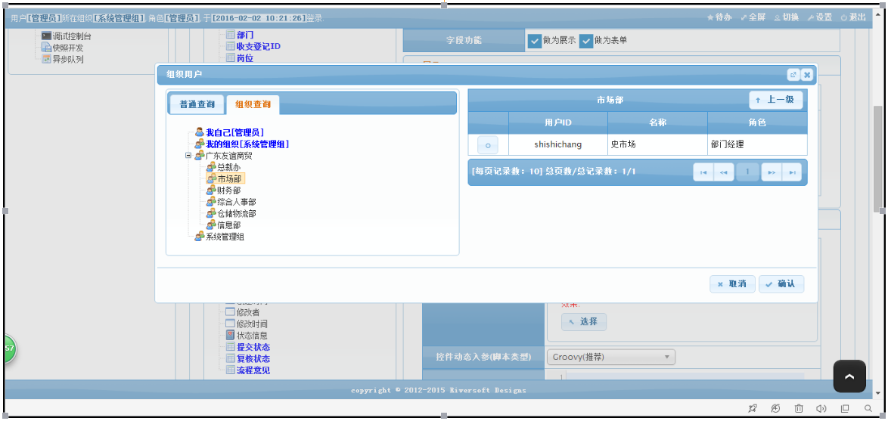
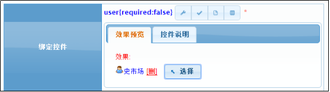

# user 用户选择框
用于选择某个用户的控件。
## 效果展示

## 参数API
| 序号 | 类型 | 说明  |
|:------:|:--------:|-------------------------|
| 1		|   boolean 	|可选,是否在展示账号.默认false.
## 界面脚本
|函数| 序号 | 类型 | 说明  |描述|
|:------:|:--------:|:--------:|:--------|:--------|
|init |无 |无 |无 |将控件设置为初始化状态. 调用示例:Widget.init($form,name);|

## 示例1:申请人设置默认值为当前登录者

`by jimlin`
