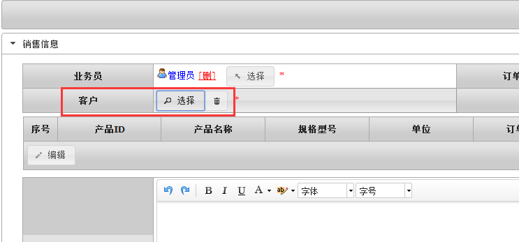
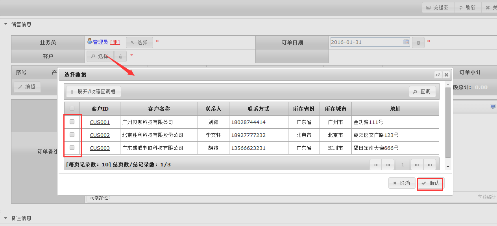
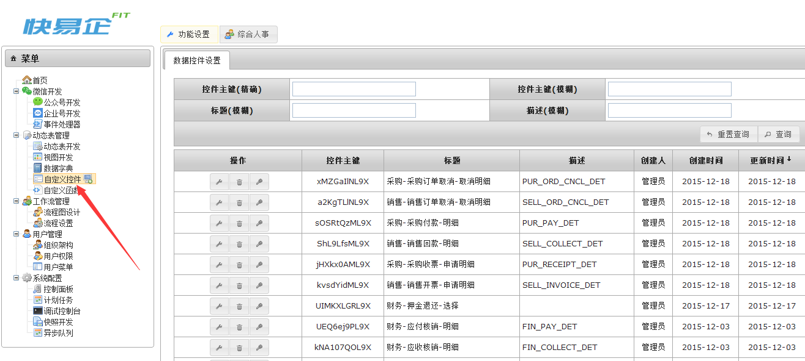
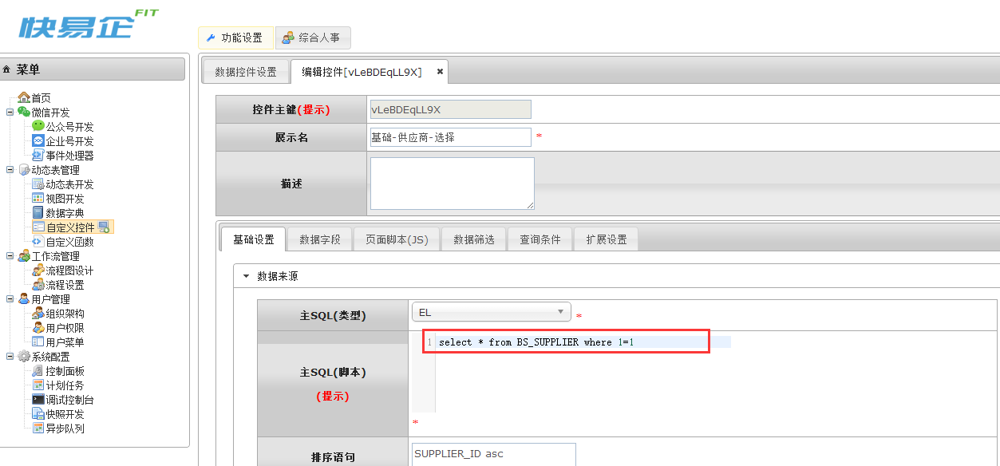
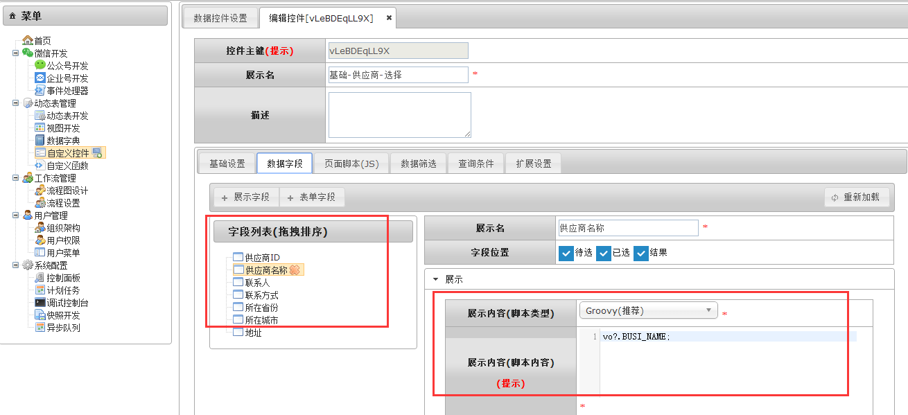
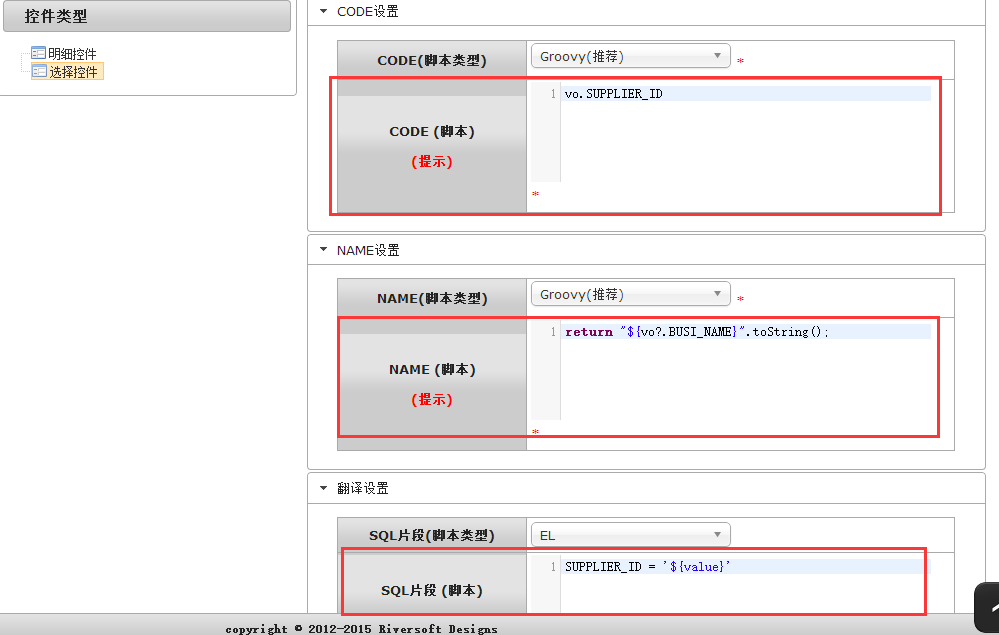
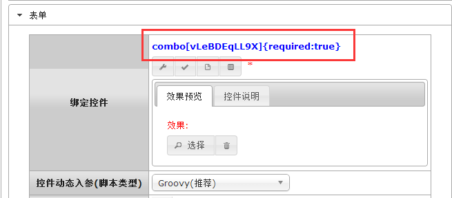
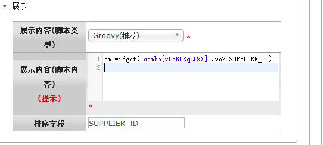
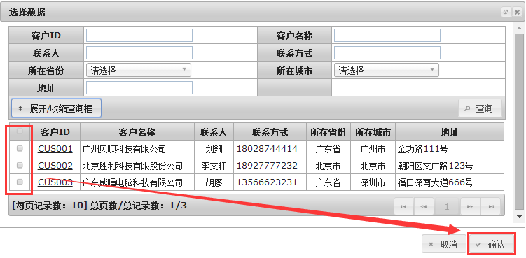

# combo 自定义选择框

通过combo控件, 可以对动态表的数据进行自定义筛选并翻译对应的字段值.combo控件需要自行配置.

## 效果展示 





## 参数API 

### 固定参数 API

| 序号 | 类型 | 描述 |
| --- | --- | --- |
| 1 | 必填 | 自定义控件配置KEY |

### 动态参数 API

| 名称 | 类型 | 描述 |
| --- | --- | --- |
| orderBy | string | 排序SQL片段 |
| pageLimit | number | 每页记录数 |
| ? | ? | 任意自定义参数均可以在控件中的处理器通过cm.params()函数调用 |

### 页面JS API

| 名称 | 参数说明 | 描述 |
| --- | --- | --- |
| init() |  无 | 将控件设置为初始化状态.<br>调用示例: <br> 	`Widget.init($form,name);`|
| enabled(flag) | flag:true:可用默认值;false:不可用 | 将控件设置为可用/不可用(disabled)状态.<br>调用示例:<br>`Widget.enabled($form,name); `|
| disabled() | 无 | 将控件设置为不可用状态<br> 调用示例: <br>`Widget.disabled($form,name);`|
| val(value) | value:可选参数,目标值(用于赋值). | 设置控件值.当val未传入时返回控件值.<br>调用示例: <br>`Widget.val($form,name,’1’);` |
| change() | 无 | 设置控件事件回调函数.控件触发change时调用<br>调用示例:<br>`Widget.change($form,name,function($this){alert($this.val());});`|

## 示例
###1.combo控件通过“自定义控件”菜单可以配置，如下图 :



###2.通过在tab[基础设置]中选择主SQL类型和填写主SQL(脚本), 如下图 :
在主SQL(脚本)中输入
```sql
select * from [TABLE_NAME] where 1=1
```


###3.在tab[数据字段]中新增展示字段, 增加需要展示的字段并填写展示内容(脚本内容), 如下图 :
填写展示名后, 在展示内容(脚本内容)中填写对应的VO字段, 并可做翻译
```groovy
return vo?.BUSI_NAME;
```


###4.最后在tab[扩展设置]中, 控件类型选择选择控件(即combo控件), CODE设置填写CODE(脚本), NAME设置填写NAME(脚本), 翻译设置SQL片段(脚本类型)
CODE(脚本):选择后返回的唯一标识
```groovy
vo.[COLUMN_NAME]
```
NAME(脚本):翻译的展示名
```groovy
return "${vo?.[COLUMN_NAME]}".toString();
```
SQL片段(脚本):后台执行的查询SQL语句where条件
```groovy
[COLUMN_NAME] = '${value}'
```


### 调用combo控件

在表单字段中使用combo[控件主键], 如下图



在展示字段中用于翻译值, 如下图:

	return cm.widget('combo[控件主键]',vo?.COLUMN_NAME);



## 最终效果
自定义的字段的动态表数据供给选择



`by Tony`
