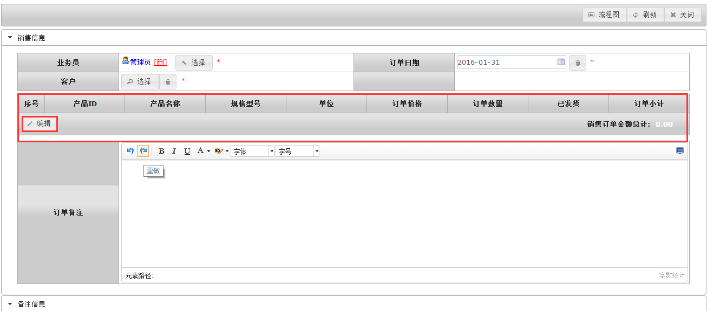
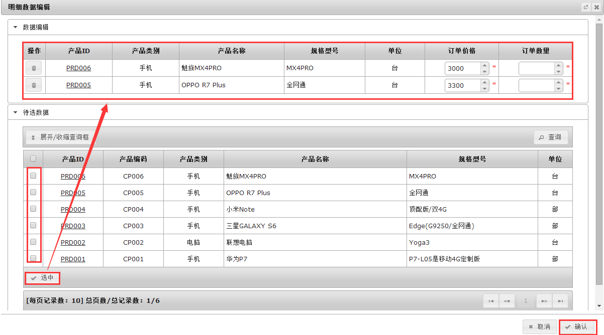
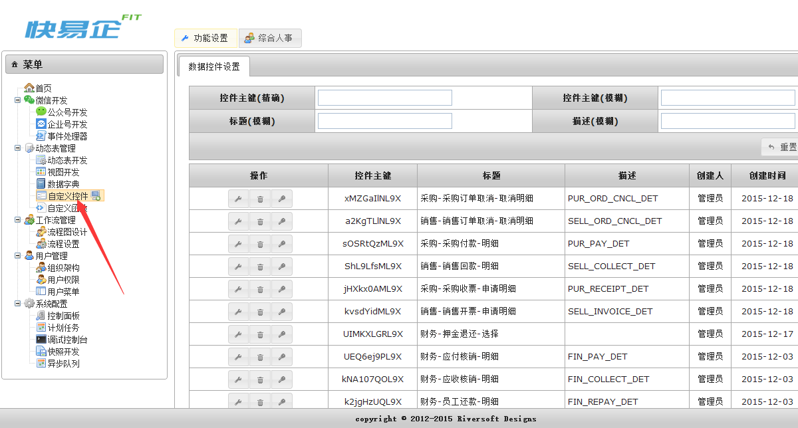
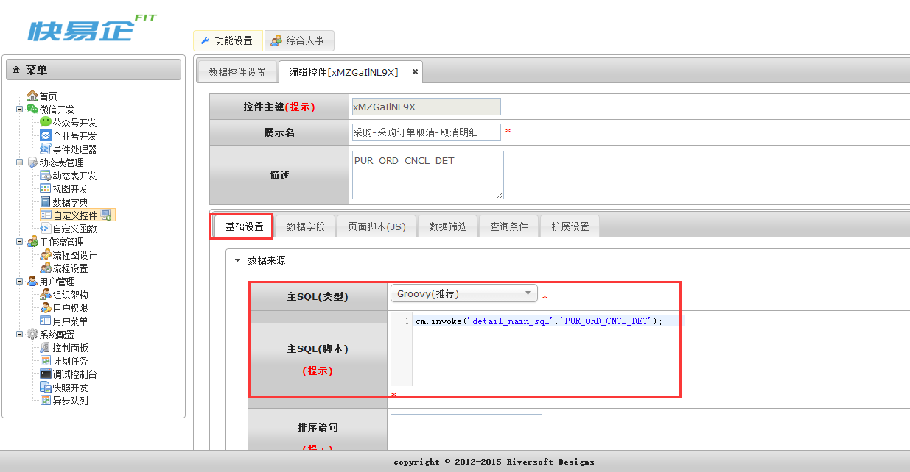
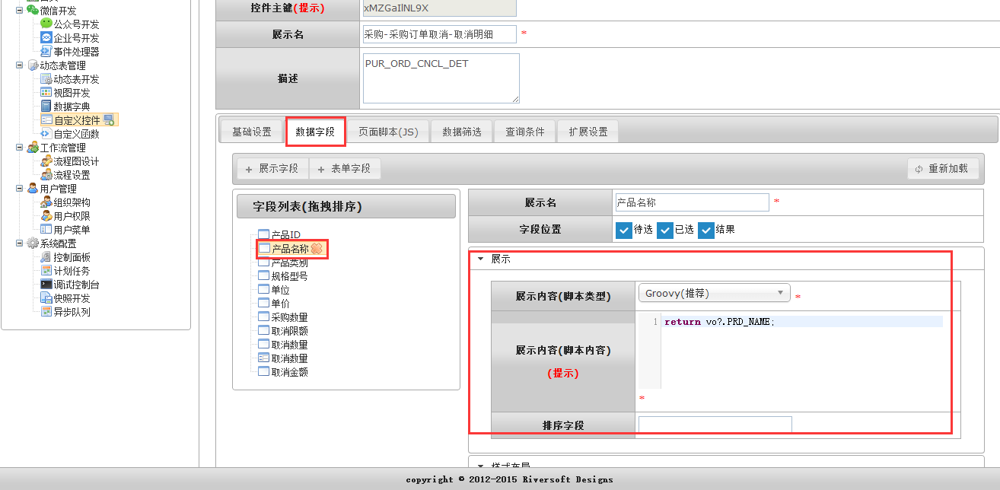
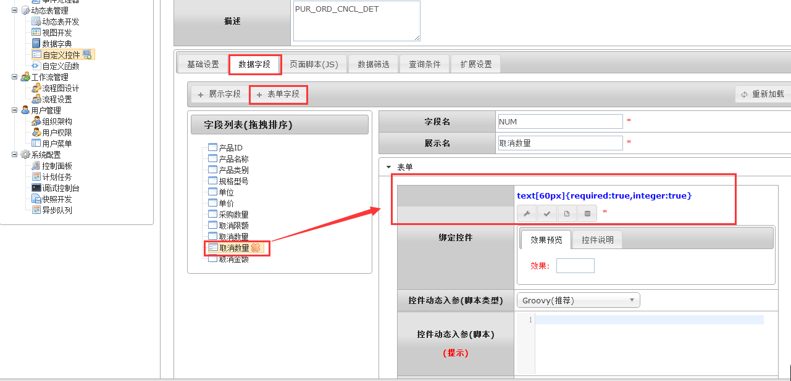
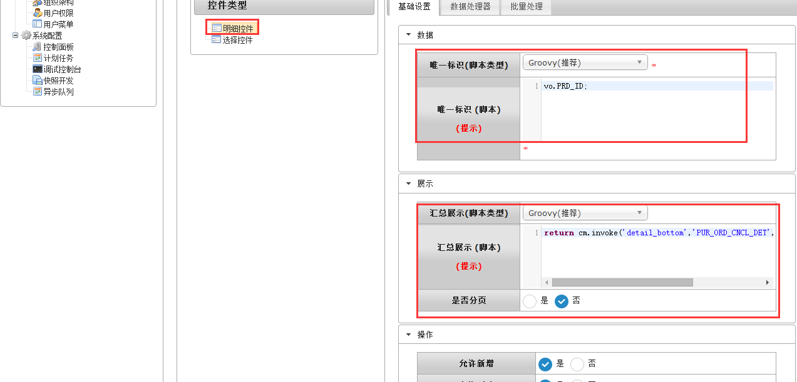
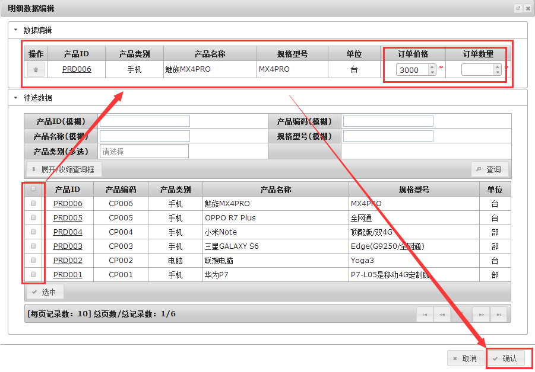

# detail 数据明细

通过detail明细控件, 可以对动态表的数据进行自定义筛选提取并翻译对应的字段值, 并对表单值进行相对应的操作.

## 效果展示 




## 参数API 

### 固定参数 API

| 序号 | 类型 | 描述 |
| --- | --- | --- |
|1|必填|自定义控件配置KEY|

### 动态参数 API

| 名称 | 类型 | 描述 |
| --- | --- | --- |
| orderBy | string | 排序SQL片段 |
| pageLimit | number | 每页记录数 |
| add | boolean | 控件是否允许增加数据 |
| delete | boolean | 控件是否允许删除数据 |
| ? | ? | 任意自定义参数均可以在控件中的处理器通过cm.params()函数调用. |

### 页面JS API

| 名称 | 参数说明 | 描述 |
| --- | --- | --- |
| init() | 无 | 将控件设置为初始化状态.<br>调用示例:<br>`Widget.init($form,name);` |
| enabled(flag) | flag:true:可用,默认值;false:不可用. | 将控件设置为可用/不可用(disabled)状态.<br>调用示例:<br>`Widget.enabled($form,name);` |
| disabled() | 无 | 将控件设置为不可用状态.<br>调用示例:<br>`Widget.disabled($form,name); `|
| val(value) | value:可选参数,目标值(用于赋值). | 设置控件值.当val未传入时返回控件值.<br>调用示例:<br>`Widget.val($form,name,json);` |

## 示例

###1.detail控件通过“自定义控件”菜单可以配置，如下图 :



###2.通过在tab[基础设置]中选择主SQL类型和填写主SQL(脚本), 如下图 :
在主SQL(脚本)中输入
```sql
cm.invoke('detail_main_sql','[TABLE_NAME]');
```
[detail_main_sql]是自定义函数, 这个语句去调用对应的自定义函数, 其具体执行的语句是sql语句:
```sql
select * from [TABLE_NAME] where 1=1
```


###3.在tab[数据字段]中新增展示字段和表单字段, 增加需要展示的字段并填写展示内容(脚本内容),增加需要操作的表单字段并选择对应的基础控件 如下图 :
填写展示名后, 在展示内容(脚本内容)中填写对应的VO字段, 并可做翻译

```groovy
return vo?.[COLUMN_NAME];
```



填写表单字段的字段名和展示名后,绑定控件中选择基础控件类型,填写表单内容(脚本内容),
```groovy
return vo?.[COLUMN_NAME];
```


###4.最后在tab[扩展设置]中, 控件类型选择明细控件(即detail控件), 数据中填写唯一标示(脚本), 展示中填写汇总展示(脚本)
唯一标示(脚本): 选择后返回的唯一标识
```groovy
vo.[COLUMN_NAME]
```
汇总展示(脚本): 在明细展示页下的汇总结果, 以下语句是调用汇总函数(函数自行定义), 传入对应的参数, 返回结果,如无需汇总可不填
```groovy
return cm.invoke('detail_bottom','[TABLE_NAME]',list,'采购订单取消金额');
```


## 最终效果
自定义的字段的动态表数据供给选择, 能批量选择以后能对相对应的表单字段进行操作最后确认



`by Tony`
