# 组织架构
组织架构是企业的流程运转、部门设置及职能规划等最基本的结构依据,是BPMT系统权限管理的基础。
## 创建系统组织架构
BMPT的组织架构由【组织架构管理】、【角色管理】、【用户管理】3部分组成。

举例:天天贸易公司的组织架构如下图,如何在系统上建立?
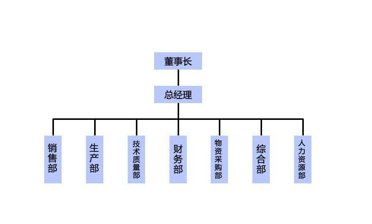
#### 创建组织
功能设置>菜单>组织架构>组织架构管理
注意:组织KEY可以由系统自动生成，但建议自己填写，方便以后管理。
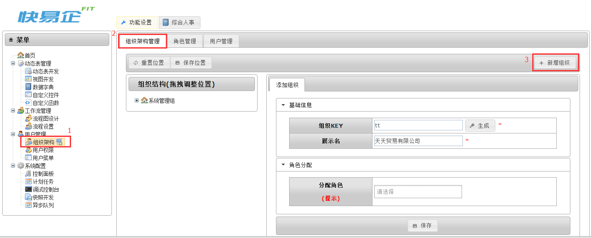

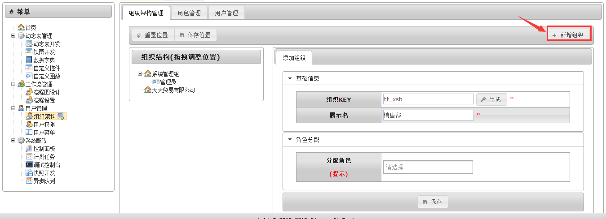

拖动[销售部]放置在[天天贸易有限公司]里面，并点击保存位置。
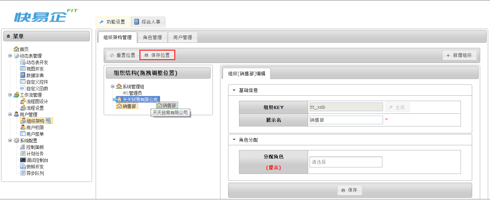

同样的我们按照上面的做法把[天天贸易有限公司]的组织建立起来。
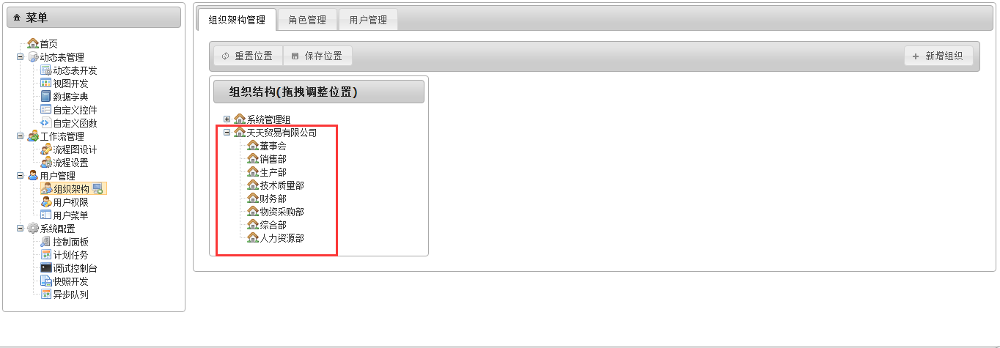

建好了组织，那么角色如何创建？假如[销售部]有[销售经理]、[销售助理]该如何添加？
#### 添加角色
功能设置>菜单>组织架构>角色管理
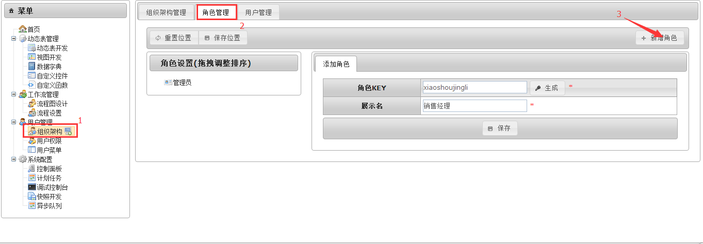
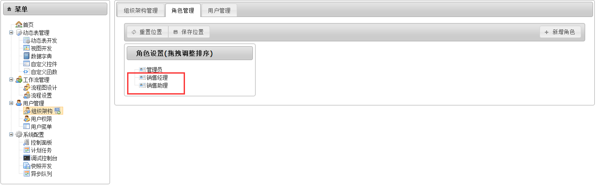
[销售经理]和[销售助理]这两个角色创建完成，如何将这两个角色“下挂”到[销售部]下面？
##### 分配角色
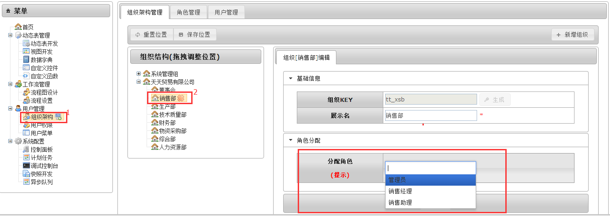
注意：只有创建完成的角色在[分配角色]里面才能选到。

#### 创建用户
功能设置>菜单>组织架构>用户管理
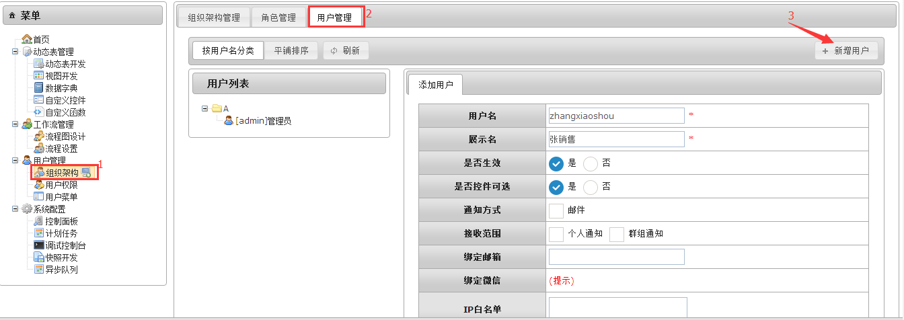
* 填写提示：
[用户名]是系统登录名，[用户名]、[展示名]和[密码]均为必填项；
[通知方式]选择绑定邮箱，如果系统上有该用户待处理的任务时系统会以邮件的方式提醒用户登录系统处理；
[接收范围]系统推送的任务分个人任务和群组任务。
##### 分配用户
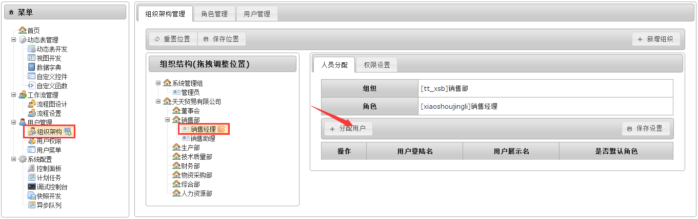

## 用户登录
退出系统，用新建的用户登录系统
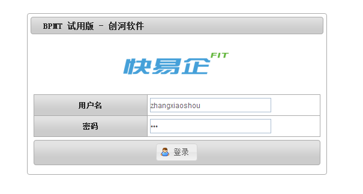


```by Kim```
