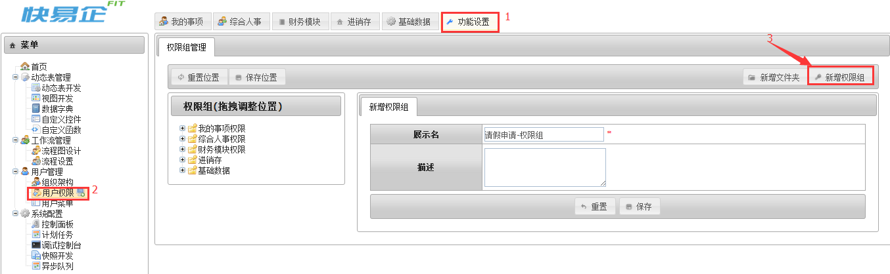
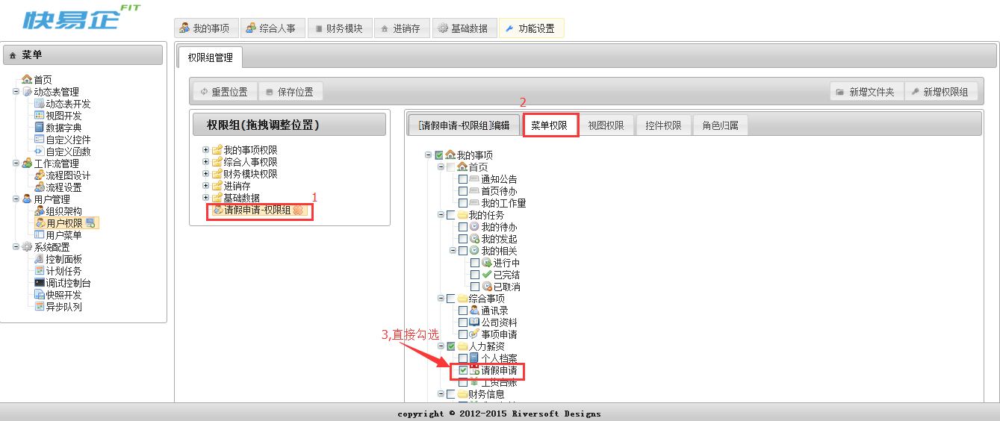
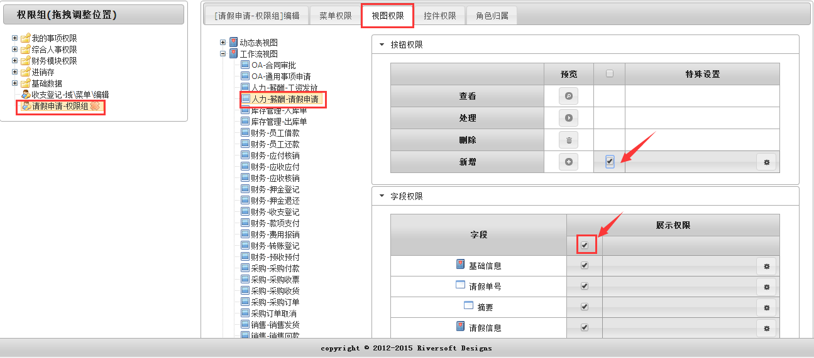
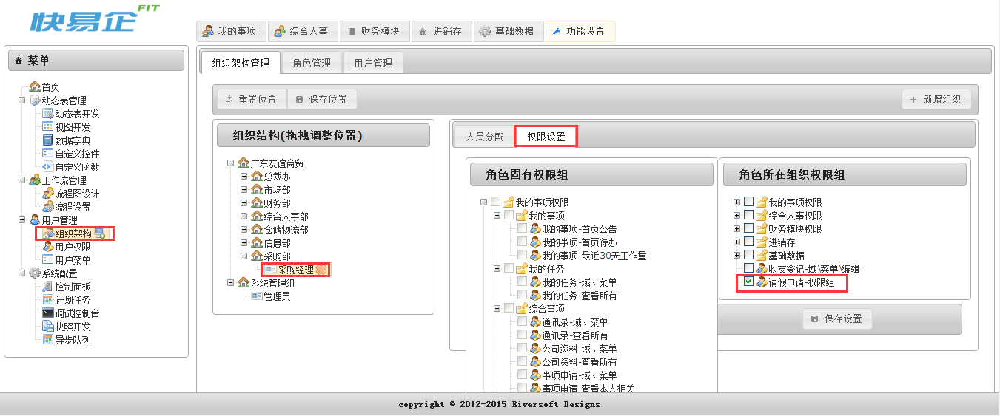

# 权限组
用户权限组是用于系统中各个菜单(域)、视图、控件权限的管理。

##创建权限组
功能设置>菜单>用户权限>新增权限组

###菜单权限
菜单权限中所能勾选的具体内容在【用户菜单】中设置，参考9.2功能域和菜单。

###视图权限
视图权限包含:动态表视图、工作流视图、报表视图、模板展示视图、首页公告和容器视图。具体内容参考前面文档。【请假申请】流程是属于工作流视图，直接在工作流视图模块中查找即可。

- 按钮权限：按钮是否展示权限
- 字段权限：字段是否展示权限
- 子表权限：子表是否展示权限
- 其他：是否选择对应数据筛选权限

###控件权限
控件权限是系统中自定义控件的展示、编辑权限。而【请假申请】流程没有涉及自定义控件，无需勾选对应权限。
权限组配置完成后需要给具体的角色配备权限。需结合8.1组织架构。

by Kim
