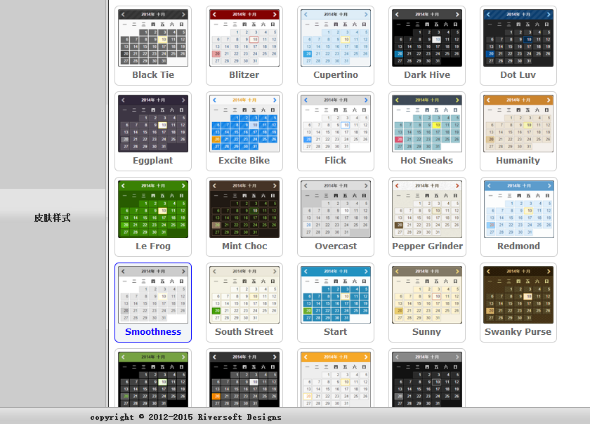
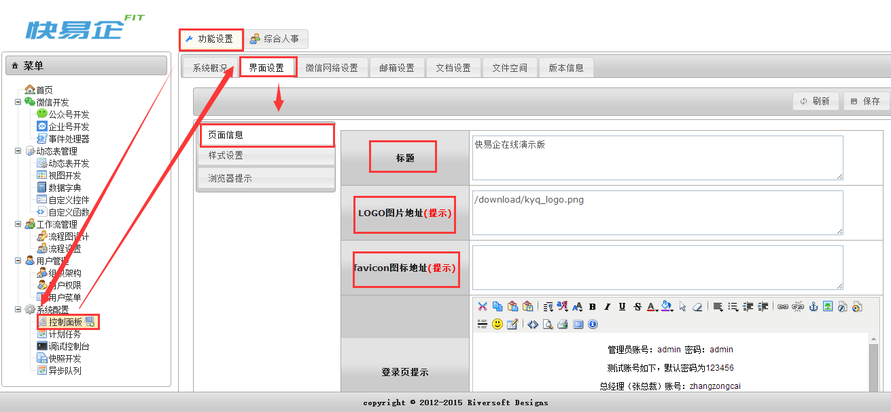
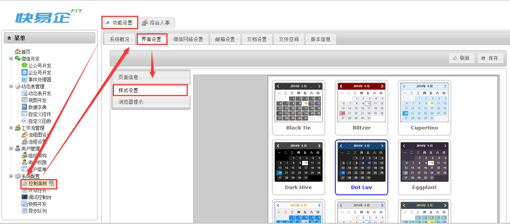
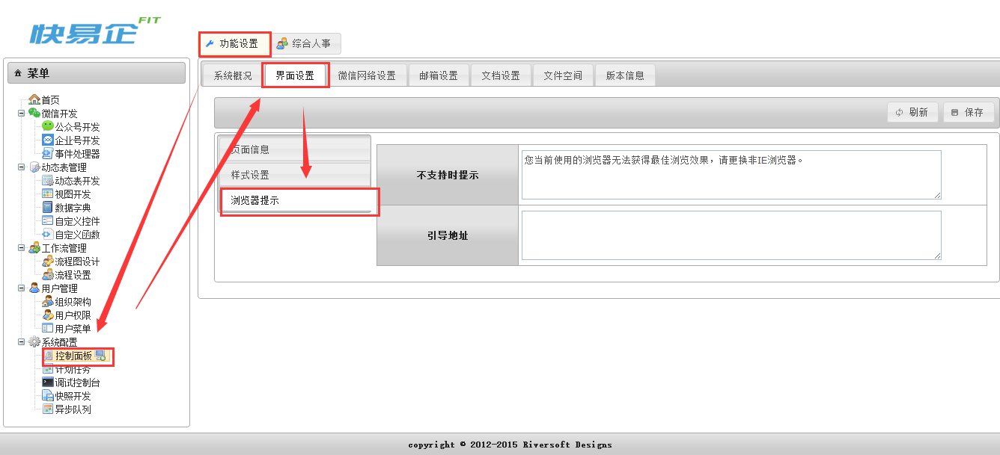

# 界面风格

通过在界面设置中管理系统界面的风格, 皮肤样式, 图标以及标语等展示

提供多种自带皮肤样式可供选择:

## 用法

### 1.页面设置

在[功能设置]域中的[控制面板]菜单下的[界面设置]tab下的[页面信息]

①标题的设置: 改变的是浏览器上的TAB名称

②LOGO图片地址 : 存放的是LOGO图片的地址

③favicon图标地址 : 存放收藏夹图标的地址

④登录页提示 : 展示于输入账号密码框下的文字

⑤底部版权信息 : 页面底部的文字

⑤验证码开关: 用于设置登录时是否需要输入验证码

### 2.样式设置

在[功能设置]域中的[控制面板]菜单下的[界面设置]tab下的[样式设置], 可以选择对应的皮肤样式, 如下图:

### 3.浏览器提示

在[功能设置]域中的[控制面板]菜单下的[界面设置]tab下的[浏览器提示], 可以编辑不支持时提示, 如下图:

`by Tony`
