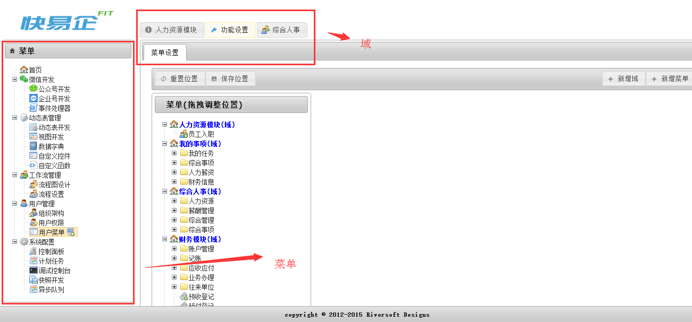
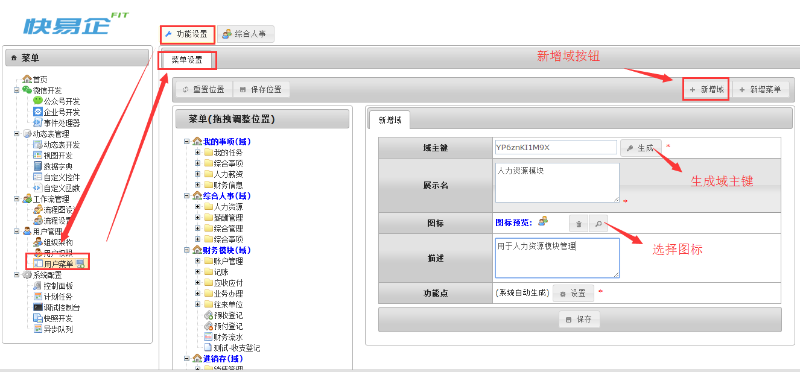
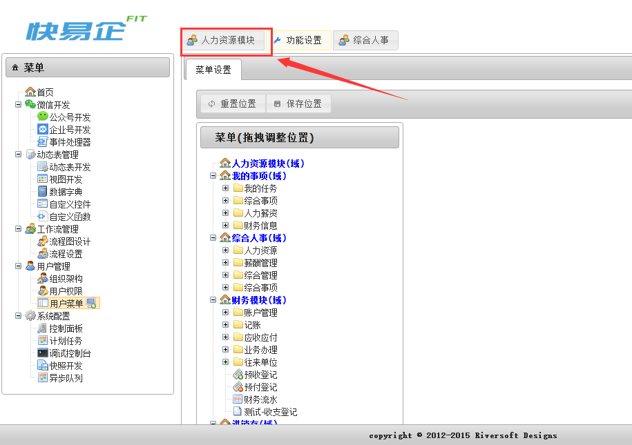
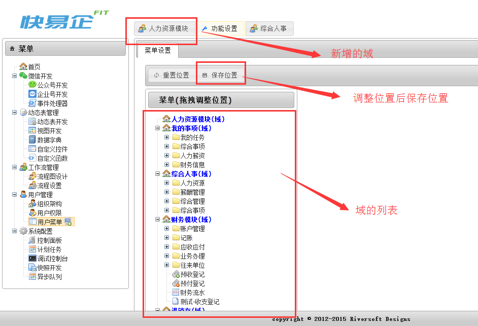
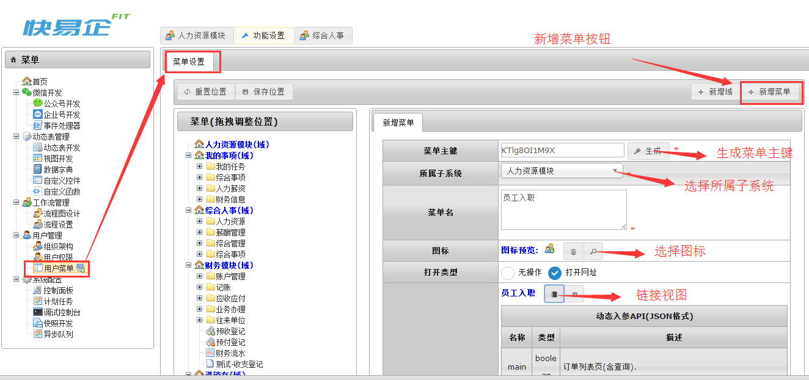
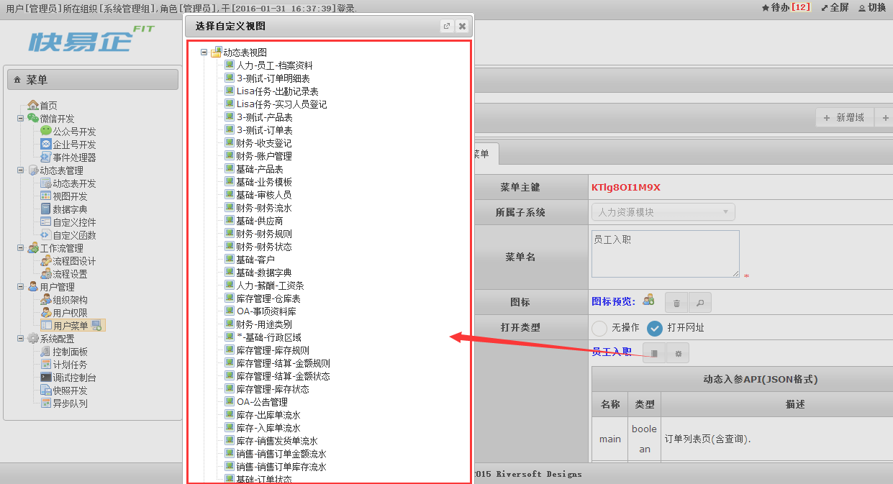
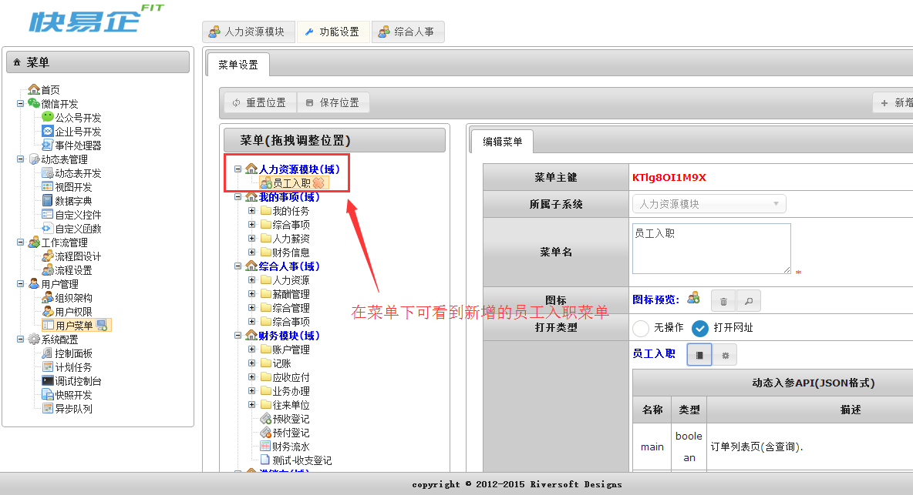
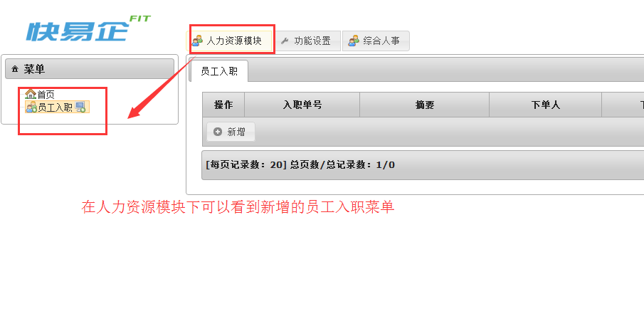
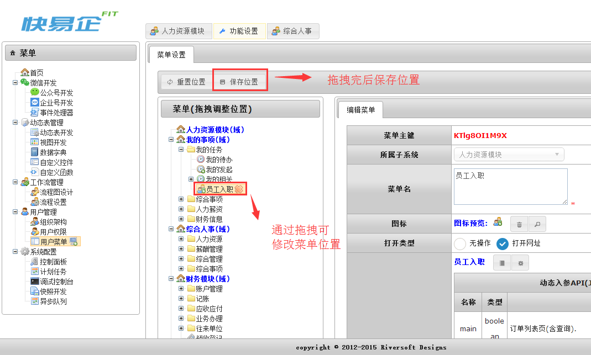
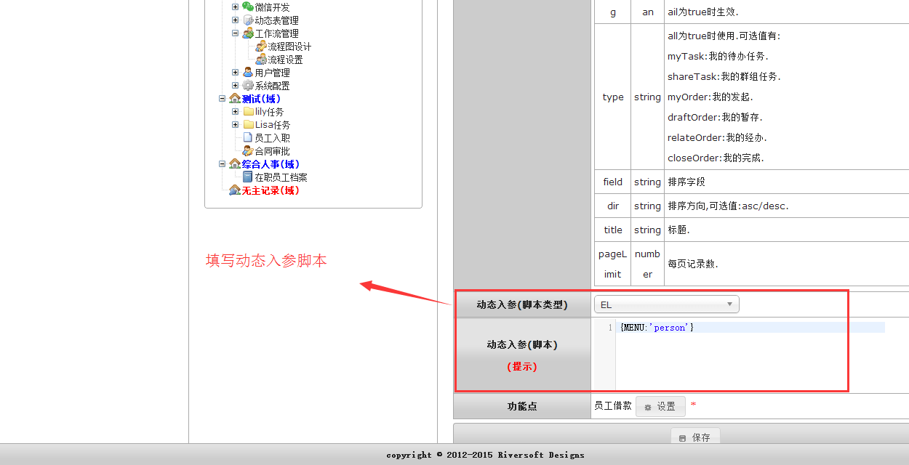

# 功能域和菜单

在系统界面上方的是功能域,界面右方的是菜单,域是一级入口, 菜单是二级入口. 每个域下自定义不同的菜单 , 如下图:

## 用法

### 新增域

通过在[功能设置]域中的[用户菜单]下找到[新增域]来新增域, 通过生成[域主键], 填写[展示名]和修改[图标], 如下图:

新增域后效果如图:

### 编辑域

新增域以后, 在界面上方的域看到新增的域, 在菜单栏看到新增域的选项, 通过鼠标的拖拽可调整域的位置, 拖拽后点击保存位置按钮可保存域的位置, 如下图: 

### 新增菜单

通过在[功能设置]域中的[用户菜单]下找到[新增菜单]来新增菜单, 通过生成[菜单主键], 选择[所属子系统], 填写[菜单名], 选择[图标], 链接[视图], 如下图:

点击链接视图按钮后, 选择对应的[动态表视图], [工作流视图]和[报表视图]等, 如下图:

新增后效果如图:

进入到域下查看: 

### 编辑菜单

新增菜单以后, 通过拖拽菜单, 可改变菜单的位置, 菜单的层级, 拖拽后点击保存位置可保存菜单位置. 如下图: 

在选择菜单的动态入参(脚本)中可以填写动态入参:

### 动态入参API参数

| 名称 | 类型 | 说明  |
| :--: | :--:| :-- |
| main  | boolean | 订单列表页(含查询)|
| list | boolean | 订单列表页|
| remove | boolean | 删除草稿箱的订单,注:处理订单时配合ordId使用|
| form | boolean | 跳入到表单页,注:处理订单时配合ordId使用,发起新流程时无需其他参数  |
| detail | boolean | 是否直接跳转到数据明细页,注:此项必须与ordId配合使用,也可配合ordFlag使用  |
| picture | boolean | 是否跳转到流程图展示页,注:此项必须与ordId配合使用  |
| all | boolean | 是否采用"所有订单"界面.此项默认true |
| ordId | string | 订单号  |
| ordFlag | boolean | 查看时是否使用"查看订单"界面,不设置此项默认为false.当detail为true时生效  |
| type | string | all为true时使用.可选值有: myTask:我的待办任务. shareTask:我的群组任务. myOrder:我的发起. draftOrder:我的暂存. relateOrder:我的经办. closeOrder:我的完成.  |
| field | string | 排序字段  |
| dir | string | 排序方向,可选值:asc/desc.  |
| title | string | 标题  |
| pageLimit | number | 每页记录数.  |

`by Tony`
