# 系统字典

通过数据字典的翻译表单值, 调用数据字典能够使存在数据库的字段以对应的值展示.

## 用法

数据字典含有数据字典类别, 数据字典类别下含有数据字典分组, 数据字典分组下有数据字典数据, 只有创建了数据字典数据后才能调用数据字典.

### 新增数据字典

#### 1.新增数据字典类别

在功能设置域下的数据字典菜单, 点击新建类别可以创建新的数据字典类别. 如下图:

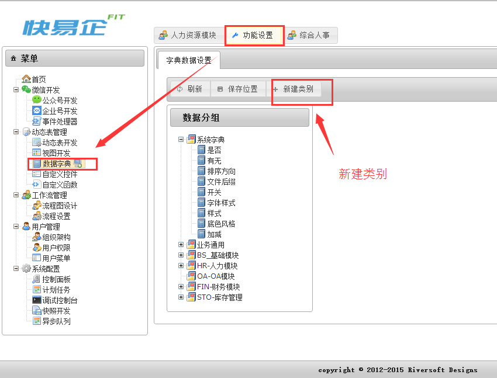

点击新建类别后出现下图窗口, 填写展示名, 创建数据字典的类别:

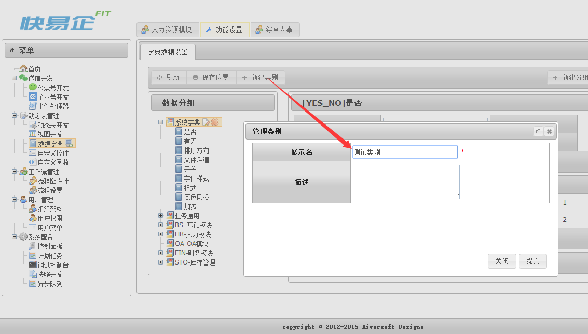

新增完后效果如图:

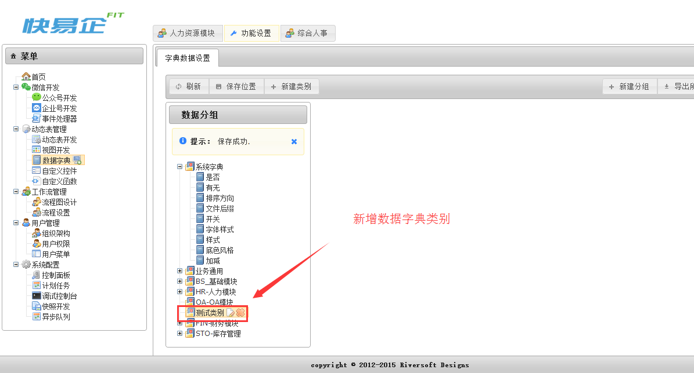

#### 2.新增数据字典分组

在功能设置域下的数据字典菜单, 点击新建分组可创建新的分组, 如下图:
 
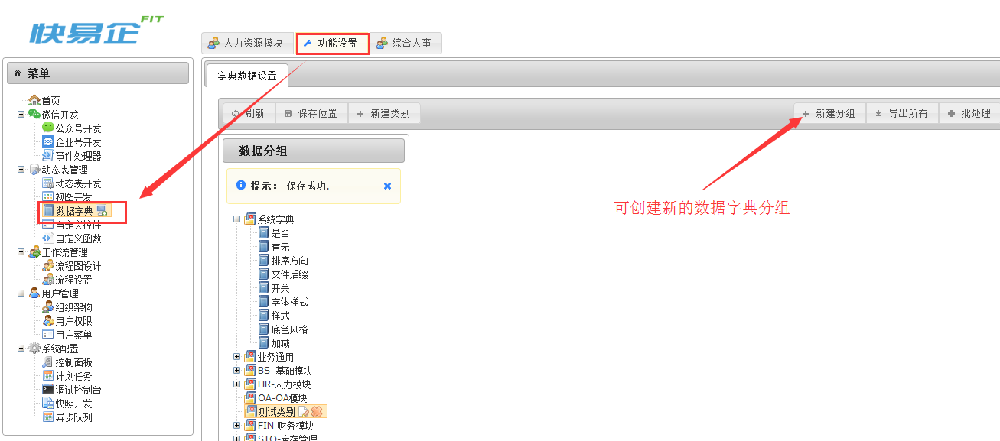

点击新建分组后出现下图窗口, 填写类型主键, 填写展示名, 选择归属的分类,创建数据字典的分组:

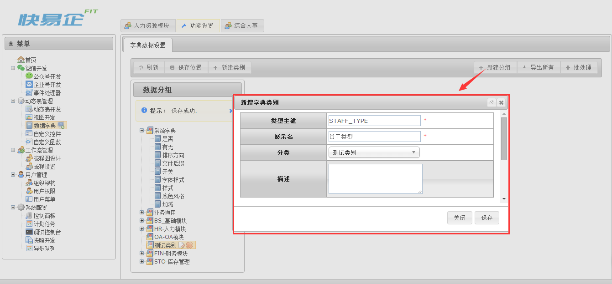

创建成功后, 可看到归属的分类下会有创建的分组, 如下图:

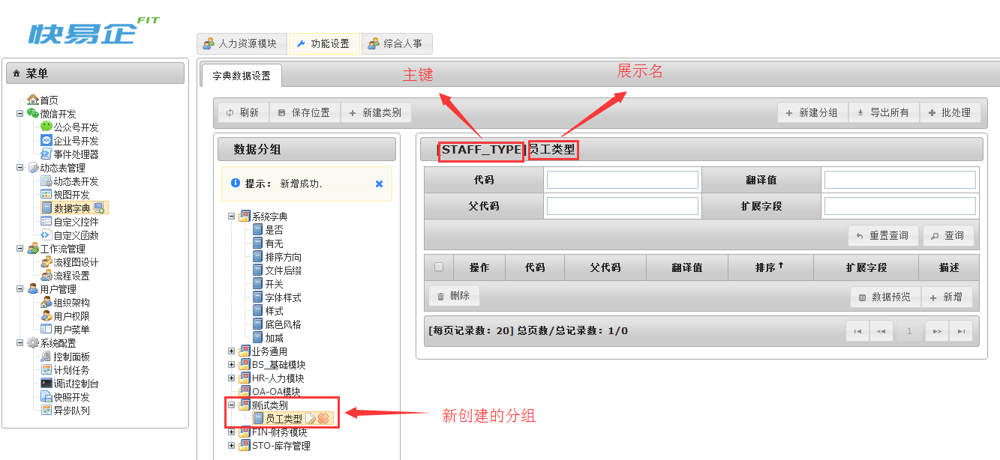

#### 3.新增数据字典数据

在已有的数据字典分组下, 点击新增按钮可以创建新的数据字典数据, 如下图:

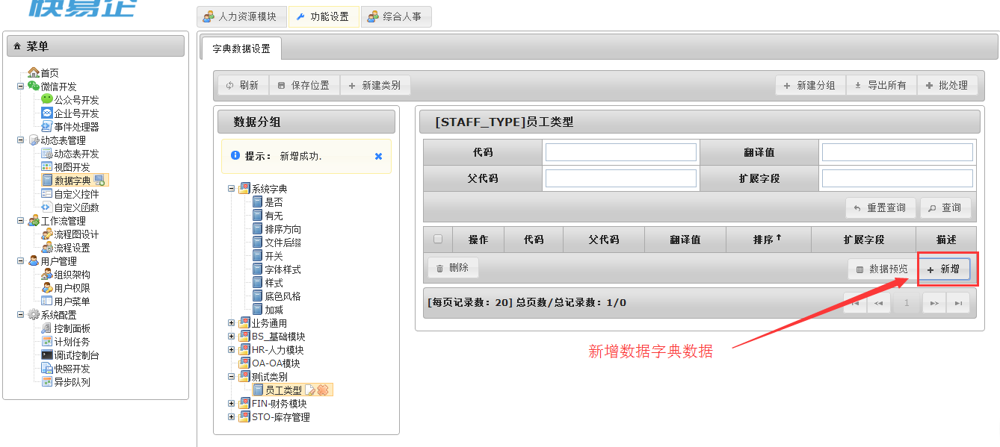

点击新增按钮, 填写代码, 填写翻译值, 选择排序, 完成数据字典数据新增(其他选项为选填), 如下图:

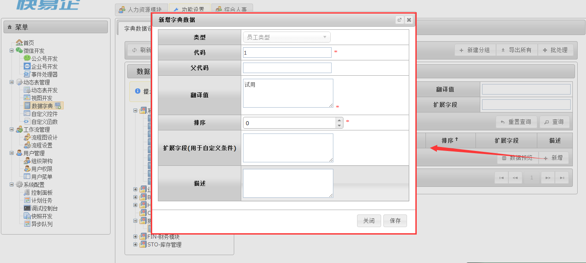

新增完后效果如图:

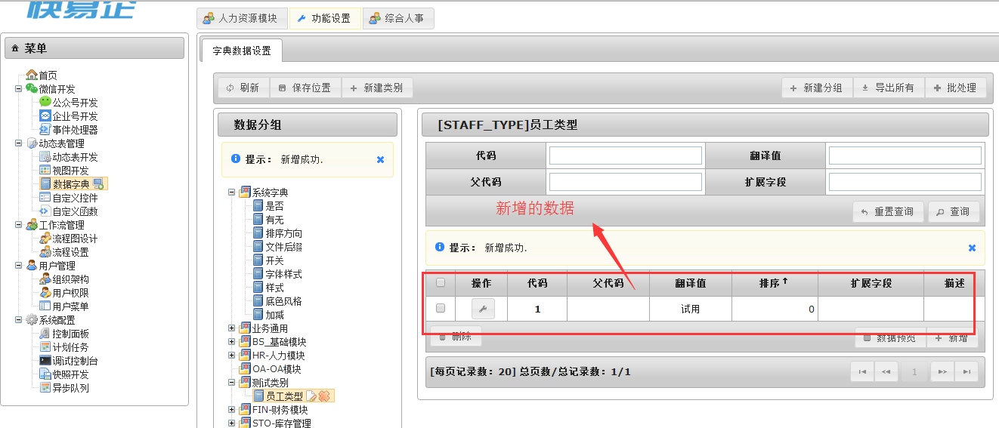


### 2.调用数据字典

调用数据字典分展示字段调用数据字典翻译展示和表单字段调用操作

#### (1) 展示字段

在展示字段中, 使用cm.widget()函数去调用数据字典进行翻译, 在展示内容(脚本内容)填写:

```groovy
cm.widget('select[YES_NO]',vo?.[COLUMN_NAME]);
```

#### (2) 表单字段

在表单字段中, 通过下图的系统选择打开控件选择窗口, 选中数据字典栏, 可以看到系统包含的所有数据字典, 选择操作类型单选下拉, 单选卡, 多选下拉, 多选卡和树形, 即对表单中用数据字典翻译后的值进行操作
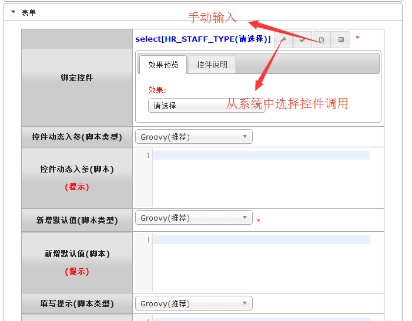
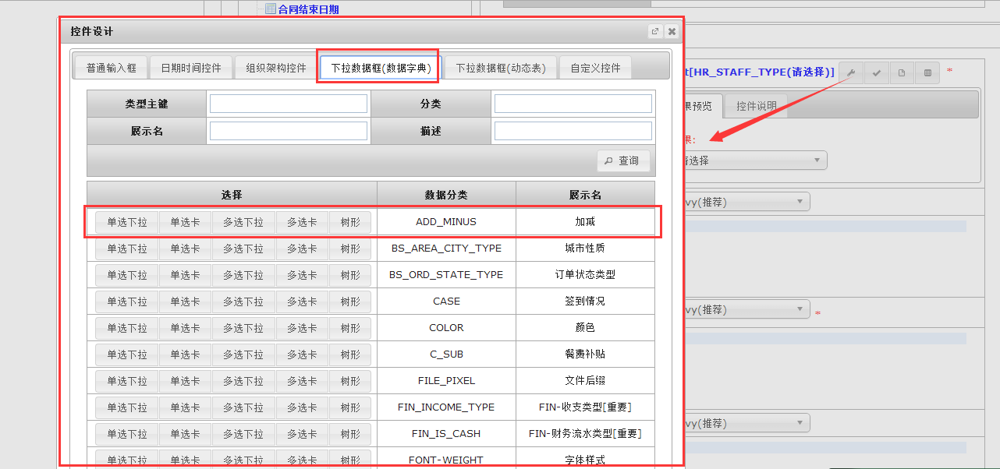


`by Tony`
