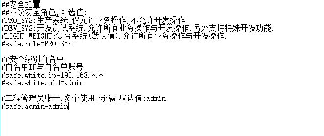
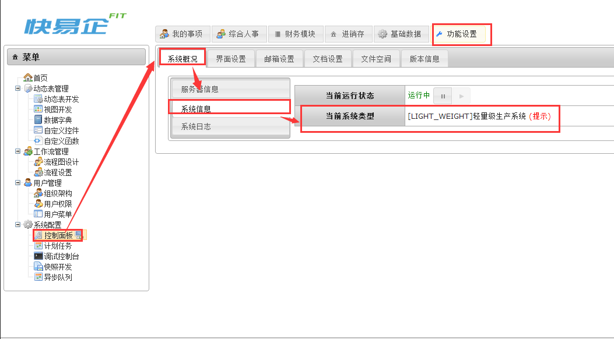

# 其他工具

## 定义 
在BPMT中, 安全配置分为三种类型:
①PRO_SYS:生产系统.仅允许业务操作,不允许开发操作;
②DEV_SYS:开发测试系统.允许所有业务操作与开发操作,另外支持特殊开发功能.
③LIGHT_WEIGHT:复合系统(默认值).允许所有业务操作与开发操作.

## 用法

在BPMT目录下的conf/下的safe.properties是系统安全配置的配置文件, 打开如下图: 



只需要修改safe.role的值便可修改安全配置的级别
```bash
safe.role=PRO_SYS
```
修改完成后保存重启BPMT即可将配置文件生效.

修改后可以在[功能设置]域下[控制面板]菜单[系统概况]的[系统信息]看到[当前系统类型]为安全配置的级别,如图:



`by Tony`
