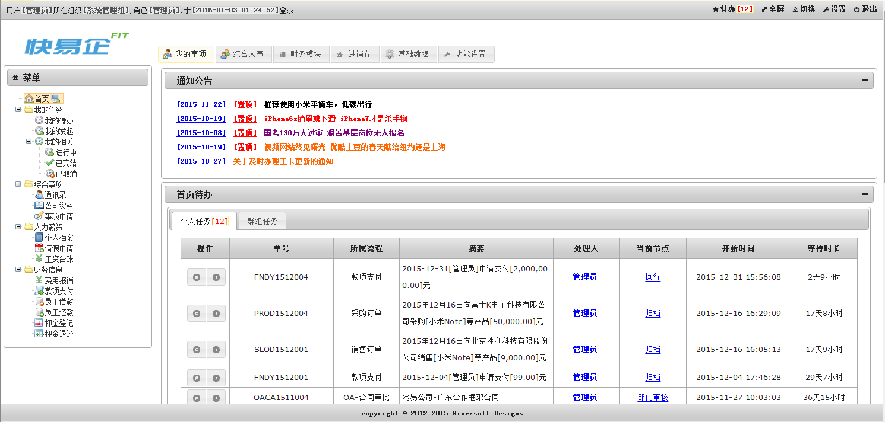

# Riversoft BPMT 在线文档
*v3.0.0* 

## 简介
BPMT 是基于JavaEE、轻量级的集成化快速开发平台，平台采用B/S结构，提供全可视化的流程集成开发环境，内建工作流引擎、数据库表设计器、表单视图构建器、报表设计器和权限管理体系等可视化工具，实现了工作流、数据表、组织机构、表单、报表、业务规则、用户权限的完全可视化设计。BPMT使得用户无需复杂编码，即可快速构建各类管理系统，将开发人员从传统的基础开发中解放出来，将更多的精力集中解决客户的业务信息化需求。

BPMT构建提供一个强大、稳定、快速、灵活的基础开发平台，使应用开发步入“降低难度、提升效率、方便升级、减少维护、提高效益”的良性阶段，为信息系统的实现在开发难度成本、开发进度效率、需求复杂善变之间寻求一个平衡点。

BPMT为信息系统的规划、设计、构建、集成、部署、运行、维护和管理等提供高可用性、高可复用性、高合理性的体系架构，真正实现“总体规划，随需而变，用户主控”的信息化战略。BPMT能解决企业的复杂业务流程管理，有效梳理及简化企业的业务流程，有效提升企业运作效率。BPMT 可以成为企业管理业务的关键创新手段，帮助用户更科学、更有效管理企业业务的各个环节，企业通过 BPMT 可以明显实现业务的高效运营。

简而言之，BPMT是一种高效提升企业信息化水平的快速开发工具，用户可以在短时间内利用其构建起有效的管理信息系统。

## 在线DEMO
1. 企业应用完整案例 -- 快易企
[http://demo.kuaiyiqi.cn](http://demo.kuaiyiqi.cn)

	

2. 基于微信服务号+企业号打通的完整案例 -- 微信会员管理
[即将推出](http://demo.kuaiyiqi.cn)

## 联系我们
- 官方网站: [http://www.riversoft.com.cn](http://www.riversoft.com.cn)
- 快易企网站: [http://www.kuaiyiqi.cn](http://www.kuaiyiqi.cn)
- 微信公众号: 请搜索 **创河软件服务号** 和 **创河软件订阅号** 或扫描以下二维码

 
