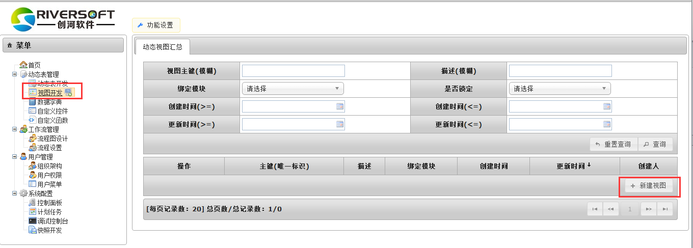
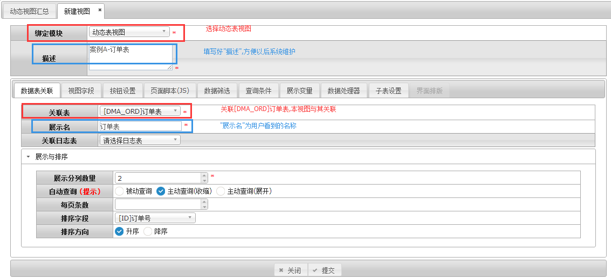
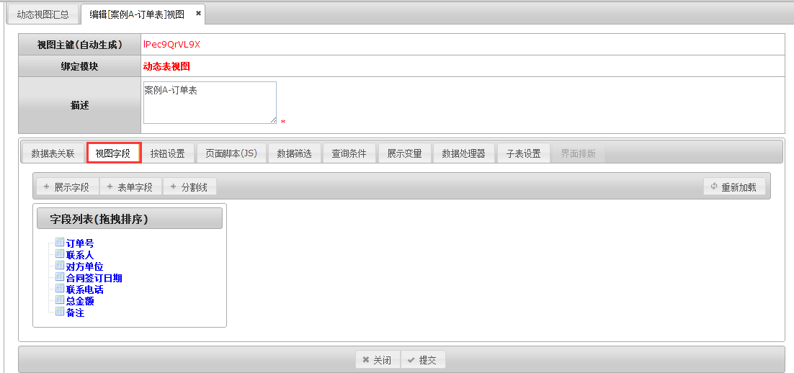
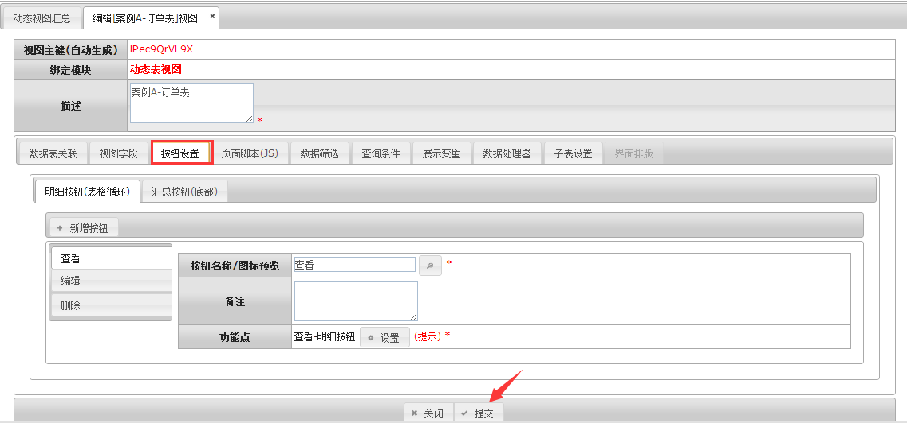
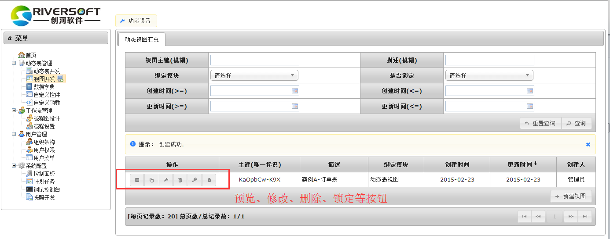

# 动态表视图

> 迁移状态：本文来自旧 GitBook，已迁入新文档结构，尚未逐项对照 `bpmt-lite v1.3.0` 当前 UI 和代码校准。

动态表是真实存在的数据库表，负责存储数据，而动态视图则用于提供该数据库表的数据录入和展示。视图作为用户与动态表交互的窗口，包括了提供数据展示的列表页和明细页，以及用户进行字段值操作的表单页。
##创建动态表视图
####关联动态表
功能设置>菜单>视图开发>新建视图

视图新建页面的绑定模块选择“动态表—主表管理”，关联表选择 “[DMA_ORD]订单表”。

#### 设置视图字段
点击“视图字段”标签页，系统为视图配置出默认的视图字段，本案例中无需编辑

#### 按钮设置
点击“按钮设置”标签页，系统为视图配置出默认的按钮，本案例中无需编辑。直接点击提交完成视图

提交后回到“功能设置>菜单>视图开发”中可以看到新建好的视图（描述：案例A-订单表）。也可点击表记录左侧的按钮进行查看、修改和删除等操作。

点击左侧第一个按钮进行预览，作为用户最终看到的界面,可以新增记录。

`by Kim`