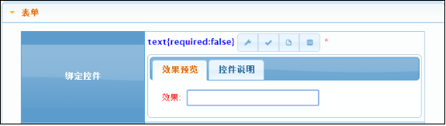
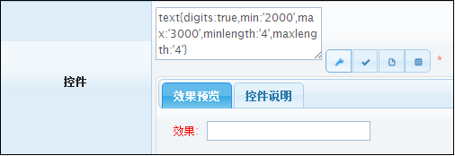

# text 文本框

> 迁移状态：本文来自旧 GitBook，已迁入新文档结构，尚未逐项对照 `bpmt-lite v1.3.0` 控件实现校准。

用于直接输入文本的控件。
## 效果展示 ##

## 参数API ##
| 序号 | 类型 | 说明  |
|:------:|:--------:|-------------------------|
| 1		|   必填 	|宽度. 示例1(宽度800像素):text[800px] 示例2(宽度占外部区域90%):text[90%]   
## 界面脚本 ##
|函数| 序号 | 类型 | 说明  |描述|
|:------:|:--------:|:--------:|:--------|:--------|
|init |无 |无 |无 |将控件设置为初始化状态. 调用示例:Widget.init($form,name);|
|enabled|1| 可选| true:可用,默认值;false:不可用.|将控件设置为可用/不可用(disabled)状态. 调用示例:Widget.enabled($form,name);|
|disabled |无 |无 |无 |将控件设置为不可用状态. 调用示例:Widget.disabled($form,name);|
|val |1 |可选 |目标值|设置控件值.当val未传入时返回控件值. 调用示例:Widget.val($form,name,’1’);|
|change |1 |必选 |回调函数,入参$this是控件对应的jquery对象. |设置控件事件回调函数.控件触发blur时调用. 调用示例: Widget.change($form,name,function($this){ alert($this.val()); });|

    
##示例1:某些文本框可以限制输入的数字大小##
验证输入的数字为2000——4000的数          

`by jimlin`                                                                                                                                                               