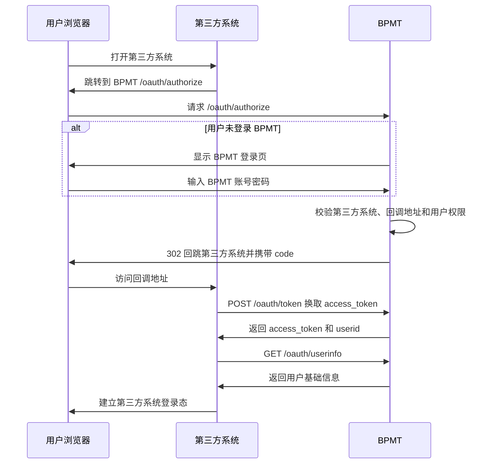
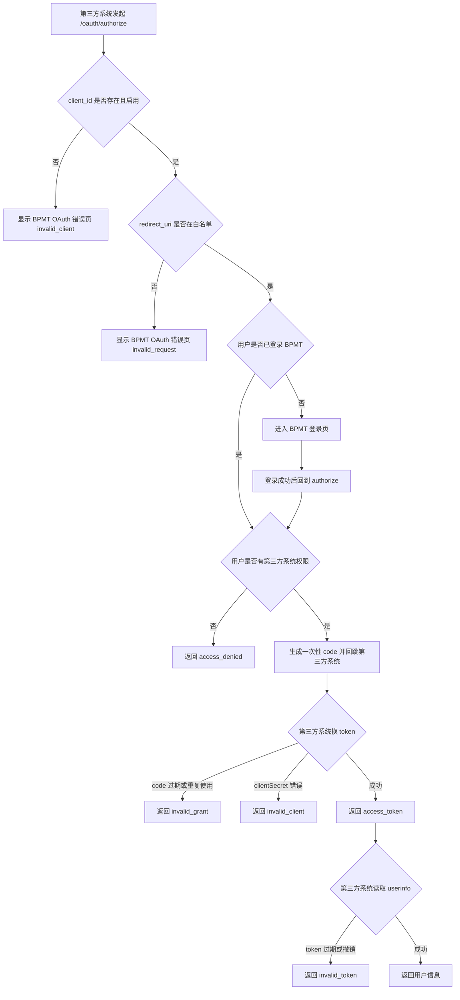

# bpmt-doc API OAuth v1.5 Documentation Implementation Plan

> **For agentic workers:** REQUIRED SUB-SKILL: Use superpowers:subagent-driven-development (recommended) or superpowers:executing-plans to implement this plan task-by-task. Steps use checkbox (`- [ ]`) syntax for tracking.

**Goal:** Add independent `bpmt-doc` documentation for the `bpmt-lite v1.4.1` API and `v1.5.0` OAuth login features, and align the public documentation baseline to `v1.5.0`.

**Architecture:** Keep the new API and OAuth content as two top-level documentation chapters under `docs/`, because they are release-era capabilities rather than legacy GitBook subtopics. Copy the machine-readable OpenAPI snapshot into `bpmt-doc`, write human-facing Markdown locally, and update the global entry documents so users see a consistent `v1.5.0` runtime story.

**Tech Stack:** Markdown, Mermaid diagrams, OpenAPI JSON, shell validation with `rg`, `git diff --check`, and Node JSON parsing.

---

## File Structure

- Modify `README.md`: Update repo overview, current runtime baseline, and entry links for Quick Start, API, and OAuth.
- Modify `AGENTS.md`: Update local-memory baseline from `v1.3.0` to `v1.5.0`, source-of-truth references, and current migration state.
- Modify `docs/SUMMARY.md`: Add top-level entries for `10.外部API` and `11.OAuth第三方登录`.
- Modify `docs/1.开始使用/1.1.快速安装.md`: Replace the old `v1.3.0` `run.sh` path with the `v1.5.0` `install.sh` one-liner, add API/OAuth access notes, and keep default credentials visible.
- Create `docs/10.外部API/README.md`: Human-readable independent API reference and usage guide.
- Create `docs/10.外部API/openapi.json`: Machine-readable OpenAPI snapshot copied from `bpmt-lite/docs/v1.4.1/openapi.json`.
- Create `docs/11.OAuth第三方登录/README.md`: Low-code-user-oriented OAuth login guide with Mermaid flow diagrams, endpoint parameters, error handling, and security notes.

## Source Inputs

Use these local source files. Do not link to them from user-facing `bpmt-doc` pages; they are implementation sources only.

- `/Users/wenzhewang/workspace/bpmt_project/bpmt-lite/AGENTS.md`
- `/Users/wenzhewang/workspace/bpmt_project/bpmt-lite/README.md`
- `/Users/wenzhewang/workspace/bpmt_project/bpmt-lite/docs/v1.4.1/api-reference.md`
- `/Users/wenzhewang/workspace/bpmt_project/bpmt-lite/docs/v1.4.1/openapi.json`
- `/Users/wenzhewang/workspace/bpmt_project/bpmt-lite/docs/v1.5.0/oauth-login-reference.md`
- `/Users/wenzhewang/workspace/bpmt_project/bpmt-doc/docs/superpowers/specs/2026-05-03-bpmt-doc-api-oauth-v1.5-design.md`

Run this orientation command before editing:

```bash
sed -n '1,220p' AGENTS.md
sed -n '1,220p' README.md
sed -n '1,180p' docs/SUMMARY.md
sed -n '1,220p' docs/1.开始使用/1.1.快速安装.md
sed -n '150,230p' /Users/wenzhewang/workspace/bpmt_project/bpmt-lite/README.md
sed -n '1,260p' /Users/wenzhewang/workspace/bpmt_project/bpmt-lite/docs/v1.4.1/api-reference.md
sed -n '1,320p' /Users/wenzhewang/workspace/bpmt_project/bpmt-lite/docs/v1.5.0/oauth-login-reference.md
```

Expected: these reads show `bpmt-doc` still describes `v1.3.0`, while `bpmt-lite` describes `v1.5.0`, API docs, and OAuth docs.

### Task 1: Update Global v1.5.0 Baseline

**Files:**
- Modify: `README.md`
- Modify: `AGENTS.md`
- Modify: `docs/1.开始使用/1.1.快速安装.md`
- Modify: `docs/SUMMARY.md`

- [ ] **Step 1: Update `README.md` overview and links**

Use `apply_patch` to replace the current `v1.3.0` overview with a `v1.5.0` baseline. The resulting README must contain these exact facts:

```markdown
`bpmt-doc` 是 BPMT 的 Markdown-first 中文文档库。当前文档结构直接沿用旧 GitBook 章节层级，并用 `bpmt-lite v1.5.0` 校准快速启动、数据库、登录、外部 API 和 OAuth 第三方登录说明。

## 从哪里开始

- 完整目录：[docs/SUMMARY.md](docs/SUMMARY.md)
- 当前快速启动：[docs/1.开始使用/1.1.快速安装.md](docs/1.开始使用/1.1.快速安装.md)
- 外部 API：[docs/10.外部API/README.md](docs/10.外部API/README.md)
- OAuth 第三方登录：[docs/11.OAuth第三方登录/README.md](docs/11.OAuth第三方登录/README.md)
- 其他工具：[docs/9.其他设置/9.4.其他工具.md](docs/9.其他设置/9.4.其他工具.md)
```

The `## 当前运行基线` section must include:

```markdown
- 当前版本：`v1.5.0`
- 默认 Web 镜像：`ghcr.io/wodenwang/bpmt-lite:1.5.0`
- 默认 API 镜像：`ghcr.io/wodenwang/bpmt-lite-api:1.5.0`
- 默认地址：`http://127.0.0.1/`
- API 文档：`http://127.0.0.1/api/docs/`
- OpenAPI：`http://127.0.0.1/api/openapi.json`
- 默认账号：`admin/admin`
- 默认数据库：`bpmt`
- 最小数据库：`bpmt_min`
```

- [ ] **Step 2: Update `AGENTS.md` source-of-truth and baseline**

Use `apply_patch` to change the current known baseline to `v1.5.0`. The baseline list must include:

```markdown
- 当前发布版本：`v1.5.0`
- 默认 Web 镜像：`ghcr.io/wodenwang/bpmt-lite:1.5.0`
- 默认 API 镜像：`ghcr.io/wodenwang/bpmt-lite-api:1.5.0`
- 默认访问地址：`http://127.0.0.1/`
- API 文档地址：`http://127.0.0.1/api/docs/`
- OpenAPI 地址：`http://127.0.0.1/api/openapi.json`
- 默认登录账号：`admin/admin`
- 默认数据库：`bpmt`
- 最小数据库：`bpmt_min`
- 最小库初始化后约 176 张表
- 完整库初始化后约 380 张表
- 技术栈：Java 8、Maven 3、Tomcat 7、MariaDB、nginx
```

Also update the source-of-truth list so it names the current versioned docs:

```markdown
3. `bpmt-lite` 仓库的 `README.md`、`docs/v1.5.0/*`、`docs/v1.4.1/*`、`docs/v1.4.0/*`、`docs/v1.3.0/*`、`docs/maintenance.md`
```

Add these migration-state bullets near the bottom of `AGENTS.md`:

```markdown
- 外部 API 章节规划：新增 `docs/10.外部API/README.md` 和 `docs/10.外部API/openapi.json`，以 `bpmt-lite/docs/v1.4.1/api-reference.md` 与 `openapi.json` 为事实来源，面向低代码用户和集成系统独立落地。
- OAuth 第三方登录章节规划：新增 `docs/11.OAuth第三方登录/README.md`，以 `bpmt-lite/docs/v1.5.0/oauth-login-reference.md` 为事实来源，使用流程图说明登录顺序、鉴权情况、错误码和应对建议，不展开底层表结构。
```

- [ ] **Step 3: Replace Quick Start with v1.5.0 one-liner**

Rewrite `docs/1.开始使用/1.1.快速安装.md` with this structure and exact commands:

````markdown
# 30秒快速安装

当前 `bpmt-lite v1.5.0` 推荐使用 Docker 一键启动。只想快速体验，优先使用最小库：

```bash
curl -fsSL https://github.com/wodenwang/bpmt-lite/raw/refs/tags/v1.5.0/scripts/install.sh | bash
```

一行命令会创建 `bpmt-lite/` 运行目录，默认使用最小库 `bpmt_min` 启动。

访问：

```text
http://127.0.0.1/
```

默认账号：

```text
用户名：admin
密码：admin
```

API 文档入口：

```text
http://127.0.0.1/api/docs/
```

OpenAPI 入口：

```text
http://127.0.0.1/api/openapi.json
```

如需完整业务库，使用 `full` 参数：

```bash
curl -fsSL https://github.com/wodenwang/bpmt-lite/raw/refs/tags/v1.5.0/scripts/install.sh | bash -s -- full
```

完整库初始化数据库名为 `bpmt`。最小库适合快速体验，完整库适合查看更多历史业务示例。

如果已经启动过，再替换初始化 SQL 不会自动重新导入。需要重新初始化数据库时，先确认数据已备份，再在运行目录执行：

```bash
docker compose down
rm -rf db/data
docker compose up -d
```

OAuth 第三方登录能力从 `v1.5.0` 开始可用。配置和接入方式见 [OAuth 第三方登录](../11.OAuth第三方登录/README.md)。
````

- [ ] **Step 4: Add new top-level chapters to `docs/SUMMARY.md`**

Append these two entries after the existing `其他设置` section:

```markdown
* [外部API](10.外部API/README.md)
* [OAuth第三方登录](11.OAuth第三方登录/README.md)
```

- [ ] **Step 5: Run Task 1 validation**

Run:

```bash
rg -n "v1\\.3\\.0|:8080|bpmt-lite:1\\.3\\.0" README.md AGENTS.md docs/1.开始使用/1.1.快速安装.md
git diff --check
```

Expected:

- `rg` may return historical mentions only if they are clearly labeled as old release history. It must not find the active runtime baseline, quick-start URL, or default image using `v1.3.0`.
- `git diff --check` prints no output.

- [ ] **Step 6: Commit Task 1**

```bash
git add README.md AGENTS.md docs/1.开始使用/1.1.快速安装.md docs/SUMMARY.md
git commit -m "docs: align bpmt-doc baseline to v1.5.0"
```

### Task 2: Add Independent External API Documentation

**Files:**
- Create: `docs/10.外部API/README.md`
- Create: `docs/10.外部API/openapi.json`

- [ ] **Step 1: Create the API directory and copy OpenAPI snapshot**

Run:

```bash
mkdir -p docs/10.外部API
cp /Users/wenzhewang/workspace/bpmt_project/bpmt-lite/docs/v1.4.1/openapi.json docs/10.外部API/openapi.json
node -e "const fs=require('fs'); const o=JSON.parse(fs.readFileSync('docs/10.外部API/openapi.json','utf8')); console.log(o.info.title + ' ' + o.info.version); console.log(Object.keys(o.paths).length + ' paths');"
```

Expected output contains:

```text
BPMT Lite API 1.4.1
10 paths
```

- [ ] **Step 2: Create `docs/10.外部API/README.md`**

Use `apply_patch` to create the file. The document must be independent and must not link to `bpmt-lite` files. It must contain these sections in this order:

```markdown
# 外部 API

## 适用版本

## 能力范围

## 接入入口

## 鉴权方式

## 签名示例

## 通用响应格式

## 接口清单

## 动态表结构接口

## 动态表模板接口

## 数据库操作接口

## 常见错误和处理建议

## 给 AI agent 和集成平台的建议
```

Populate `## 能力范围` with these facts:

```markdown
- 动态表结构管理：查询、创建、调整、同步 DDL。
- 动态表模板：查询模板列表、查看模板详情、按模板创建动态表。
- 数据库操作：`query`、`find`、`save`、`exec`。
- 本 API 不提供动态表删除。
- 本 API 不提供动态表业务数据 CRUD。
- OAuth 第三方登录不属于本章 API；OAuth 端点不使用 HMAC 业务签名。
```

Populate `## 接入入口` with:

```markdown
| 入口 | 用途 |
| --- | --- |
| `http://127.0.0.1/api/docs/` | Web API 文档，适合人工阅读和调试 |
| `http://127.0.0.1/api/openapi.json` | 运行实例暴露的 OpenAPI JSON |
| `docs/10.外部API/openapi.json` | 本仓归档的 OpenAPI JSON 快照，适合 AI agent、N8N、飞书集成平台和后续 skill 封装 |
```

Populate `## 鉴权方式` with the HMAC header and canonical string from the design spec:

```text
METHOD
PATH
NORMALIZED_QUERY
TIMESTAMP
NONCE
SHA256_HEX(BODY)
```

Include this warning:

```markdown
`PATH` 必须包含公开 context path，例如 `/api/v1/dynamic-tables`，不能只签 `/v1/dynamic-tables`。
```

- [ ] **Step 3: Add endpoint tables and parameter details**

Ensure `README.md` includes this endpoint table exactly:

```markdown
| 方法 | 路径 | 说明 | 风险 |
| --- | --- | --- | --- |
| `GET` | `/api/v1/dynamic-tables` | 查询动态表结构列表 | 只读 |
| `POST` | `/api/v1/dynamic-tables` | 创建动态表结构 | 写元数据，执行 DDL |
| `GET` | `/api/v1/dynamic-tables/{name}` | 查询单个动态表结构 | 只读 |
| `PUT` | `/api/v1/dynamic-tables/{name}` | 调整动态表结构 | 写元数据，执行 DDL |
| `POST` | `/api/v1/dynamic-tables/{name}/ddl:sync` | 同步动态表 DDL | 执行 DDL |
| `GET` | `/api/v1/dynamic-tables/templates` | 查询动态表模板列表 | 只读 |
| `GET` | `/api/v1/dynamic-tables/templates/{templateCode}` | 查询模板详情 | 只读 |
| `POST` | `/api/v1/dynamic-tables/templates/{templateCode}:create-table` | 按模板建表 | 写元数据，执行 DDL |
| `POST` | `/api/v1/database-operations/query` | SQL 查询，通常只允许 SELECT | 只读 |
| `POST` | `/api/v1/database-operations/find` | SQL 单行查询，通常只允许 SELECT | 只读 |
| `POST` | `/api/v1/database-operations/save` | SQL 保存，通常用于 INSERT | 高风险写操作 |
| `POST` | `/api/v1/database-operations/exec` | SQL 执行，通常用于 UPDATE/DELETE | 高风险写操作 |
```

Add parameter tables for:

- `GET /api/v1/dynamic-tables`: `start` default `0`, `limit` default `20` max `100`, `sort` default `createDate`, `order` default `desc`.
- Dynamic table request body fields: `name`, `description`, `cacheFlag`, `columns`, `indexes`.
- Column fields: `name`, `description`, `type`, `totalSize`, `scale`, `primaryKey`, `required`.
- Supported field types: `String`, `Integer`, `BigDecimal`, `Date`, `Long`, `Clob`, `Blob`.
- Database operation body fields: `sql`, `params`, and operation-specific behavior for `query/find/save/exec`.

- [ ] **Step 4: Add curl signing example**

Include this command block under `## 签名示例`:

```bash
BASE_URL="http://127.0.0.1/api"
APP_KEY="bpmt-api"
APP_SECRET="bpmt-api-secret"
METHOD="GET"
PATH="/api/v1/dynamic-tables"
QUERY="order=desc&sort=createDate"
BODY=""
TIMESTAMP="$(date +%s)"
NONCE="demo-$TIMESTAMP"
BODY_HASH="$(printf '%s' "$BODY" | shasum -a 256 | awk '{print $1}')"
CANONICAL="$(printf '%s\n%s\n%s\n%s\n%s\n%s' "$METHOD" "$PATH" "$QUERY" "$TIMESTAMP" "$NONCE" "$BODY_HASH")"
SIGNATURE="$(printf '%s' "$CANONICAL" | openssl dgst -sha256 -hmac "$APP_SECRET" | awk '{print $NF}')"

curl -sS "$BASE_URL/v1/dynamic-tables?$QUERY" \
  -H "X-BPMT-App-Key: $APP_KEY" \
  -H "X-BPMT-Timestamp: $TIMESTAMP" \
  -H "X-BPMT-Nonce: $NONCE" \
  -H "X-BPMT-Signature: $SIGNATURE"
```

- [ ] **Step 5: Run Task 2 validation**

Run:

```bash
node -e "const fs=require('fs'); const o=JSON.parse(fs.readFileSync('docs/10.外部API/openapi.json','utf8')); if (!o.paths['/v1/dynamic-tables']) process.exit(1); if (!o.paths['/v1/database-operations/exec']) process.exit(2); console.log('openapi json ok');"
rg -n "/api/v1/dynamic-tables|X-BPMT-Signature|BPMT_API_DBOPS_EXECUTE_ENABLED|success/data/error" docs/10.外部API/README.md
rg -n "bpmt-lite/docs|docs/v1\\.4\\.1|\\.\\./v1\\.4" docs/10.外部API/README.md
git diff --check
```

Expected:

- First command prints `openapi json ok`.
- Second `rg` finds the API path, signature header, dbops env var, and response model.
- Third `rg` finds no output because the page must not link to `bpmt-lite` source docs.
- `git diff --check` prints no output.

- [ ] **Step 6: Commit Task 2**

```bash
git add docs/10.外部API/README.md docs/10.外部API/openapi.json
git commit -m "docs: add external api reference"
```

### Task 3: Add Low-Code OAuth Third-Party Login Documentation

**Files:**
- Create: `docs/11.OAuth第三方登录/README.md`

- [ ] **Step 1: Create the OAuth directory and README skeleton**

Run:

```bash
mkdir -p docs/11.OAuth第三方登录
```

Use `apply_patch` to create `docs/11.OAuth第三方登录/README.md` with these sections in order:

```markdown
# OAuth 第三方登录

## 适用版本

## 这项能力解决什么问题

## 管理员需要先配置什么

## 登录顺序

## 常见鉴权情况

## 接入端点和参数

## 错误码和应对建议

## 安全提醒

## 边界说明
```

The opening must say:

```markdown
从 `bpmt-lite v1.5.0` 开始，BPMT 可以作为第三方系统的统一登录入口。第三方系统把用户带到 BPMT 登录，BPMT 登录成功后再把用户带回第三方系统。
```

- [ ] **Step 2: Write administrator configuration guidance**

Under `## 管理员需要先配置什么`, include these user-facing bullets:

```markdown
1. 在 BPMT 后台进入 `系统开发 -> 第三方系统`。
2. 新增第三方系统，填写系统名称、`client_id`、回调地址、首页地址和权限点。
3. 保存后记录系统生成的 `clientSecret`。该密钥只展示一次，丢失后需要重置。
4. 进入 `权限组管理 -> 第三方系统权限`，把对应第三方系统权限分配给允许访问的用户或角色。
5. 把 `client_id`、`clientSecret`、回调地址和 BPMT OAuth 地址交给第三方系统维护者。
```

Add this low-code note:

```markdown
OAuth 运行数据由 BPMT 自动保存。低代码用户不需要直接维护数据库表，也不需要手工处理授权码或 token 的存储。
```

- [ ] **Step 3: Add Mermaid login sequence diagram**

Under `## 登录顺序`, add this exact Mermaid diagram:

````markdown

````

- [ ] **Step 4: Add Mermaid authentication branch diagram**

Under `## 常见鉴权情况`, add this exact Mermaid diagram:

````markdown

````

- [ ] **Step 5: Add endpoint parameters and responses**

Under `## 接入端点和参数`, document these endpoints:

```markdown
| 方法 | 路径 | 用途 |
| --- | --- | --- |
| `GET` | `/oauth/authorize` | 浏览器授权入口 |
| `POST` | `/oauth/token` | 使用授权码换取 access token |
| `GET` | `/oauth/userinfo` | 使用 access token 读取当前用户基础信息 |
```

Add parameter tables for:

- `GET /oauth/authorize`: `response_type` required value `code`, `client_id`, `redirect_uri`, optional `state`.
- `POST /oauth/token`: `grant_type` required value `authorization_code`, `code`, `redirect_uri`, `client_id`, `client_secret`.
- `GET /oauth/userinfo`: `Authorization: Bearer <access_token>`.

Include this successful token response example:

```json
{
  "access_token": "opaque-token",
  "token_type": "Bearer",
  "expires_in": 7200,
  "userid": "admin"
}
```

Include this successful userinfo response example:

```json
{
  "userid": "admin",
  "name": "管理员",
  "group": {
    "groupKey": "default",
    "name": "默认组织"
  },
  "role": {
    "roleKey": "admin",
    "name": "管理员"
  }
}
```

- [ ] **Step 6: Add error-code response table**

Under `## 错误码和应对建议`, add this table:

```markdown
| 错误码 | 用户可能看到 | 第三方系统应对 | BPMT 管理员检查 |
| --- | --- | --- | --- |
| `invalid_request` | 登录失败或参数错误提示 | 检查请求参数，特别是 `redirect_uri` 和 `response_type` | 确认回调地址配置和第三方系统文档一致 |
| `invalid_client` | 第三方系统不可用 | 检查 `client_id`、`clientSecret` 和系统启停状态 | 确认第三方系统存在、已启用，必要时重置密钥 |
| `invalid_grant` | 登录回调失败或需要重新登录 | 重新发起 `/oauth/authorize`，不要重复使用旧 `code` | 检查授权码是否过期、是否被重复使用 |
| `invalid_token` | 登录态失效 | 引导用户重新走 OAuth 登录 | 检查 token 是否过期、撤销或格式错误 |
| `unsupported_grant_type` | 第三方系统接入方式不支持 | 使用 `authorization_code` | 确认第三方系统没有使用密码模式或刷新 token |
| `access_denied` | 当前用户无权进入第三方系统 | 给用户显示无权限提示 | 到 `权限组管理 -> 第三方系统权限` 分配权限 |
```

Also include this OAuth error JSON example:

```json
{
  "error": "invalid_grant",
  "error_description": "authorization code is invalid, expired, or already used"
}
```

- [ ] **Step 7: Add security and boundary notes**

Under `## 安全提醒`, include:

```markdown
- `clientSecret` 不要放在前端页面、浏览器地址、公开文档或日志里。
- 回调地址必须固定并精确匹配，避免使用过宽的跳转地址。
- 日志不要记录明文 `code`、`access_token`、`client_secret`、`password`。
- 第三方系统应自己建立本系统登录态，不要把 BPMT 的 access token 当成长久会话凭证。
```

Under `## 边界说明`, include:

```markdown
- BPMT 菜单里的第三方 URL 或 iframe 只是打开第三方页面，不等于自动完成 OAuth 登录。
- 第三方页面没有自己的登录态时，应由第三方系统自行跳转到 `/oauth/authorize`。
- `v1.5.0` 不提供 OIDC、`id_token`、`refresh_token`、跨系统单点登出或独立 demo。
- 当前没有完善 demo，本章先使用流程图说明，不放真实截图。
```

- [ ] **Step 8: Run Task 3 validation**

Run:

```bash
rg -n "sequenceDiagram|flowchart TD|invalid_grant|第三方系统权限|clientSecret|/oauth/authorize|/oauth/token|/oauth/userinfo" docs/11.OAuth第三方登录/README.md
rg -n "CM_THIRDPART|AUTH_CODE|ACCESS_TOKEN|Hibernate|OAuthAction|OAuthService" docs/11.OAuth第三方登录/README.md
git diff --check
```

Expected:

- First `rg` finds the required OAuth flow, error code, config, and endpoint content.
- Second `rg` finds no output because this low-code chapter must not dwell on table names or implementation classes.
- `git diff --check` prints no output.

- [ ] **Step 9: Commit Task 3**

```bash
git add docs/11.OAuth第三方登录/README.md
git commit -m "docs: add oauth third-party login guide"
```

### Task 4: Final Cross-Document Validation

**Files:**
- Verify: all files modified in Tasks 1-3

- [ ] **Step 1: Check all new document links**

Run:

```bash
test -f docs/10.外部API/README.md
test -f docs/10.外部API/openapi.json
test -f docs/11.OAuth第三方登录/README.md
rg -n "10\\.外部API|11\\.OAuth第三方登录" README.md docs/SUMMARY.md docs/1.开始使用/1.1.快速安装.md AGENTS.md
```

Expected:

- All `test -f` commands exit successfully.
- `rg` finds references to the two new chapters in the entry documents.

- [ ] **Step 2: Check current version baseline**

Run:

```bash
rg -n "v1\\.5\\.0|bpmt-lite-api:1\\.5\\.0|http://127\\.0\\.0\\.1/api/docs/|http://127\\.0\\.0\\.1/api/openapi\\.json" README.md AGENTS.md docs/1.开始使用/1.1.快速安装.md docs/10.外部API/README.md docs/11.OAuth第三方登录/README.md
rg -n "v1\\.3\\.0|bpmt-lite:1\\.3\\.0|127\\.0\\.0\\.1:8080" README.md AGENTS.md docs/1.开始使用/1.1.快速安装.md docs/10.外部API/README.md docs/11.OAuth第三方登录/README.md
```

Expected:

- First `rg` finds `v1.5.0`, API image, API docs, and OpenAPI entries.
- Second `rg` finds no active baseline references. If it finds historical context in `AGENTS.md`, verify it is explicitly historical and not user-facing setup guidance.

- [ ] **Step 3: Validate JSON and OpenAPI path count**

Run:

```bash
node -e "const fs=require('fs'); const o=JSON.parse(fs.readFileSync('docs/10.外部API/openapi.json','utf8')); const paths=Object.keys(o.paths||{}); if (o.info.version !== '1.4.1') process.exit(1); if (paths.length !== 10) process.exit(2); console.log(o.info.title + ' ' + o.info.version + ' ' + paths.length + ' paths');"
```

Expected:

```text
BPMT Lite API 1.4.1 10 paths
```

- [ ] **Step 4: Check for forbidden source-doc links in user-facing new chapters**

Run:

```bash
rg -n "bpmt-lite/docs|docs/v1\\.4\\.1|docs/v1\\.5\\.0|/Users/wenzhewang/workspace" docs/10.外部API/README.md docs/11.OAuth第三方登录/README.md
```

Expected: no output.

- [ ] **Step 5: Optional live smoke if service is already running**

Run only if `bpmt-lite v1.5.0` is already running locally. Do not start a full demo just for this documentation task.

```bash
curl -fsSI http://127.0.0.1/
curl -fsSI http://127.0.0.1/api/docs/
curl -fsS http://127.0.0.1/api/openapi.json >/tmp/bpmt-doc-openapi-live.json
node -e "const fs=require('fs'); const o=JSON.parse(fs.readFileSync('/tmp/bpmt-doc-openapi-live.json','utf8')); console.log(o.info.title + ' ' + o.info.version);"
```

Expected if running:

- `/` returns HTTP 200 or 302 to login.
- `/api/docs/` returns HTTP 200.
- OpenAPI JSON parses.

- [ ] **Step 6: Final whitespace and status check**

Run:

```bash
git diff --check
git status --short
```

Expected:

- `git diff --check` prints no output.
- `git status --short` shows only intended files if a task commit was intentionally skipped; after all task commits, it should be clean.

## Self-Review Checklist

- Spec coverage: Task 1 covers global `v1.5.0` baseline; Task 2 covers independent API Markdown and OpenAPI JSON; Task 3 covers low-code OAuth flow, auth cases, endpoints, errors, and security notes; Task 4 covers validation.
- Placeholder scan: The plan contains no placeholder markers or open-ended implementation instructions.
- Scope check: The plan stays inside `bpmt-doc`; it does not modify `bpmt-lite`, start a demo, or capture screenshots.
- User constraints: API docs are independent, OAuth uses flow diagrams rather than screenshots, and OAuth does not dwell on data model internals.
